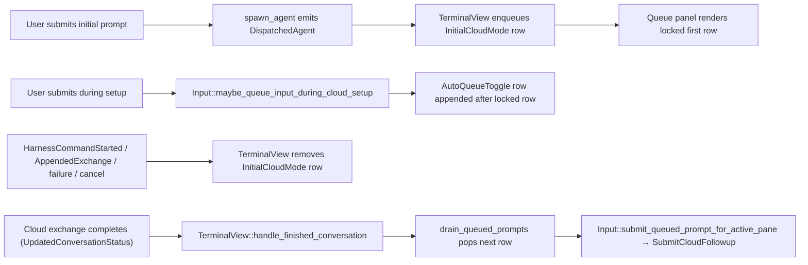

# Queued Prompts in Cloud Mode Setup — Tech Spec
See `specs/APP-4562/PRODUCT.md` for user-visible behavior. This document covers the implementation that supports that behavior, layered on top of the regular Agent Mode queued-prompts panel introduced in `specs/REMOTE-1543/`.
## Context
The regular queued-prompts panel (`specs/REMOTE-1543/`) is a terminal-owned queue that appears between the warping indicator and the input editor in `TerminalView`. The queue is per-`TerminalView` and implicitly scoped to whichever conversation owns the agent view — entries are wiped on agent-view exit and on `ClearedConversationsInTerminalView`, so it never holds rows for more than one conversation at a time. Its data model lives in `app/src/ai/blocklist/queued_query.rs`, its view lives in `app/src/ai/blocklist/queued_prompts_panel.rs`, and the trigger/drain glue lives in `app/src/terminal/input.rs` and `app/src/terminal/view.rs`. Cloud Mode is currently outside that surface — see `specs/REMOTE-1543/PRODUCT.md (13, 30, 62)` and the panel's `should_render` gate at `app/src/ai/blocklist/queued_prompts_panel.rs`.
For Cloud Mode today:
- The initial submitted cloud prompt is shown as a legacy pending-user-query block inserted by `TerminalView::insert_cloud_mode_queued_user_query_block` (`app/src/terminal/view/pending_user_query.rs:90`), called from `app/src/terminal/view/ambient_agent/view_impl.rs:173` (`DispatchedAgent`) and `:212` (`FollowupDispatched`).
- Pressing Enter while the cloud environment is still setting up is suppressed by `Input::should_block_cloud_mode_setup_submission` (`app/src/terminal/input.rs:6575`), short-circuited at `app/src/terminal/input.rs:12617`.
- Queued prompts drain off `BlocklistAIControllerEvent::FinishedReceivingOutput` in `TerminalView::handle_ai_controller_event` (`app/src/terminal/view.rs:4930`). That event does not fire for a cloud-mode pane because the response stream lives on the cloud side, so subsequent queued prompts never fire.
- `QueuedQueryOrigin::InitialCloudMode` is already defined at `app/src/ai/blocklist/queued_query.rs:24` but is currently unused — this spec wires it up.
## Proposed changes
### 1. Feature flag `QueuedPromptsV2`
Add a compile-time + runtime feature flag.
- `app/Cargo.toml`: add `queued_prompts_v2 = ["queue_slash_command"]` under `[features]`. The cargo dependency means enabling V2 transitively enables the existing queue feature, so every existing `FeatureFlag::QueueSlashCommand.is_enabled()` site still works without modification. Do not add to `default`.
- `crates/warp_features/src/lib.rs`: add `QueuedPromptsV2` to the `FeatureFlag` enum, alongside the existing `QueueSlashCommand` entry. Add the variant to `DOGFOOD_FLAGS`.
- `app/src/features.rs:432-433`: register the runtime flag under `#[cfg(feature = "queued_prompts_v2")]`.
All cloud-mode-aware sites described below gate on `FeatureFlag::QueuedPromptsV2.is_enabled()` directly.
### 2. `QueuedQueryOrigin::InitialCloudMode` is now load-bearing
`QueuedQueryModel` (`app/src/ai/blocklist/queued_query.rs`) gains origin-aware no-ops so the locked-row contract is enforced at the model layer, not just the panel. The shared check lives on `QueuedQuery::is_locked()` so every mutator can ask the same question. Currently a row is locked iff its origin is `InitialCloudMode`; lifecycle code removes it explicitly via `QueuedQueryModel::remove_initial_cloud_mode_row`.
- `pop_front(ctx)`: returns `None` if the head is locked. The non-clean drain path in `TerminalView::drain_queued_prompts` reaches `pop_front` whenever a server-pushed `UpdatedConversationStatus → Error/Cancelled` arrives, so this gate prevents an in-flight status transition from clobbering the locked initial Cloud Mode row before the matching ambient-agent cleanup event has run.
- `pop_for_autofire(edit_text_override, ctx)`: returns `None` if the first row is locked. The cloud-setup lifecycle removes that row via §5, not autofire.
- `remove_by_id(query_id, ctx)`: no-op if the target row is locked. Lifecycle code uses `remove_initial_cloud_mode_row` instead.
- `reorder(source_id, target_index, ctx)`: no-op if `source_id` is locked, or if `target_index == 0` would displace a locked row currently at the head.
- `enter_edit_mode(query_id, ctx)`: no-op if the target row is locked.
- Add `remove_initial_cloud_mode_row(ctx)` that removes the first row of the queue if and only if its origin is `InitialCloudMode`. Used by §5.
All of these signatures are conversation-id-free because the model owns a single `Vec<QueuedQuery>` per terminal view — see the Context section. This division means the panel UI in §3 only needs to *render* the lock; it does not need to gate handler dispatch, because the model rejects forbidden mutations even if a click somehow gets through.
### 3. Panel: lock the InitialCloudMode row visually
In `app/src/ai/blocklist/queued_prompts_panel.rs`:
- All locked-row hover affordances share a single tooltip constant `INITIAL_CLOUD_MODE_PROMPT_TOOLTIP = "The first cloud-mode prompt cannot be changed."` (`app/src/ai/blocklist/queued_prompts_panel.rs:44`) so the drag handle, edit button, and delete button all surface the same short explanation.
- In the row rendering inside `render` (`app/src/ai/blocklist/queued_prompts_panel.rs:597`), when the rendered query's `origin()` is `QueuedQueryOrigin::InitialCloudMode`:
  - Render the drag handle in a visually disabled state without wrapping the row in `Draggable`, and show the shared tooltip on hover.
  - Keep the edit and delete `ActionButton`s revealed on hover and call `set_disabled(true)` on each so the click handler is gated and the disabled tooltip is surfaced. Pair that with `with_disabled_theme(NakedTheme)` so the disabled state reuses the regular naked appearance instead of picking up the default greyed-out `DisabledTheme` fill/text. Both buttons reuse the shared tooltip.
  - Static preview text renders identically to other rows.
- `should_render` (`app/src/ai/blocklist/queued_prompts_panel.rs:547`) is unchanged. Because the cargo feature transitively enables `queue_slash_command`, the existing `FeatureFlag::QueueSlashCommand.is_enabled()` check passes when V2 is on.
- Wire the panel into the V2 cloud-mode composing input in `Input::render_cloud_mode_v2_composing_input` (`app/src/terminal/input/agent.rs:345`). Render the panel as a sibling above the input card, inside the same `ConstrainedBox` constrained to `CLOUD_MODE_V2_MAX_WIDTH` (`app/src/terminal/input/agent.rs:34`). The non-V2 placement at `app/src/terminal/input/agent.rs:324` is unchanged.
### 4. Route initial + follow-up cloud-mode prompts into the queue
Branch both existing `insert_cloud_mode_queued_user_query_block` call sites on `FeatureFlag::QueuedPromptsV2.is_enabled()`:
- `app/src/terminal/view/ambient_agent/view_impl.rs` initial `DispatchedAgent`.
- `app/src/terminal/view/ambient_agent/view_impl.rs` `FollowupDispatched`.
When V2 is on, call `TerminalView::enqueue_initial_cloud_mode_prompt(prompt, ctx)` which delegates to `enqueue_prompt` with `QueuedQueryOrigin::InitialCloudMode`. `enqueue_prompt` keeps `BlocklistAIContextModel::selected_conversation_id` as a *gate* — it bails when no conversation is selected so prompts are not stranded outside the agent view — but the queue itself is not keyed by the conversation id. If the gate fails, fall back to `insert_cloud_mode_queued_user_query_block` so the visual indicator is never lost.
The `FollowupDispatched` path also enqueues an `InitialCloudMode` row. Every cloud-side dispatch — whether the first execution or a follow-up — produces a locked row that the lifecycle events in §5 retire when the cloud agent picks up the prompt.
### 5. Mirror legacy block-removal sites onto the panel row
Introduce `TerminalView::remove_cloud_mode_queue_row(&mut self, ctx)` (`app/src/terminal/view/pending_user_query.rs`) that calls `QueuedQueryModel::remove_initial_cloud_mode_row` from §2. The helper is a no-op when V2 is off because no `InitialCloudMode` row was ever appended.
Affected sites:
- `app/src/terminal/view/ambient_agent/view_impl.rs:114-127` — `should_clean_up_pending_cloud_query` covers `HarnessCommandStarted`, `NeedsGithubAuth`, `Cancelled`, `HandoffSnapshotUploadFailed`, and `Failed` when `!CloudModeSetupV2.is_enabled()`. Both the legacy pending-user-query block and the V2 queue row are removed on the *same* condition so the two surfaces cannot diverge.
- `app/src/terminal/view.rs:5452` — `remove_pending_cloud_mode_query_if_exchange_has_renderable_user_query`, called from `AppendedExchange` at `app/src/terminal/view.rs:5813`. The pending-block removal stays scoped to the legacy `CloudMode` kind so unrelated `PendingUserQueryKind::QueuedPrompt` blocks (the `/queue` slash-command surface) are not torn down under V2; the queue-row removal is V2-gated independently and is a no-op when the V2 row is not present.
- `app/src/terminal/view.rs:5613-5620` — oz local-to-cloud handoff first `AppendedExchange`.
### 6. Allow submission while environment is setting up (queue instead of block)
`Input::should_block_cloud_mode_setup_submission` currently short-circuits Enter to a no-op when the cloud pane is in `WaitingForSession` / `Failed` / `Cancelled` / `NeedsGithubAuth`. This stays untouched. The new path is purely additive and gated.
Add `Input::maybe_queue_input_during_cloud_setup(ctx)` next to `maybe_queue_input_for_in_progress_conversation`. It:
1. **Hard-gates** on `FeatureFlag::QueuedPromptsV2.is_enabled()` as the very first check; returns false immediately if the flag is off, without inspecting any other state.
2. Returns false unless the cloud-pane predicate `is_ambient_agent() && !is_configuring_ambient_agent() && !is_agent_running()` holds (same predicate as today's block check).
3. Gates on `BlocklistAIContextModel::selected_conversation_id` being `Some` so we don't queue while the agent view is closed; the conversation id itself is not used to key the queue (see Context).
4. Reads and trims the editor buffer; returns false if empty.
5. Clears the editor buffer and pending attachments.
6. Appends a row with `QueuedQueryOrigin::AutoQueueToggle` to the single per-view queue.
7. Returns true so the submit handler short-circuits.
Call `maybe_queue_input_during_cloud_setup` in the submit handler immediately alongside `maybe_queue_input_for_in_progress_conversation`, before `should_block_cloud_mode_setup_submission` is evaluated. When V2 is off, the new helper returns false and the existing block check still short-circuits submission to a no-op exactly as today.
### 7. Drain via conversation-status path, submit via cloud follow-up path
Two pieces change for cloud-mode draining to work end-to-end.
#### 7a. Detect finish via the conversation-status path
Add a second drain entry point inside `TerminalView::handle_ai_history_model_event`, in the `BlocklistAIHistoryEvent::UpdatedConversationStatus` arm:
- Gate on `FeatureFlag::QueuedPromptsV2.is_enabled()` and `self.is_ambient_agent_session(ctx)`.
- Detect a transition from in-progress/blocked to a terminal status using a `last_observed_conversation_status: HashMap<AIConversationId, ConversationStatus>` field on `TerminalView`. The map is cleared on `ClearedConversationsInTerminalView`, and individual entries are removed in the `RemoveConversation` / `DeletedConversation` handlers. The per-conversation status map remains keyed by conversation id even though the queue is not — see Context — because we have to distinguish transitions per conversation when multiple conversations have lived in the same terminal view.
- Translate the terminal status into a `FinishReason` via an exhaustive match: `Success → Complete`, `Error → Error`, `Cancelled → Cancelled`, `InProgress | Blocked → None`. The `None` arm matters: a status update that is not a transition to a terminal status must not drain the queue.
- Call `self.handle_finished_conversation(finish_reason, ctx)`, which already routes through `drain_queued_prompts` and any registered `queued_prompt_callback`s.
The local AI controller path continues to feed `handle_finished_conversation` for local Agent Mode; the new history-model path feeds it for cloud-mode panes. Both converge on the same drain logic.
#### 7b. Route the popped prompt through the cloud submission path
`TerminalView::drain_queued_prompts` currently submits popped rows via `Input::submit_queued_prompt`, which goes through the local `BlocklistAIController`. That path does nothing useful for a cloud pane.
Add `Input::submit_queued_prompt_for_active_pane(prompt, ctx)` next to `submit_queued_prompt`. It selects the submission path based on pane kind, in order:
- **Cloud follow-up first.** If `ambient_agent_view_model.as_ref(ctx).is_ready_for_cloud_followup_prompt()`, emit `InputEvent::SubmitCloudFollowup { prompt }`. That event is handled by `TerminalView` and routes through `AmbientAgentViewModel::submit_cloud_followup`, the same path used for user-initiated cloud follow-ups. This branch wins over the viewer path because the old shared session is no longer live to receive a `SendAgentPrompt`.
- **Shared-session viewer next.** If `self.model.lock().shared_session_status().is_viewer()`, send the prompt straight to the sharer via `Event::SendAgentPrompt` — no buffer replace, no pending-attachment piggyback, and no use of `submit_viewer_ai_query`. When the user's editor is empty we also surface the standard `"<prompt> ◌"` loading affordance so the queued submission has visible feedback while the sharer ack flight is in flight; the `NetworkEvent::AgentPromptRequestInFlight → unfreeze_and_clear_agent_input` hop will clear it once the sharer acknowledges receipt. If the user has typed something locally, leave the buffer alone so their in-progress prompt is not clobbered.
- **Local Agent Mode fallback.** Otherwise call `submit_queued_prompt` so non-cloud queues are unaffected.
Change `drain_queued_prompts`'s `AutofireAction::Submit { text }` branch to call `submit_queued_prompt_for_active_pane(text, ctx)` instead of `submit_queued_prompt(text, ctx)`. The `PopFromEditMode` branch is unchanged.
## End-to-end flow (V2 on)

## Testing and validation
Map tests directly to the product invariants in `specs/APP-4562/PRODUCT.md`:
- **§1, §2 (feature gating)**: compile both with and without the cargo feature (`cargo check -p warp` and `cargo check -p warp --features queued_prompts_v2`); unit-test that all new helpers no-op when V2 is off.
- **§3, §4 (initial cloud-mode prompt as locked row)**: `app/src/terminal/view/queued_prompts_test.rs` covers (a) `DispatchedAgent` appends an `InitialCloudMode` row when V2 is on (`dispatched_cloud_prompt_uses_locked_queue_row_when_v2_is_enabled`), (b) `FollowupDispatched` does the same (`dispatched_cloud_followup_uses_locked_queue_row_when_v2_is_enabled`), and (c) the legacy block is not inserted when V2 is on.
- **§4 (lock semantics at the model level)**: `app/src/ai/blocklist/queued_query_tests.rs` includes `initial_cloud_mode_head_rejects_user_mutations_and_autofire` proving `enter_edit_mode`, `remove_by_id`, `reorder` (both `source_id` and `target_index == 0`), and `pop_for_autofire` no-op for `InitialCloudMode` rows; `pop_front_no_ops_when_head_is_locked` covers the non-clean drain path; `remove_initial_cloud_mode_row_only_removes_the_locked_head` covers the lifecycle removal path.
- **§6, §7 (removal sites)**: `cloud_setup_cleanup_events_remove_the_locked_queue_row` covers `HarnessCommandStarted`, `Cancelled`, `NeedsGithubAuth`, and `HandoffSnapshotUploadFailed`; `failed_event_keeps_locked_queue_row_under_cloud_mode_setup_v2` and `failed_event_removes_locked_queue_row_without_cloud_mode_setup_v2` cover the `Failed` event under both `CloudModeSetupV2` configurations, mirroring the legacy block's gating. `AppendedExchange` with renderable user query, and the oz local-to-cloud handoff first exchange, are exercised by existing terminal-view test coverage of the legacy removal sites — both paths now share the same `remove_cloud_mode_queue_row` helper.
- **§8 (during-setup queueing)**: `cloud_setup_enter_queues_followup_input_when_v2_is_enabled` asserts `maybe_queue_input_during_cloud_setup` appends an `AutoQueueToggle` row in the `WaitingForSession` state; `cloud_setup_enter_remains_blocked_when_v2_is_disabled` asserts no row is appended and the editor buffer is preserved when V2 is off.
- **§13–§16 (drain)**: `terminal_cloud_status_transition_drains_once_through_cloud_followup_input_event` asserts (a) `UpdatedConversationStatus` transitioning to a terminal status calls `handle_finished_conversation` once per transition, not per status event (the test feeds two `Success` events back-to-back and verifies a single drain), and (b) the resulting submission path goes through `InputEvent::SubmitCloudFollowup` for cloud panes via the `is_ready_for_cloud_followup_prompt` predicate.
- Full presubmit: `./script/presubmit`.
Do not run the app to test.
## Parallelization
Single workstream. The queue model, panel rendering, cloud-mode dispatch sites, conversation-status drain hook, and submission routing all share types (`QueuedQueryOrigin`, `FinishReason`, `ConversationStatus`, `AmbientAgentViewModelEvent`) that must stay consistent across edits. Splitting across child agents would create merge churn on the same files without reducing wall-clock time.
## Risks and mitigations
- **`InitialCloudMode` row leaking past run start**: every existing call to `remove_pending_user_query_block` for cloud kind has a sibling call to `TerminalView::remove_cloud_mode_queue_row` (via a unified `should_clean_up_pending_cloud_query` gate in §5), and the model-level `pop_for_autofire` and `pop_front` no-ops prevent accidental autofire or non-clean-drain pop of the locked row. The shared `QueuedQuery::is_locked()` helper centralises the check so every mutator agrees on the lock contract.
- **Double drain**: `FinishedReceivingOutput` (local) and `UpdatedConversationStatus` (history) could both call `handle_finished_conversation`. Mitigation: the new history-model entry is gated on `is_ambient_agent_session` and on a status *transition* tracked via `last_observed_conversation_status`, not on raw status updates. The `FinishReason` translation uses an exhaustive match that returns `None` for `InProgress | Blocked` so partial-status updates do not re-fire the queue.
- **Cross-surface block removal regression**: `remove_pending_cloud_mode_query_if_exchange_has_renderable_user_query` gates the legacy pending-user-query block removal on the `CloudMode` kind explicitly (independent of the V2 flag) so unrelated `PendingUserQueryKind::QueuedPrompt` blocks are not torn down under V2; the V2 queue-row removal is layered on top as a no-op when no `InitialCloudMode` row exists.
- **Conversation id not yet assigned at `DispatchedAgent`**: §4 falls back to the legacy pending-user-query block so the visual indicator is never lost.
- **Cargo feature dependency mistake**: if `queued_prompts_v2 = ["queue_slash_command"]` is omitted from `app/Cargo.toml`, V2 appears to work but the regular queue surfaces are silently dark. Mitigation: presubmit + the explicit compile-check on `--features queued_prompts_v2` in isolation.
- **Panel placement inside the V2 centered input**: the panel must match `CLOUD_MODE_V2_MAX_WIDTH` so it stays visually attached to the input card. Mitigation: render it inside the same `ConstrainedBox`/`Align` wrapper that the V2 input uses (§3).
