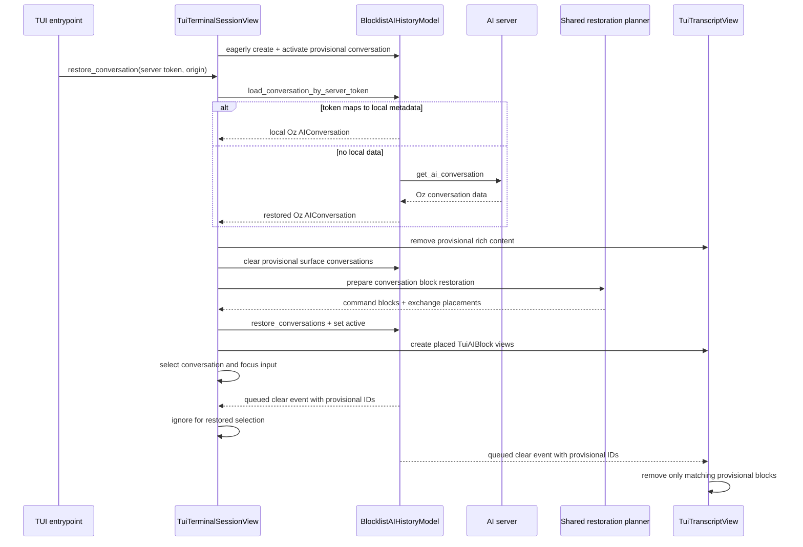

# TECH: Warp TUI Conversation Resume and Restoration (CODE-1820)

Implements the behavior in [`PRODUCT.md`](./PRODUCT.md). Historical context links remain pinned to commit `1eb3698892bdcc9e038a9b0ea8b0eb34ffadfde0`; implementation references below use current branch paths.

## Context

The TUI boots the main `app` crate and reuses the same agent conversation, history, action, controller, persistence, terminal model, and blocklist implementations as the GUI. CODE-1820 adds token-based resume, frontend-neutral command/exchange restoration planning, TUI historical block materialization, and post-teardown resume hints.

The TUI is modeled as always presenting one conversation. `TuiConversationSelection` eagerly creates and selects an empty conversation when the session starts, marks it active in `BlocklistAIHistoryModel`, and associates subsequent shell blocks with it. The first prompt must target this eager conversation; it cannot create another conversation as a fallback. `TranscriptScope::Unfiltered` makes the TUI blocklist independent of GUI Agent View lifecycle while preserving the serialized conversation membership used for restoration and cleanup (`app/src/terminal/model/block.rs:85-109`, `app/src/terminal/model/blocks.rs:1661-1741`, `crates/warp_tui/src/conversation_selection.rs:20-310`).

Startup resume loads and validates the requested conversation before replacing the provisional eager conversation. Clearing provisional history emits `ClearedConversationsForTerminalSurface`, whose delivery can occur after the restored conversation is selected and materialized. Selection and transcript subscribers therefore consume the event's `active_conversation_id` and `cleared_conversation_ids`; they never clear whichever conversation happens to be current at delivery time (`crates/warp_tui/src/conversation_selection.rs:263-291`, `crates/warp_tui/src/transcript_view.rs:84-166`).

The relevant existing paths are:

- [`crates/warp_tui/src/session.rs (42-157)`](https://github.com/warpdotdev/warp/blob/1eb3698892bdcc9e038a9b0ea8b0eb34ffadfde0/crates/warp_tui/src/session.rs#L42-L157) — dispatches TUI worker re-execs, starts `warp::run_tui`, gates terminal-session creation on login, and exposes the `post_wire` callback after the surface is connected.
- [`app/src/ai/blocklist/history_model/conversation_loader.rs (233-366)`](https://github.com/warpdotdev/warp/blob/1eb3698892bdcc9e038a9b0ea8b0eb34ffadfde0/app/src/ai/blocklist/history_model/conversation_loader.rs#L233-L366) — loads conversations from memory, local SQLite, or the server. `load_conversation_by_server_token` resolves a canonical local ID, reuses local data when present, and falls back to the server.
- [`app/src/ai/blocklist/history_model.rs (1058-1169)`](https://github.com/warpdotdev/warp/blob/1eb3698892bdcc9e038a9b0ea8b0eb34ffadfde0/app/src/ai/blocklist/history_model.rs#L1058-L1169) — `restore_conversations` registers a loaded conversation on a terminal surface and rebuilds the server-token and parent/child indexes; `set_active_conversation_id` establishes active-surface state.
- [`app/src/terminal/view/load_ai_conversation.rs (439-637)`](https://github.com/warpdotdev/warp/blob/1eb3698892bdcc9e038a9b0ea8b0eb34ffadfde0/app/src/terminal/view/load_ai_conversation.rs#L439-L637) — GUI historical restoration: restore action results and documents, register conversations, reconstruct command blocks, compute AI-block placement, and create GUI views.
- [`app/src/terminal/view/load_ai_conversation.rs (1196-1272)`](https://github.com/warpdotdev/warp/blob/1eb3698892bdcc9e038a9b0ea8b0eb34ffadfde0/app/src/terminal/view/load_ai_conversation.rs#L1196-L1272) — computes where restored agent exchanges belong relative to command blocks.
- [`app/src/ai/agent/conversation.rs (4003-4086)`](https://github.com/warpdotdev/warp/blob/1eb3698892bdcc9e038a9b0ea8b0eb34ffadfde0/app/src/ai/agent/conversation.rs#L4003-L4086) — reconstructs `SerializedBlockListItem::Command` values from conversation task messages.
- [`app/src/ai/blocklist/action_model.rs (606-671)`](https://github.com/warpdotdev/warp/blob/1eb3698892bdcc9e038a9b0ea8b0eb34ffadfde0/app/src/ai/blocklist/action_model.rs#L606-L671) — historical blocks read action status from `BlocklistAIActionModel`; `restore_action_results_from_exchanges` populates the past-results map they require.
- `app/src/terminal/conversation_restoration.rs:55-97` — frontend-neutral command restoration and exchange placement plan consumed by GUI and TUI surfaces.
- `crates/warp_tui/src/terminal_session_view.rs:444-535` — token load, provisional-state replacement, action restoration, transcript materialization, active-history update, and restored selection.
- `crates/warp_tui/src/transcript_view.rs:84-166, 251-286` — live/restored `TuiAIBlock` materialization and conversation-ID-scoped cleanup of rich content.
- `crates/warp_tui/src/conversation_selection.rs:20-310` — eager conversation ownership, strict prompt target, `/new` replacement, and history-event reconciliation.

`RestoredAgentConversations` is not the interactive loader for this feature. It supports GUI startup by handing local-ID records to recreated panes at most once. Token-based interactive restoration already has the correct local-first/server-fallback behavior in `BlocklistAIHistoryModel::load_conversation_by_server_token`.

## End-to-end flow



## Implemented design

### 1. Parse and carry `--resume`

`crates/warp_tui/src/session.rs` parses optional `--resume <token>` input and validates its UUID shape before launching the app. `run_tui_worker_if_requested` remains the first operation so terminal-server and other internal re-execs retain their current behavior.

`Option<ServerConversationToken>` is carried through the mount closure and login gate. Restoration starts from the terminal manager's `post_wire` callback, where the `TuiTerminalSessionView` and all of its controller/model dependencies have been created and connected. Startup without a token follows the eager-conversation path without entering restoration state.

The startup entrypoint must not implement restoration itself. It calls the generalized TUI operation described below, which the future inline list will call directly with the selected entry's token.

### 2. Add one generalized TUI restoration operation

`TuiTerminalSessionView` exposes the generalized restoration operation:

```rust
restore_conversation(
    server_token: ServerConversationToken,
    origin: TuiConversationRestoreOrigin,
    ctx: &mut ViewContext<Self>,
)
```

`TuiConversationRestoreOrigin` distinguishes startup resume from future list selection for telemetry and presentation only. It does not change identity, loading, block reconstruction, or continuation semantics.

`TuiConversationSelection` creates and activates the provisional conversation during terminal-session construction. Shell commands completed before the first prompt therefore inherit that conversation, and `send_prompt` requires an existing selection rather than creating a second conversation.

The restoration operation owns this state transition:

1. Enter a loading state that suppresses the interactive zero state.
2. Call the existing `BlocklistAIHistoryModel::load_conversation_by_server_token`, matching the GUI's local-first/server-fallback behavior.
3. Restore `CloudConversationData::Oz`, reject `CloudConversationData::CLIAgent` with a permanent unsupported-harness error, and treat `None` as a generic loading failure.
4. Verify that the returned `AIConversation` contains the requested server token before registration.
5. Prepare the shared block restoration plan and historical action state.
6. Atomically replace the sole TUI conversation surface.
7. Register the conversation, create TUI views, mark it active and selected, clear loading state, scroll to the end, and focus the input.

The server token must be installed on the `AIConversation` before `restore_conversations`. Local conversion obtains it from persisted `AgentConversationData`; server conversion with `RestorationMode::Continue` obtains it from server metadata. If a compatibility path must repair an absent token, add the narrowest pre-registration API needed rather than inserting the conversation and patching it afterward, because registration builds the reverse token index from the conversation value it receives.

For startup, replacement operates on the provisional eager conversation and an otherwise empty transcript. For future inline selection, load and validate the requested conversation before clearing the current surface. If loading fails, retain the old transcript and selection. Once loading succeeds, remove the old conversation's agent rich content, conversation-derived command blocks, and action state before applying the new plan. `clear_conversations_for_terminal_surface` still emits a cleanup event for other subscribers; selection and transcript handlers must compare their current content with the IDs carried by that event because delivery may occur after the restored conversation is installed.

Escape or Ctrl-C while startup restoration is loading aborts the loader, invalidates its request generation, clears the loading state, and reveals the existing eager provisional conversation as a normal new TUI session. The loading screen includes `Esc or Ctrl-C to cancel and start a new session`. A cancelled request cannot later replace the session, and the requested token never reaches the exit-summary handle.

### 3. Extract shared conversation block restoration preparation

The GUI and TUI share `AIConversation`, `TerminalModel`, and `BlockList`; only their final rich-content view types differ. `app/src/terminal/conversation_restoration.rs` contains the model/blocklist work extracted from `TerminalView::restore_conversation_after_view_creation`.

`ConversationBlockRestorationPlan` contains ordered restored exchanges and their `Option<BlockIndex>` placement relative to command blocks. Its builder:

- Uses the existing `exchanges_for_blocklist` rules from `app/src/terminal/view/blocklist_filter.rs` so hidden exchanges and internal task types remain consistently filtered.
- Calls `AIConversation::to_serialized_blocklist_items` and inserts the resulting command blocks into the supplied `TerminalModel`.
- Computes exchange placement with the existing timestamp algorithm from `command_block_indices_for_exchanges`.
- Returns frontend-neutral exchange data and placement; it does not construct views, manage focus, or apply Agent View policy.

Filtering and placement helpers are exposed at the narrowest visibility that supports both `app` and `warp_tui`. New functions and types have concise doc comments, and imports remain at file scope.

The GUI historical path consumes the plan without changing its behavior. It continues to own `AIBlockCreationParams`, document restoration, Agent View entry blocks, directory hints, pixel sizing, mouse state, and restored appearance.

### 4. Restore action state before constructing historical blocks

Before either frontend constructs historical agent views, pass the plan's visible exchanges to `BlocklistAIActionModel::restore_action_results_from_exchanges`.

This ordering is required: `TuiAIBlock` resolves tool-call status through the action model at render time. Constructing blocks first would render completed historical actions as unknown or pending. Keep the same ordering in the refactored GUI path so the extraction cannot introduce a cross-surface discrepancy.

When the sole TUI surface is replaced, clear the previous conversation's historical action-result state or replace the per-surface action model as necessary so results from the old transcript cannot satisfy action IDs in the new one.

### 5. Materialize restored TUI blocks with shared placement

`TuiTranscriptView` has a restored-insertion path separate from the live `AppendedExchange` append path.

For each planned exchange:

- Construct the existing `AIBlockModelImpl<TuiAIBlock>`.
- Register the `TuiAIBlock` view and subscriptions exactly as live blocks do.
- Insert its `RichContentItem` before the planned command block with `BlockList::insert_rich_content_before_block_index`, or append it when no command placement exists.
- Preserve duplicate protection by exchange ID.

The explicit restoration operation drives this path because `RestoredConversations` carries IDs but not the block-placement plan. Other history observers continue to receive that event normally.

After all blocks are materialized, move the viewport to the end and notify the transcript so restored height and layout are recomputed.

Conversation-removal events are ID-scoped. `RemoveConversation`, `DeletedConversation`, and `ConversationTransferredBetweenTerminalSurfaces` remove blocks for their explicit conversation ID. `ClearedConversationsForTerminalSurface` removes only blocks named by its `active_conversation_id` and `cleared_conversation_ids`; it must not clear the entire transcript because a queued provisional clear can arrive after restored blocks are inserted.

### 6. Register, activate, and select in a fixed order

Apply restored state in this order:

1. Load and validate the requested conversation without mutating the current surface.
2. Remove provisional transcript rich content, command blocks, and historical action results.
3. Clear provisional history ownership, emitting an ID-bearing cleanup event.
4. Insert conversation-derived command blocks and compute placements.
5. Restore historical action results.
6. Call `BlocklistAIHistoryModel::restore_conversations`.
7. Create placed `TuiAIBlock` views.
8. Call `set_active_conversation_id`.
9. Call `ConversationSelection::select_existing_conversation` with a restore-specific origin.
10. Clear loading state, scroll to the end, and focus the input.

Registration must precede `TuiAIBlock` construction because `AIBlockModelImpl` resolves the exchange from `BlocklistAIHistoryModel`. Selection happens after materialization so the input never targets a conversation whose transcript failed to build.

### 7. Represent loading and errors in the sole TUI surface

`TuiTerminalSessionView` owns restoration state:

- `Idle`
- `Loading`
- `Failed(String)`

Startup resume renders loading instead of the zero state until completion and includes the cancellation hint. A startup failure renders an error with the input disabled until the user exits; it must not silently enter new-conversation mode. User-initiated cancellation is distinct from failure: it aborts the request and reveals the eager provisional new-conversation state.

Future inline selection may display loading while retaining the current transcript. On failure, show a transient or inline error and return to the prior selected conversation. Keep this distinction controlled by `TuiConversationRestoreOrigin`, while all loader and materialization behavior remains shared.

Use the GUI loader's generic failure semantics rather than adding a second error-bearing loading path. Preserve the explicit non-Oz message because the returned `CloudConversationData` already distinguishes CLI-agent transcripts.

### 8. Capture and print the selected server token

Printing must happen after `warp::run_tui` returns so raw mode and the alternate screen have been restored. At that point the `App` and its models have been dropped.

`TuiExitSummaryHandle` is backed by run-scoped shared storage and retained by `session::run`. It updates from the live source of truth whenever:

- `ConversationSelectionEvent::Changed` changes the selected conversation.
- `BlocklistAIHistoryEvent::ConversationServerTokenAssigned` gives the selected conversation its token.
- A restored conversation becomes selected.
- Selection is cleared.

Each update re-reads the selected `AIConversation` and stores its `ServerConversationToken` only when `AIConversation::is_empty()` is false; it does not duplicate conversation state. After `run_tui` returns successfully, print the resume command when the handle contains an eligible token. Do not print for the eager empty conversation and do not fall back to an active conversation or local ID.

This run-scoped bridge avoids changing the shared `TerminationResult`, which carries only `Result<()>`, and avoids printing while the alternate screen is still active. It also works with the headless signal path, which funnels termination through the same event loop before model teardown.

## Testing and validation

### Loader and identity tests

- Known token mapped to a live conversation returns that conversation without a server fetch. (PRODUCT 7-8)
- Known token mapped to local persisted metadata restores from SQLite. (PRODUCT 7-8)
- Unknown local token fetches from the server and preserves the requested token before registration. (PRODUCT 8, 16)
- Canonical local IDs remain stable for repeated loads of the same token.
- Generic loading failures do not enter a new conversation, and returned non-Oz transcripts show the explicit unsupported-harness message. (PRODUCT 21-23)

### Shared restoration-plan tests

- The refactored GUI path produces the same visible exchange set and block ordering as before.
- Hidden exchanges and filtered internal task types are excluded. (PRODUCT 11)
- Conversation-derived command blocks are reconstructed without execution. (PRODUCT 10, 13)
- Agent exchanges are placed correctly relative to command blocks, including equal timestamps and no-command cases. (PRODUCT 10, 14)
- Action results are restored before block construction. (PRODUCT 12)

### TUI unit and view tests

Use existing `App::test` fixtures under `crates/warp_tui` to verify:

- Startup restoration transitions from loading to the restored transcript without showing an interactive zero state. (PRODUCT 5-6)
- TUI startup eagerly creates one selected and history-active conversation; shell commands before the first prompt belong to it, and prompt submission cannot create a different fallback conversation.
- Transcript content, command/agent ordering, hidden filtering, and duplicate prevention. (PRODUCT 9-15)
- Restored tool calls render recorded terminal states. (PRODUCT 12)
- The restored conversation becomes active and selected only after successful materialization. (PRODUCT 15-18)
- A queued clear event naming the provisional conversation does not clear the restored selection or remove restored transcript blocks.
- Transcript clear handling removes only agent blocks whose conversation IDs appear in the event payload.
- The next submitted prompt carries the restored server token. (PRODUCT 16)
- Inline-style replacement retains the old transcript on load failure and removes stale blocks/action state on success. (PRODUCT 19-20)
- Startup loading cancellation reveals the existing eager provisional conversation, does not create a second replacement conversation, and ignores late loader completion. Error states remain blocking. (PRODUCT 21-24)

### CLI and exit tests

- Internal worker arguments retain precedence over TUI arguments.
- No `--resume` preserves existing startup. (PRODUCT 1)
- A malformed or missing token value fails clearly. (PRODUCT 2-4)
- Successful exit prints the selected token after TUI teardown. (PRODUCT 25-27)
- Empty selection, no selection, no selected token, cancelled startup restoration, worker mode, and error termination print no hint. (PRODUCT 28-31)

### End-to-end verification

Run the TUI, complete a conversation, exit, and relaunch with the emitted token. Verify transcript order, command-block content, input focus, and same-lineage follow-up. Repeat once with local persisted data available offline and once with a token that requires a server fetch. Verify a failed token never enters a new conversation.

Run `cargo nextest run -p warp_tui`, the focused `warp` restoration/history tests, `./script/format`, and the presubmit clippy invocation before opening the PR.

## Risks and mitigations

- **Shared GUI refactor:** extracting restoration planning could change existing block ordering. Keep GUI behavior unchanged, preserve its tests, and add plan-level timestamp-ordering coverage before wiring the TUI.
- **Token patched too late:** inserting a conversation before its token is present can rebuild a stale reverse index. Verify or repair the token before `restore_conversations`, never after.
- **Partial surface replacement:** clearing before a cloud load succeeds can destroy a usable transcript. Load and validate first, then replace the surface as one foreground-thread operation.
- **Delayed provisional cleanup:** the provisional history clear event may be delivered after the restored conversation is selected and its blocks are inserted. Every clear subscriber must scope cleanup to the IDs carried by the event.
- **Late completion after cancellation:** retain an abort handle and request generation for startup restoration; cancellation invalidates both before returning the provisional session to interactive state.
- **Stale action results:** reusing an action model across conversation replacements can leak historical tool status. Clear or reinitialize per-conversation restoration state as part of replacement and test action-ID isolation.
- **Hint printed inside the alternate screen:** only persist the exit summary during the run; print after `run_tui` returns.

## Parallelization

Not proposed. The work forms one tightly coupled dependency chain: shared GUI restoration extraction, TUI materialization against that shared plan, selection/loading state, and exit lifecycle. Splitting it across agents would create contention in `load_ai_conversation.rs`, `transcript_view.rs`, and the shared blocklist APIs while forcing each worker to coordinate intermediate type changes. Implement sequentially on `harry/code-1820-conversation-persistence`.
