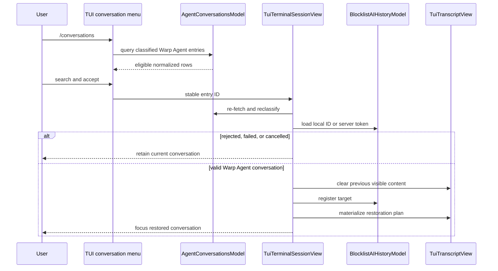

# TECH: Warp TUI Conversation Management (CODE-1821)

Implements [`PRODUCT.md`](./PRODUCT.md) for [CODE-1821](https://linear.app/warpdotdev/issue/CODE-1821/conversation-management).

## Context

This change builds on two parent branches whose APIs are already established:

- [`crates/warp_tui/src/inline_menu.rs @ 053d02e1`](https://github.com/warpdotdev/warp/blob/053d02e1/crates/warp_tui/src/inline_menu.rs) and [`crates/warp_tui/src/input/view.rs @ 053d02e1`](https://github.com/warpdotdev/warp/blob/053d02e1/crates/warp_tui/src/input/view.rs) route navigation, acceptance, dismissal, and rendering through an ordered collection of type-erased TUI inline-menu handles.
- [`specs/frontend-neutral-conversation-list-policy/TECH.md`](../frontend-neutral-conversation-list-policy/TECH.md) documents the frontend-neutral list policy introduced by the next parent branch. [`AgentConversationsModel @ 0f9eecda`](https://github.com/warpdotdev/warp/blob/0f9eecda/app/src/ai/agent_conversations_model.rs) supplies normalized entries, and the TUI’s `ConversationSelection` classifies them relative to its sole conversation surface.

This spec does not repeat those parent-branch designs. This branch owns the `/conversations` menu, its loading/search/update lifecycle, acceptance-time validation, and safe replacement of the TUI’s selected conversation.

The existing restoration path from CODE-1820 provides the starting point:

- [`crates/warp_tui/src/terminal_session_view.rs (589-698) @ 99261042`](https://github.com/warpdotdev/warp/blob/992610422e4e441ae1e4d29de17aebbc5e0a1b23/crates/warp_tui/src/terminal_session_view.rs#L589-L698) loads a conversation by server token and replaces the provisional TUI conversation after loading succeeds.
- [`app/src/ai/blocklist/history_model/conversation_loader.rs (233-366) @ 99261042`](https://github.com/warpdotdev/warp/blob/992610422e4e441ae1e4d29de17aebbc5e0a1b23/app/src/ai/blocklist/history_model/conversation_loader.rs#L233-L366) loads conversations from memory, local persistence, or the server.
- [`app/src/ai/blocklist/history_model.rs (1058-1169) @ 99261042`](https://github.com/warpdotdev/warp/blob/992610422e4e441ae1e4d29de17aebbc5e0a1b23/app/src/ai/blocklist/history_model.rs#L1058-L1169) registers restored conversations and owns terminal-surface associations.
- [`app/src/terminal/conversation_restoration.rs (20-97) @ 99261042`](https://github.com/warpdotdev/warp/blob/992610422e4e441ae1e4d29de17aebbc5e0a1b23/app/src/terminal/conversation_restoration.rs#L20-L97) builds the frontend-neutral command/exchange restoration plan consumed by the TUI.
- [`crates/warp_tui/src/transcript_view.rs (84-307) @ 99261042`](https://github.com/warpdotdev/warp/blob/992610422e4e441ae1e4d29de17aebbc5e0a1b23/crates/warp_tui/src/transcript_view.rs#L84-L307) materializes restored agent blocks and removes conversation-scoped transcript content.

## Proposed changes

### Add the conversation menu model

Add `TuiConversationMenuModel` in `crates/warp_tui/src/conversation_menu.rs`. It owns:

- Explicit open and closed state.
- Title-only rows with stable `AgentConversationEntryId` identity.
- `InlineMenuSelection`, scroll offset, loading state, and selection reconciliation.
- A menu-only query sourced from the shared input editor.
- Loading and empty snapshots using the existing TUI inline-menu presentation.

Opening the menu registers its model ID with `AgentConversationsModel`; closing unregisters it. This activates existing polling and deferred RTC refresh behavior only while the list is visible.

The model subscribes to input changes and `AgentConversationsModelEvent`. Every refresh reruns the current query, preserves selection by stable entry ID, and falls back to the nearest valid index when the selected row disappears.

### Query and order eligible entries

Request personal Warp Agent entries from `AgentConversationsModel::get_entries` and classify each through the TUI’s existing conversation-selection policy. Pass eligible entries to the same pure `query_conversation_entries` helper used by the GUI inline menu. The helper owns the 50-entry recent cap, case-insensitive fuzzy matching, score threshold, score/recency ordering, and 500-result search cap. GUI-only directory filtering and frontend-specific row construction remain outside the helper.

With an empty query:

- Keep the model’s reverse-chronological ordering.
- Take the 50 most recent eligible entries.
- Reverse those rows for bottom-selected inline-menu presentation.

With a non-empty query:

- Use `fuzzy_match::match_indices_case_insensitive`.
- Drop scores below 25.
- Order by score and last-updated time so the best result remains nearest the default bottom selection.
- Retain at most 500 results.

The currently selected conversation and unavailable entries are omitted by their policy state. Rows render only the conversation title.

### Surface partial cloud failure

Extend the initial `AgentConversationsModel` load result to distinguish successful cloud metadata loading from a request that returned usable local/task data without cloud metadata.

Track cloud metadata with one exhaustive `CloudConversationMetadataLoadState`: `Available` or `Failed`. The shared initial request already uses `OUT_OF_BAND_REQUEST_RETRY_STRATEGY`; opening a GUI or TUI list does not add another retry lifecycle.

When the shared request exhausts its retries, local entries remain available and the TUI shows the PRODUCT.md warning once per menu opening.

### Wire `/conversations`

Add the existing plural command to the TUI slash-command allowlist. Selecting or submitting it:

1. Clears the slash-command input.
2. Opens `TuiConversationMenuModel`.
3. Leaves focus in the input editor so typing updates the menu query.
4. Records normal static slash-command telemetry.

Extend the existing inline-menu router with a conversation-menu variant and an accepted conversation entry ID. Escape dismisses the active conversation menu and clears its query. Enter sends the stable entry ID to `TuiTerminalSessionView`.

### Revalidate acceptance

Menu contents are advisory; acceptance rechecks all mutable state before loading:

1. Reject when another restore is already loading.
2. Reject when the foreground terminal cannot start a new conversation.
3. Reject when the selected conversation is non-empty and not done.
4. Re-fetch the normalized entry by stable ID.
5. Reclassify it through the TUI conversation-selection policy.
6. Resolve either a local conversation ID or server token.

Rejected acceptance keeps the menu and current conversation intact and shows the PRODUCT.md message in the transient footer slot. Accepted selection dismisses the menu before starting restoration.

### Generalize restoration identity

Replace the server-token-only TUI restoration input with:

- `Local(AIConversationId)` for loaded or persisted local conversations.
- `Server(ServerConversationToken)` for metadata-only conversations and startup `--resume`.

Both paths return the same `CloudConversationData` result. The completion callback validates that the returned conversation matches the requested local ID or server token before mutating the visible surface.

Both local and server targets use the existing GUI restoration path: load an owned conversation value and register it on the destination surface through `BlocklistAIHistoryModel::restore_conversations`.

### Replace the visible conversation after loading

No current state is removed until loading and target validation succeed. Successful replacement remains synchronous on the foreground callback:

1. Clear old TUI agent-block views.
2. Remove command blocks associated with the previous conversation.
3. Clear restored historical action results.
4. Clear the terminal surface’s previous history association.
5. Build the shared restoration plan.
6. Restore action results required by historical blocks.
7. Register the target conversation.
8. Materialize restored TUI blocks.
9. Mark the target active and selected.
10. Refresh the exit summary, focus input, and repaint.

This preserves the existing CODE-1820 transcript ordering and continuation behavior while matching the GUI restoration path for repeated switching.

### Make restoration single-flight and cancelable

Expand `ConversationRestoreState::Loading` with:

- The restore origin.
- A monotonically increasing request ID.
- The spawned loader handle.

Every completion verifies that its request ID is still current. Cancellation aborts the loader, invalidates the generation, returns to `Idle`, and ignores late completion.

Presentation depends on origin:

- Startup restore keeps the full loading screen and adds the CODE-1820 cancellation hint.
- Conversation-list restore keeps the current transcript visible, shows a loading footer hint, and suppresses prompt submission.

Escape and Ctrl-C cancel either origin. Startup cancellation reveals the provisional empty conversation; list cancellation returns to the previous selected conversation. Startup failure retains the blocking error screen, while list failure returns to the old conversation with a transient error.

## End-to-end flow

## Testing and validation

- Shared model tests cover the 50-row recent cap, fuzzy threshold, score/recency ordering, and 500-result cap; the TUI menu tests only its stable-ID selection preservation and nearest-index fallback.
- TUI policy tests from the parent branch cover selected, terminal-state, active, unsupported-harness, and missing-identity classifications.
- Input/menu tests continue to verify navigation, acceptance, and dismissal routing through the active menu.
- UI tests verify the startup restoration cancellation hint.
- Focused session tests should cover busy rejection, load failure rollback, successful local/server replacement, list cancellation, startup cancellation, and ignored late completion.
- Run `cargo nextest run -p warp_tui` and focused history/model tests.
- Run `./script/format` and the repository clippy invocation before submission.

## Risks and mitigations

- **Partial destructive replacement:** Loading and identity validation finish before any transcript, history, command, or action state is removed.
- **Stale async completion:** Abort handles and request generations prevent cancelled or superseded loads from replacing the visible conversation.
- **Menu churn:** Refreshes preserve stable entry identity and clamp selection and scroll state.
- **Hidden cloud failure:** Local rows remain available and the explicit warning exposes incomplete cloud metadata after shared retries are exhausted.

## Parallelization

Parallel implementation is not useful. The menu lifecycle, accepted-entry routing, restore state machine, and terminal-surface replacement overlap in `terminal_session_view.rs` and depend sequentially on the same model and history APIs.