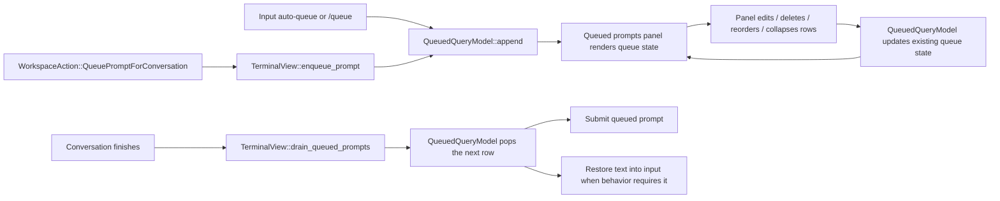

# Queued Prompts UI — Technical Spec
See `specs/REMOTE-1543/PRODUCT.md` for user-visible behavior. This document covers the implementation that supports that behavior.
## Context
Regular Agent Mode queued prompts are implemented as a terminal-owned queue subsystem rather than as pending-user-query rich content. That architecture keeps the rendered panel close to the input that hosts it, while queue rows remain scoped to the conversation they were filed against.

The implementation spans four ownership layers:
- `app/src/terminal/view.rs (3240-3330, 3707-4370, 5074-5181, 5871-5985)` constructs the terminal-scoped `QueuedQueryModel`, wires it into `Input`, constructs the panel, receives panel events that need input mutation, clears terminal-local queue state from lifecycle events, and drains queued prompts when conversations finish.
- `app/src/ai/blocklist/queued_query.rs (90-365)` owns queue data, edit/collapse state, row identity, reorder behavior, and auto-fire pop semantics.
- `app/src/ai/blocklist/queued_prompts_panel.rs (1-284, 485-841)` owns panel rendering and row-level interactions: collapse, edit, delete, drag reorder, and panel telemetry.
- `app/src/terminal/input.rs (13121-13319)` and `app/src/terminal/input/slash_commands/mod.rs (1032-1085)` route regular queue trigger surfaces into the shared queue model.

Cloud Mode placeholders and compact follow-up placeholders remain on the legacy pending-user-query path. They still use the rich-content machinery in `app/src/terminal/view/pending_user_query.rs`, `app/src/terminal/view/rich_content.rs`, and related terminal selection plumbing because their lifecycle is driven by cloud setup or summarize/fork workflows rather than by regular Agent Mode queue draining.
## Proposed changes
### Queue ownership and data model
`TerminalView::new` constructs one `QueuedQueryModel` per terminal view and hands that model to the input and queued-prompts panel (`app/src/terminal/view.rs (3707-4370)`). The model is terminal-owned because the panel and input are terminal-owned UI, but its rows are keyed by `AIConversationId` so switching conversations hides or reveals the correct queue without folding queue data into `TerminalView` itself. `BlocklistAIHistoryModel` remains responsible for conversation history only; queue cleanup reacts to its terminal-scoped events from `TerminalView`.

`QueuedQueryModel` is the source of truth for regular queued prompts (`app/src/ai/blocklist/queued_query.rs (90-365)`):
- `queues: HashMap<AIConversationId, Vec<QueuedQuery>>` stores FIFO queue contents per conversation.
- `QueuedQueryId` gives each row stable identity across edit, delete, and reorder.
- `QueuedQueryOrigin` distinguishes `/queue` rows from auto-queue rows for telemetry without affecting firing semantics.
- `editing: Option<EditingRow>` enforces one active inline edit globally within the model.
- `collapsed: HashSet<AIConversationId>` preserves per-conversation panel collapse state while that queue exists.
- `queue_next_prompt_enabled` moves the queue-next toggle state out of `BlocklistAIContextModel` and into the same model that handles regular queued prompt behavior.

The model emits `QueuedQueryEvent`s for append/remove/replace/reorder/edit/collapse/clear transitions. Views consume those events to refresh UI state without owning queue data themselves.
### Trigger routing and enqueue flow
All regular queue entry points converge on `QueuedQueryModel::append`:
- The auto-queue path in `Input::maybe_queue_input_for_in_progress_conversation` verifies that the flag is enabled, AI input is active, the selected conversation is in progress or blocked, and the prompt is non-empty before appending an `AutoQueueToggle` row (`app/src/terminal/input.rs (13154-13263)`).
- `/queue <prompt>` appends a `QueueSlashCommand` row while the conversation is active, and otherwise falls back to normal queued-prompt submission (`app/src/terminal/input/slash_commands/mod.rs (1032-1085)`).
- `WorkspaceAction::QueuePromptForConversation` routes button/keybinding-driven enqueue requests through `TerminalView::enqueue_prompt`, preserving a single append API at the terminal layer (`app/src/workspace/view.rs (22648-22663)`, `app/src/terminal/view.rs (5074-5099)`).

`FeatureFlag::QueueSlashCommand` remains the single gate for the regular queue experience. It covers the trigger surfaces above and the panel attachment/render path; there is no separate panel-specific rollout switch.
### Panel composition and interaction ownership
`TerminalView::new` constructs `QueuedPromptsPanelView` when the regular queue feature is available, subscribes to its emitted events, and stores the panel handle on `Input` (`app/src/terminal/view.rs (4338-4367)`, `app/src/terminal/input.rs (3697-3718)`). The input render tree places the panel between the status bar and the editor (`app/src/terminal/input/agent.rs (329-341)`), matching the product placement contract.

`QueuedPromptsPanelView` intentionally owns only queue-panel concerns:
- It renders the queue header, expanded rows, hover controls, inline edit editor, and drag handles (`app/src/ai/blocklist/queued_prompts_panel.rs (485-841)`).
- Static rows render bounded multiline previews: prompt text is character-trimmed before rendering, then constrained to a compact maximum height so queued prompts remain readable without letting one row dominate the panel (`app/src/ai/blocklist/queued_prompts_panel.rs (722-812)`).
- Edit mode reuses the multiline editor pattern used elsewhere in the client (`EditorOptions` with autogrow + soft wrap), constrains the editor to the same visual height as the static preview, and wraps it in a clipped outlined scroll surface with a scrollbar so larger edits stay bounded inside the row (`app/src/ai/blocklist/queued_prompts_panel.rs (594-612, 722-832)`).
- It mutates queue state through model methods such as `enter_edit_mode`, `remove_by_id`, `commit_edit`, `cancel_edit`, `reorder`, and `set_collapsed` (`app/src/ai/blocklist/queued_prompts_panel.rs (157-374)`).
- It emits higher-level `QueuedPromptsPanelEvent`s when the host view must coordinate with input focus or buffer placement (`app/src/ai/blocklist/queued_prompts_panel.rs (82-112)`).

`TerminalView::handle_queued_prompts_panel_event` owns the cross-component consequences the panel should not perform directly: focus restoration and placing deleted text into the main input when the input is empty (`app/src/terminal/view.rs (5103-5130)`).
### Drain behavior and conversation lifecycle
When the active conversation finishes, `TerminalView` decides how queued prompts advance; the queued prompts panel only renders and edits queued rows. `TerminalView::handle_ai_controller_event` invokes `drain_queued_prompts` before other completion callbacks run (`app/src/terminal/view.rs (4982-5072)`).

`drain_queued_prompts` branches on `FinishReason` (`app/src/terminal/view.rs (5132-5181)`):
- `Complete`: pop one queued row via `pop_for_autofire`; submit it through `Input::submit_queued_prompt`, or place it into the input if the row was first in queue and in edit mode.
- `Error`, `Cancelled`, or `CancelledDuringRequestedCommandExecution`: if the input is empty, pop the first row and place its text into the input; otherwise leave the queue untouched.

The model owns row-removal details and queue-empty cleanup, while the terminal owns submission and input mutation. This division keeps queue semantics testable in `queued_query_tests.rs` while preserving terminal-specific side effects in `queued_prompts_test.rs`.

Queue state is cleared along the same lifecycle boundaries that remove the conversation or exit Agent View:
- Removing a conversation clears that conversation’s rows from `TerminalView::handle_ai_history_model_event` (`app/src/terminal/view.rs (5970-5985)`).
- Clearing conversations in a terminal clears all queues for that terminal from the same history-event handler (`app/src/terminal/view.rs (5914-5937)`).
- Exiting Agent View clears terminal queue state in `TerminalView`’s `AgentViewControllerEvent::ExitedAgentView` subscription (`app/src/terminal/view.rs (3240-3330)`).
### Compatibility boundary for legacy pending placeholders
The regular queue subsystem does not absorb placeholder flows whose lifecycle is unrelated to conversation-completion draining:
- Cloud Mode initial/follow-up placeholders continue using pending-user-query rich content.
- `/compact-and` and `/fork-and-compact` continue using the summarize/fork placeholder path.

This boundary matters architecturally because these placeholders are owned by cloud or summarize/fork workflows, not by `QueuedQueryModel`. Keeping them separate avoids forcing prompt placeholders into queue APIs whose responsibilities are append, inspect, edit, reorder, and drain regular Agent Mode follow-ups.
### Telemetry
Panel-only interaction telemetry is emitted from `QueuedPromptsPanelView`, where the interaction actually occurs:
- `QueuedPrompt.Edited`
- `QueuedPrompt.Deleted`
- `QueuedPrompt.Reordered`
- `QueuedPrompt.PanelCollapseToggled`

`app/src/server/telemetry/events.rs (1205-1228, 2947-2971, 5848-5859)` mirrors queue-row origin into telemetry payloads and associates these events with `FeatureFlag::QueueSlashCommand`.
## End-to-end flow

## Testing and validation
Map tests directly to the product behavior in `specs/REMOTE-1543/PRODUCT.md`:
- Behaviors 4-11: regular queue gating, `/queue`, auto-queue, and shell-mode exclusion should stay covered by terminal/input-level tests plus slash-command coverage.
- Behaviors 12-30: row rendering, collapse/edit/delete/reorder semantics belong in `app/src/terminal/view/queued_prompts_test.rs` and `app/src/ai/blocklist/queued_query_tests.rs`.
- Behaviors 31-37: sequential firing, edit-mode drain handling, and cancellation/error restoration belong in `TerminalView::drain_queued_prompts` coverage in `app/src/terminal/view/queued_prompts_test.rs`.
- Behaviors 38-40: conversation/terminal/Agent View cleanup belong in queue-model lifecycle tests plus terminal-view event-handler integration coverage.
- Behavior 43: telemetry payload/origin plumbing should be covered where telemetry event serialization or event wiring already has local test patterns.

Validation for this implementation should use:
- `cargo fmt`
- Targeted compile/test coverage for queued prompt model and terminal view queue behavior
- Full presubmit before PR submission

Do not run the app as part of this change.
## Parallelization
Parallel child agents are not especially helpful for implementing this feature because the queue model, panel, input routing, and terminal drain semantics share tight ownership boundaries and must remain consistent across one architectural thread. Review and validation can be parallelized later, but the primary implementation should stay in a single workstream to avoid churn across the same types and event contracts.
## Risks and mitigations
- **Queue lifecycle drifting from conversation lifecycle**: centralize cleanup in `TerminalView`’s history-event and Agent View exit handling rather than relying on panel teardown or expanding history-model ownership.
- **Panel owning terminal/input side effects**: keep focus restoration and input-buffer placement in `TerminalView::handle_queued_prompts_panel_event`.
- **Drain behavior losing edit-mode or cancellation semantics**: keep firing policy in `TerminalView::drain_queued_prompts` and row-removal mechanics in `QueuedQueryModel`.
- **Compatibility placeholders leaking into regular queue abstractions**: keep Cloud Mode and compact follow-up placeholders on their existing pending-user-query path because their ownership and removal semantics differ.
