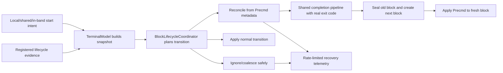

# Terminal Lifecycle Transition Recovery — Tech Spec

Linear: [REMOTE-1973](https://linear.app/warpdotdev/issue/REMOTE-1973)

## Behavioral guarantees

- Correctly ordered lifecycle events retain their existing user-visible behavior, block sequence, prompt rendering, exit-code semantics, and downstream notifications.
- Missing, duplicated, stale, or out-of-order lifecycle evidence must not panic, corrupt a finished block or prompt grid, lose preserved command/output, create phantom blocks, repeat once-per-block side effects, or leave Warp permanently stuck in an executing state.
- When completion metadata supplied by `Precmd` permits recovery, Warp preserves the shell-provided exit code and exact next-block identity while applying prompt metadata only to the corresponding fresh prompt block.
- A novel completion is treated as evidence that the active command executed, even when Warp missed submission or `Preexec` evidence.
- Duplicate, colliding, malformed, or otherwise unsupported lifecycle evidence is handled conservatively without overwriting trustworthy state or fabricating completion evidence. In particular, any correlated or prompt-only `Precmd` received after the active block has already reached `AtPrompt` is ignored with diagnostics.
- Version-skewed shared sessions preserve normal prompt flow when possible; a prompt-only or malformed `Precmd` must never complete or advance a block or fall through to the existing unsafe mutation path.

## Context

Warp currently validates that lifecycle hooks come from registered shell sessions, then immediately dispatches them to `TerminalModel`. `TerminalModel` performs model-wide cleanup and delegates block mutations through `BlockList` to the active `Block`. There is no central transition check before a hook mutates the active block or prompt grid:

- [`app/src/terminal/model/ansi/mod.rs (552-609) @ 73858e86`](https://github.com/warpdotdev/warp/blob/73858e86d5aa813907d7f076c14ceb485bcc2c35/app/src/terminal/model/ansi/mod.rs#L552-L609) validates registered sessions and directly dispatches decoded hooks.
- [`app/src/terminal/model/terminal_model.rs (2700-2780) @ 73858e86`](https://github.com/warpdotdev/warp/blob/73858e86d5aa813907d7f076c14ceb485bcc2c35/app/src/terminal/model/terminal_model.rs#L2700-L2780) handles completion, prompt-ready, and execution-start hooks, including alt-screen/controller-facing side effects.
- [`app/src/terminal/model/blocks.rs (3715-3795) @ 73858e86`](https://github.com/warpdotdev/warp/blob/73858e86d5aa813907d7f076c14ceb485bcc2c35/app/src/terminal/model/blocks.rs#L3715-L3795) finalizes/advances blocks and applies prompt metadata.
- [`app/src/terminal/model/block.rs (3329-3400) @ 73858e86`](https://github.com/warpdotdev/warp/blob/73858e86d5aa813907d7f076c14ceb485bcc2c35/app/src/terminal/model/block.rs#L3329-L3400) reparses prompt grids and mutates block lifecycle state.

Command starts enter the model through a separate path:

- [`app/src/terminal/model/terminal_model.rs (1639-1695) @ 73858e86`](https://github.com/warpdotdev/warp/blob/73858e86d5aa813907d7f076c14ceb485bcc2c35/app/src/terminal/model/terminal_model.rs#L1639-L1695) starts local, shared-session, environment-collection, and AI-associated commands without returning an acceptance disposition.
- [`app/src/terminal/model/blocks.rs (2801-2840) @ 73858e86`](https://github.com/warpdotdev/warp/blob/73858e86d5aa813907d7f076c14ceb485bcc2c35/app/src/terminal/model/blocks.rs#L2801-L2840) caches prompt state and starts normal/in-band blocks.
- [`app/src/terminal/writeable_pty/pty_controller.rs (492-610) @ 73858e86`](https://github.com/warpdotdev/warp/blob/73858e86d5aa813907d7f076c14ceb485bcc2c35/app/src/terminal/writeable_pty/pty_controller.rs#L492-L610) attaches start state and writes queued commands.

Completion is currently represented as an always-present exit code. `Block::finish` seals grids, stores the exit code, changes block state, and emits `BlockCompleted`; `BlockList` separately advances to the next block and later emits `AfterBlockCompleted` from `Precmd`:

- [`app/src/terminal/model/block.rs (1560-1620) @ 73858e86`](https://github.com/warpdotdev/warp/blob/73858e86d5aa813907d7f076c14ceb485bcc2c35/app/src/terminal/model/block.rs#L1560-L1620) stores a concrete exit code and emits completion.
- [`app/src/terminal/model/blocks.rs (2975-3055) @ 73858e86`](https://github.com/warpdotdev/warp/blob/73858e86d5aa813907d7f076c14ceb485bcc2c35/app/src/terminal/model/blocks.rs#L2975-L3055) advances the block list and handles background/bootstrap state.
- [`app/src/terminal/model/block/serialized_block.rs (160-365) @ 73858e86`](https://github.com/warpdotdev/warp/blob/73858e86d5aa813907d7f076c14ceb485bcc2c35/app/src/terminal/model/block/serialized_block.rs#L160-L365) serializes completed block state.

Shared sessions send ordered lifecycle events separately from raw PTY bytes. The sharer emits the completion's next-block identity while parsing the hook and sends the raw PTY chunk afterward, but the viewer currently does not use the ordered completion event to coordinate raw-hook recovery:

- [`app/src/terminal/model/terminal_model.rs (3010-3050) @ 73858e86`](https://github.com/warpdotdev/warp/blob/73858e86d5aa813907d7f076c14ceb485bcc2c35/app/src/terminal/model/terminal_model.rs#L3010-L3050) sends raw PTY bytes after processing a chunk.
- [`app/src/terminal/shared_session/sharer/network.rs (1518-1595) @ 73858e86`](https://github.com/warpdotdev/warp/blob/73858e86d5aa813907d7f076c14ceb485bcc2c35/app/src/terminal/shared_session/sharer/network.rs#L1518-L1595) preserves ordered event delivery.
- [`app/src/terminal/shared_session/viewer/event_loop.rs (180-305) @ 73858e86`](https://github.com/warpdotdev/warp/blob/73858e86d5aa813907d7f076c14ceb485bcc2c35/app/src/terminal/shared_session/viewer/event_loop.rs#L180-L305) applies shared events and PTY bytes.

Every supported shell already captures the previous command's exit code at the beginning of the same shell function that emits `CommandFinished` and then `Precmd`: [`zsh_body.sh:301 @ 73858e86`](https://github.com/warpdotdev/warp/blob/73858e86d5aa813907d7f076c14ceb485bcc2c35/app/assets/bundled/bootstrap/zsh_body.sh#L301), [`bash_body.sh:432 @ 73858e86`](https://github.com/warpdotdev/warp/blob/73858e86d5aa813907d7f076c14ceb485bcc2c35/app/assets/bundled/bootstrap/bash_body.sh#L432), [`fish.sh:267 @ 73858e86`](https://github.com/warpdotdev/warp/blob/73858e86d5aa813907d7f076c14ceb485bcc2c35/app/assets/bundled/bootstrap/fish.sh#L267), and [`pwsh.ps1:442 @ 73858e86`](https://github.com/warpdotdev/warp/blob/73858e86d5aa813907d7f076c14ceb485bcc2c35/app/assets/bundled/bootstrap/pwsh.ps1#L442). The same function also allocates the next block ID. Repeating both values in `Precmd` lets it reconcile a lost `CommandFinished` without inventing an exit code or block identity.

The existing cursor-clamping changes remain defense in depth. This spec adds completion metadata shared by `CommandFinished` and `Precmd` to the existing shell protocol; a fuller prompt-cycle identity, enforceable frozen-grid semantics, and PTY-reader teardown remain follow-ups.

## Proposed changes

### 1. Add a private block-lifecycle module owned by `TerminalModel`

Declare a private `mod lifecycle;` from `app/src/terminal/model/mod.rs`. This is an ordinary Rust helper module, not a WarpUI entity or model. Keep its API private to `terminal::model`, exposing only the `pub(super)` types and entry points needed by `TerminalModel`.

Organize new lifecycle code under `app/src/terminal/model/lifecycle/`:

- `mod.rs` is the small internal facade and owns `BlockLifecycleCoordinator`.
- `transition.rs` owns the pure phase/input/snapshot/action types and exhaustive transition planner.
- `telemetry.rs` owns recovery records and per-terminal rate limiting.
- `mod_test.rs` owns the table-driven transition and rate-limiting tests.

`TerminalModel` owns one `BlockLifecycleCoordinator` because it is the existing layer that observes local/shared/in-band command starts, every lifecycle hook, alt-screen and bracketed-paste cleanup, handler-event emission, shared-session ordering, scrollback loading, and terminal exit. Keep changes in `terminal_model.rs` to thin integration: gather live evidence, call the lifecycle facade, and execute the returned action through small application helpers.

`BlockList` and `Block` expose recovery-capable mutation primitives, but they do not decide whether a lifecycle transition is valid. All production command starts and lifecycle hooks must be planned by the coordinator before those primitives run.

The private lifecycle module owns these core types:

- `LifecyclePhase`: `AwaitingPrecmd`, `AtPrompt`, `Submitted`, `Executing`, `Unknown`, and `Terminated`.
- `CommandStartKind`: distinguishes user/queued/shared-session, in-band, and bootstrap starts.
- `NextBlockIdDisposition`: `Novel`, `ActiveDuplicate`, or `ExistingCollision`.
- `PreexecObservation`: classifies whether a repeated execution-start command agrees with the active command without retaining command text.
- `LifecycleInput`: payload-light evidence for `StartCommand`, `Preexec`, `CommandFinished`, `PrecmdWithCompletionMetadata`, `PromptOnlyPrecmd`, `InitShell`, and terminal exit.
- `LifecycleSnapshot`: immutable live evidence including active block ID/session, block state, started/finished/received-`Precmd`/in-band flags, bootstrap stage, alt-screen state, and hook session.
- `LifecycleAction`: exhaustive planned operations: `StartActiveBlock`, `ApplyPreexec`, `AcceptCommandFinished`, `ReconcileCompletionThenApplyPrecmd`, `ApplyPrecmd`, `BeginEpoch`, `Terminate`, and `Ignore`.
- `LifecycleTransition`: previous phase, next phase, action, and optional recovery record.
- `LifecycleRecoveryRecord`: structured non-UGC diagnostic data for a non-normal transition, including whether completion evidence came from `CommandFinished` or `Precmd`.
- `BlockLifecycleCoordinator`: current phase, lifecycle epoch, and per-terminal transition rate limiter.
- `StartCommandOutcome`: `Accepted`, `Coalesced`, `RejectedExecuting`, or `IgnoredTerminated`.

Planning is a pure exhaustive match over phase, snapshot, and input. `TerminalModel` applies the planned action and commits the next phase only after the action succeeds. Before each plan, the coordinator reconciles its phase with the live snapshot; an impossible combination degrades to `Unknown` and recovers from the incoming evidence.

Completion identity is evaluated before the phase-specific matrix:

- `CommandFinished` with a next block ID equal to the active block is a duplicate and is ignored.
- `Precmd` with a next block ID equal to the active block applies prompt metadata only when the block is fresh and awaiting its first prompt. If the active block already received `Precmd`, ignore the repeated evidence. If its exit code disagrees with the already-completed previous block, record the mismatch without re-finishing or overwriting the block.
- Completion metadata whose next block ID belongs to a non-active existing block is stale/colliding and is ignored.
- Completion metadata with a novel next block ID treats an unfinished active block as having executed and completes it using the provided exit code, or advances past an already-finished active block without re-finishing it. Completion evidence is sufficient to choose `DoneWithExecution` even when Warp did not observe submission or `Preexec`. It creates that exact next block and—when the evidence came from `Precmd`—applies prompt metadata to it.

The remaining phase-specific policy is:

- `AwaitingPrecmd`: `StartCommand` or `Preexec` accepts the new command and records the missing prompt.
- `AtPrompt`: `StartCommand` and missing-local-start `Preexec` are accepted.
- `Submitted`: repeated `StartCommand` coalesces and `Preexec` executes normally.
- `Executing`: `StartCommand` is rejected before bytes are written. Repeated `Preexec` is ignored, with a differing command recorded separately.
- `Unknown`: `StartCommand` establishes `Submitted`; `Preexec` ensures start and establishes `Executing`; completion metadata supplied by `Precmd` reconciles block identity before applying the phase result.
- `Terminated`: ignore all command lifecycle inputs.

`TerminalModel::new_internal`, restored/imported state, and shared-session scrollback begin at `Unknown`. `InitShell` starts a new epoch and moves to bootstrap `Submitted` after the bootstrap block exists. `Bootstrapped` changes metadata only. Terminal exit moves to `Terminated`.

### 2. Share flattened completion metadata between `CommandFinished` and `Precmd`

Define `CompletionMetadata` in `app/src/terminal/model/ansi/dcs_hooks.rs`:

```rust
pub struct CompletionMetadata {
    pub exit_code: ExitCode,
    pub next_block_id: BlockId,
}
```

The current `PrecmdValue` is also constructed internally for session restoration and tests, where no command-completion evidence exists. Split its existing prompt/session/in-band fields into a reusable `PromptMetadata` struct, retaining their current field-level serde attributes and default behavior:

```rust
pub struct PromptMetadata {
    pub pwd: Option<String>,
    pub ps1: Option<String>,
    pub ps1_is_encoded: Option<bool>,
    pub honor_ps1: Option<bool>,
    pub rprompt: Option<String>,
    pub git_head: Option<String>,
    pub git_branch: Option<String>,
    pub virtual_env: Option<String>,
    pub conda_env: Option<String>,
    pub node_version: Option<String>,
    pub kube_config: Option<String>,
    pub session_id: HookSessionId,
    pub is_after_in_band_command: bool,
}
```

The ANSI parser constructs full canonical `PrecmdValue` for hooks with completion metadata, and `TerminalModel` is the only lifecycle layer that consumes it. `BlockList`, `Block`, `HeaderGrid`, cached in-band prompt data, and restoration paths consume only `PromptMetadata`. Update hook session extraction to read `PrecmdValue.prompt_metadata.session_id`.

Embed `CompletionMetadata` non-optionally in both hook payloads and flatten both components of `PrecmdValue`:

```rust
pub struct CommandFinishedValue {
    #[serde(flatten)]
    pub completion_metadata: CompletionMetadata,
    #[serde(default)]
    pub session_id: HookSessionId,
}

pub struct PrecmdValue {
    #[serde(flatten)]
    pub completion_metadata: CompletionMetadata,
    #[serde(flatten)]
    pub prompt_metadata: PromptMetadata,
}
```

`#[serde(flatten)]` keeps every JSON field at its current top level. `CommandFinished` retains its existing flat `exit_code` and `next_block_id` fields, while `Precmd` gains the same two top-level fields without nesting its existing prompt fields. Keep `session_id` in `PromptMetadata`, outside `CompletionMetadata`: it belongs to the prompt hook's session semantics, while the shared completion struct represents only command-result and block-identity evidence.

Each shell emitter captures the exit code first, allocates the next block ID into a local variable, and sends the same pair in both hooks. Zsh and Bash currently allocate/increment the next ID inline while constructing `CommandFinished`; move that allocation into a local before sending either hook. Fish and PowerShell already retain equivalent locals.

`CommandFinished` remains the early, low-latency completion signal. `Precmd` is the authoritative reconciliation barrier: when the early event was lost, it supplies the real exit code and exact next block ID needed to perform normal completion exactly once. This design preserves the existing non-optional `Block.exit_code`, serialization, persistence, history, styling, AI results, and downstream result semantics.

Do not derive or apply a meaningful default for incomplete `CompletionMetadata`. `PromptMetadata` may retain `Default` for internal prompt-only construction. Refactor the key-value decoder's current `DProtoHook::default_from_name` plus incremental `populate_field` path for completion-bearing hooks to collect partial completion fields and construct canonical `CompletionMetadata` only after both fields are present. Replace production/test uses of default full `PrecmdValue` or `CommandFinishedValue` with explicit helpers for hooks with completion metadata where necessary.

At the parser boundary, classify both JSON and key-value `Precmd` payloads:

- Both completion fields produce canonical `PrecmdValue`.
- Neither completion field produces a distinct internal prompt-only `Precmd` event carrying only `PromptMetadata`.
- Exactly one completion field is malformed and is rejected.

Keep `CompletionMetadata` non-optional inside canonical `PrecmdValue`. Add a separate prompt-only handler callback for the internal prompt-only event, and extract its registered session from `PromptMetadata.session_id`.

Prompt-only compatibility exists specifically for meaningful client-version skew, primarily a newer shared-session viewer parsing raw PTY hooks from an older sharer. A prompt-only `Precmd` may apply prompt metadata to a fresh block in `AwaitingPrecmd` after an accepted `CommandFinished`. In `AtPrompt`, `Submitted`, `Executing`, or `Unknown`, it is ignored with diagnostics because it cannot prove completion, identify the next block, or safely identify prompt content that should be replaced. It never completes or advances a block. This preserves normal cross-version prompt flow without attempting to emulate unsafe older behavior during the rare overlap of version skew and an exceptional lifecycle sequence.

Keep `HandlerEvent::Precmd` as a normal once-per-block prompt event. Ignored repeated `Precmd` evidence must not emit another downstream prompt event.

### 3. Centralize lifecycle application in `TerminalModel`

Add private helpers near the ANSI handler implementation:

- `lifecycle_snapshot` constructs live evidence.
- `plan_lifecycle_transition` asks the coordinator for an action.
- `apply_lifecycle_transition` exhaustively executes the action, emits recovery diagnostics, and commits the next phase.
- `complete_command` is the only finalization pipeline and consumes `CompletionMetadata` from either hook.
- `apply_precmd_to_fresh_block` passes only `PromptMetadata` into the normal prompt-ready path.

Rewrite `TerminalModel`'s `command_finished`, `precmd_with_completion_metadata`, `prompt_only_precmd`, and `preexec` handlers to plan before mutation. Accepted lifecycle hooks always target `BlockList` rather than using `delegate!`, even when the alternate screen is active; unrelated ANSI behavior continues using existing delegation.

`complete_command` performs shared completion behavior whether the first accepted evidence came from `CommandFinished` or `Precmd`:

1. Unset bracketed paste and exit the alternate screen.
2. Capture command type, bootstrap stage, in-band state, and the next block ID.
3. If the unfinished active block is not executing, move it through a minimal preexec-equivalent execution transition without replacing its command text, so `Block::finish` produces `DoneWithExecution`.
4. Complete/advance the block list through one primitive.
5. Emit the ordered shared-session completion event.
6. Emit `HandlerEvent::CommandFinished` so controller state clears.

When `Precmd.completion_metadata.next_block_id` is novel, run `complete_command` with its real completion metadata, then apply the received prompt metadata to the newly created block. When its next block ID is already active, apply the prompt only if the active block is still awaiting its first prompt; otherwise ignore the repeated evidence without completing or mutating prompt state. This ordering prevents the received prompt from touching the completed block.

Change all `TerminalModel::start_command_execution*` variants to return `StartCommandOutcome`. Attach AI/environment/shared metadata, emit ordered shared-session start events, set controller executing state, and write PTY bytes only for `Accepted`. Route the in-band before-write callback through a lifecycle-aware `TerminalModel::start_in_band_command_execution` instead of calling `BlockList::start_active_block_for_in_band_command` directly.

### 4. Add focused `BlockList` and `Block` primitives

Replace `BlockList::finalize_block_and_advance_list(CommandFinishedValue)` with `complete_active_block_and_advance(CompletionMetadata)`. This primitive preserves existing bootstrap progression, background-block finalization, selection/height changes, in-band decrement, latest-finish timing, and next-block creation regardless of which hook supplied the completion metadata.

Add:

- `classify_next_block_id` for the global duplicate/collision rule.
- `ensure_active_block_started(CommandStartKind)` for missing-start/`Preexec` recovery while preserving prompt caching and early-output reset.
- `ensure_active_block_executing_for_completion` for the minimal preexec-equivalent transition required before completing a submitted/unknown unfinished block as `DoneWithExecution`.
- `advance_from_finished_active` for a novel completion that must not finish the old block twice.
- `apply_precmd_to_active(PromptMetadata)` for the normal once-per-block path, including cached populated in-band prompt-metadata substitution.

Do not add prompt-refresh mutation primitives for repeated `Precmd`. Once the active block has reached `AtPrompt`, retaining its existing prompt, context, command/input content, and cursor position is safer than attempting to identify and replace a possibly stale prompt region.

Keep `ansi::Handler::precmd_with_completion_metadata(PrecmdValue)` as the callback for a `Precmd` with completion metadata and add `prompt_only_precmd` for the internal prompt-only event; stop delegating either below `TerminalModel`. Add direct `PromptMetadata`-accepting helpers for `BlockList`, `Block`, and `HeaderGrid`; change `BlockList`'s cached/last-populated prompt payloads and session-restoration construction to use `PromptMetadata`. Completion metadata is consumed and removed at the `TerminalModel` lifecycle boundary before prompt metadata reaches block mutation code.

Keep `Block::preexec`'s defensive start fallback, but production recovery calls `BlockList::ensure_active_block_started` first so prompt caching and early-output reset occur.

### 5. Reconcile shared sessions from raw hooks with completion metadata

The shell-generated completion metadata travels in both raw hooks, so sharers and viewers parse the same real exit code and next block ID. A viewer that accepts `CommandFinished` first advances normally; a viewer that misses it can reconcile from the subsequent raw `Precmd` without generating an ID or consulting an ordered-event hint.

Keep `OrderedTerminalEventType::CommandExecutionFinished` as the existing low-latency shared-session signal. It no longer needs to provide a recovery hint. A raw `Precmd` with completion metadata remains authoritative for exact reconciliation on both sharer and viewer.

Meaningful sharer/viewer version skew can still diverge during exceptional sequences: an old viewer cannot use a new sharer's additional `Precmd` fields, and a new viewer cannot recover from an old sharer's prompt-only `Precmd` if `CommandFinished` was also lost. Accept this rare overlap rather than reproducing unsafe old behavior. The prompt-only path preserves normal old-sharer/new-viewer prompt application.

Reduce the old-sharer population before relying on `Precmd` completion metadata in production: ship the protocol-only emitter/parser change to stable as soon as possible, then allow two additional stable releases to ship before enabling state-mutating lifecycle recovery in production. The remaining implementation may merge and recovery may be enabled for dev/dogfood during this compatibility soak.

Loading or appending shared-session scrollback resets the coordinator to `Unknown` so later completion metadata re-establishes the phase. No serialized block, persistence, history, AI-result, or shared-session result schema changes are required.

### 6. Add structured, rate-limited lifecycle telemetry

Implement the feature-specific event in `app/src/terminal/model/lifecycle/telemetry.rs` rather than adding a large global telemetry variant. Add an internal `Event::LifecycleRecovery(LifecycleRecoveryRecord)`; `ModelEventDispatcher`, which owns `ModelContext`, sends the feature telemetry without exposing a new public `ModelEvent`.

Rate-limit per terminal and `(previous phase, input kind, recovery action)` pair. Emit the first event immediately, then at most once per minute with a suppressed-repeat count.

Record phase, input kind, recovery action, active/hook session IDs, active and supplied next block IDs, bootstrap/in-band/start/precmd/preexec evidence, and whether completion evidence came from `CommandFinished` or `Precmd`. Never record command text, output, PS1, CWD, or other UGC.

### 7. Use one lifecycle pipeline and feature-flag only abnormal recovery

Add `FeatureFlag::TerminalLifecycleRecovery` in `crates/warp_features/src/lib.rs`. Enable it only for dev/dogfood during the two-release compatibility soak; leave it disabled in production.

Do not maintain separate old and new lifecycle-mutation pipelines. Route every lifecycle input through `BlockLifecycleCoordinator` and the shared completion/prompt application helpers unconditionally. Normal transitions, duplicate/collision rejection, and the rule that unsupported evidence never reaches the old unsafe mutation path are always enabled.

Use `TerminalLifecycleRecovery` only when the coordinator selects a non-normal recovery action that would mutate state for a sequence Warp previously mishandled, such as completing from a `Precmd` with completion metadata. When the flag is disabled, keep the same coordinator and diagnostics but conservatively ignore that recovery action. This keeps the flag localized to action selection rather than duplicating lifecycle logic. Ship the protocol-only first slice to stable as soon as possible. The remaining implementation and dev/dogfood enablement may merge during the compatibility soak, but production recovery remains disabled until two additional stable releases have shipped with `Precmd` completion metadata. Leave recovery actions dogfood-only for at least one full week before the human DRI considers production enablement; production promotion and eventual flag removal are not implementation slices in this spec.

Deliver in sequential reviewable slices:

1. Update all shell emitters to send the same completion pair in both hooks, without restructuring the Rust hook value structs or changing block behavior.
2. Add flattened `CompletionMetadata`, split reusable `PromptMetadata` from the wire `PrecmdValue`, classify `WithCompletionMetadata`/`PromptOnly`/malformed `Precmd`, and add protocol serialization/parsing tests without changing block behavior.
3. Centralize normal lifecycle mutations behind focused `TerminalModel`, `BlockList`, and `Block` helpers with normal-flow parity.
4. Add `BlockLifecycleCoordinator`, telemetry, phase reconciliation, start rejection/coalescing, and unconditional safety rules; keep state-mutating recovery disabled.
5. Add conservative repeated-`Precmd` no-op handling and safe prompt-only handling.
6. Add completion reconciliation from `Precmd` with completion metadata and shared-session recovery; gate state-mutating non-normal recovery actions behind `TerminalLifecycleRecovery`.
7. Enable recovery actions for dev/dogfood while keeping them disabled in production.

## End-to-end flow



## Testing and validation

### Pure transition matrix

Add `app/src/terminal/model/lifecycle/mod_test.rs` with table-driven coverage for every `(LifecyclePhase, LifecycleInput)` pair. Assert action, next phase, recovery classification, next-block-ID handling from `Precmd` completion metadata, duplicate/collision handling, `Unknown` snapshot reconciliation, `InitShell` epoch reset, `Terminated` absorption, and rate limiting.

The full matrix must be visible in test cases so a policy change is an explicit review decision.

### Model integration

Add `TerminalModel` regression coverage for:

- Normal command flow with `Preexec`, `CommandFinished`, and `Precmd`.
- Missing local start and missing prompt metadata.
- Missing-`CommandFinished` recovery from a `Precmd` with completion metadata, including real exit-code preservation and fresh-block prompt application.
- Completion from `CommandFinished` without observed `Preexec` in submitted, unknown, and otherwise-normal flows, including the minimal execution transition and conservative `DoneWithExecution` result.
- Repeated/differing `Preexec`, same-ID and novel-ID `Precmd`, repeated start, and start while executing.
- Duplicate/colliding/novel completion from every phase.
- Restored/unknown state, bootstrap/subshell epochs, registered session switches, and ignored hooks after exit.
- In-band completion and cached prompt payload reuse.

Update `out_of_order_precmd_pty_hook_cannot_restore_cursor_outside_finished_header_grid` to assert that recovery seals the old block once with the real exit code supplied by `Precmd`, creates the specified fresh block, applies prompt metadata only to the fresh block, and does not panic.

Capture terminal and handler events to assert exact side effects: one `BlockCompleted`, one `AfterBlockCompleted`, one `BlockMetadataReceived` for the fresh block, one command-finished handler event, one prompt handler event, alt-screen/bracketed-paste cleanup, background finalization, and in-band decrement. Repeated correlated and prompt-only `Precmd` must leave the active prompt, context, current command/input content, and cursor position unchanged and emit none of the once-per-block events.

### Controller, shell protocol, and sharing

- Add `PtyController` tests proving rejected/coalesced starts do not write bytes or leave executing state stuck.
- Add `CompletionMetadata` serde tests proving both hook payloads use the same flat JSON keys and reject a payload with only one completion field.
- Add `PromptMetadata` tests proving restoration and prompt-only internal paths never construct or require completion evidence.
- Add key-value decoder tests proving it constructs canonical metadata only when both fields were populated and never supplies default completion evidence.
- Add prompt-only `Precmd` tests proving normal first-prompt application remains compatible after an accepted `CommandFinished`, while repeated prompt-only evidence and prompt-only evidence in `Submitted`, `Executing`, and `Unknown` never mutates, completes, or advances a block.
- Add shell-emitter tests proving zsh, bash, fish, and PowerShell send identical exit-code/next-block-ID pairs in `CommandFinished` and `Precmd`, including in-band commands.
- Add shared-session viewer tests proving a raw `Precmd` with completion metadata reconciles to the shell-specified next block ID without an ordered-event hint.
- Assert normal persistence, history, styling, automation, and AI-result behavior is unchanged because every completed command still has a real exit code.
- Assert telemetry field allowlisting and rate limiting.

### Repository validation

- Run focused `cargo nextest` filters for DCS hooks, block-lifecycle coordinator, terminal model, controller, and shared-session viewer tests.
- Run `cargo check -p warp --lib`.
- Run `./script/format`, then the relevant clippy command from `./script/presubmit`, and `git diff --check` before review.
- Ask the user to manually validate normal/empty/syntax-error commands, an alt-screen command, an in-band command, prompt repaint, subshell/SSH return, shared-session viewing, and an injected missing-`CommandFinished` sequence. Do not use `cargo run` on the user's behalf.

## Parallelization

Do not parallelize the Warp implementation across child agents. The shared hook schema, shell emitters, transition coordinator, common completion pipeline, and handler events must evolve together; parallel worktrees would make it easy for the duplicated shell payloads and Rust reconciliation contract to drift before either path can be validated end to end.

Implement the slices sequentially. Reviewers can still review the protocol/schema foundation separately from recovery behavior through dependent commits, but one owner should integrate and validate the lifecycle semantics end to end.

## Risks and mitigations

- **The two shell-emitted metadata copies could diverge.** Allocate the exit code and next block ID once per shell prompt cycle, reuse them in both messages, and add emitter/parsing tests. Record mismatches when both events arrive.
- **A stale prompt-ready event could be mistaken for completion.** Require a registered session and classify the supplied next block ID before mutation. A next block ID belonging to a non-active existing block is stale and ignored.
- **Ignoring a repeated `Precmd` could discard newer prompt metadata.** Prefer the existing trustworthy `AtPrompt` state over mutating an ambiguous prompt-and-command header. A later prompt cycle will apply fresh metadata normally.
- **Recovery could duplicate lifecycle side effects.** `CommandFinished` and `Precmd` with completion metadata share one completion pipeline; active-ID and existing-ID cases use dedicated no-refinish paths; integration tests assert exact event counts.
- **A feature flag could cause old and new lifecycle paths to drift.** Always use the new coordinator and shared mutation helpers; the flag changes only whether a selected non-normal recovery action is applied or conservatively ignored.
- **Internal prompt-only flows could fabricate completion evidence.** Restrict full `PrecmdValue` to the parser/`TerminalModel` boundary and use `PromptMetadata` for block mutation, prompt caching, restoration, and prompt-only tests.
- **Incomplete key-value hooks could appear valid through defaults.** Never treat defaulted `CompletionMetadata` as evidence; the decoder/builder must require both completion fields together.
- **Sharer/viewer block sequences could diverge.** Both parse the same raw shell-generated next block ID from `Precmd` completion metadata; neither generates a recovery ID.
- **Client-version skew could still diverge during an exceptional sequence.** Preserve normal prompt application for a new viewer of an old sharer, but never let prompt-only evidence complete or advance a block. Accept the rare exceptional divergence rather than emulating unsafe old behavior.
- **Too many old sharers could limit recovery from `Precmd` completion metadata.** Ship the protocol-only change to stable first and wait through two additional stable releases before enabling recovery actions in production, reducing the active old-sharer population before production Warp relies on the new evidence.
- **Unexpected transition volume could hide a producer regression.** Dogfood rollout and rate-limited structured telemetry provide visibility before broader enablement.

## Follow-ups

- Add a finished-block or prompt-cycle identity if the next-block identity proves insufficient to reject all stale hooks.
- Enforce explicit receiving/frozen content states for prompt/output grids.
- Make PTY-reader teardown panic-safe and separate abnormal model sealing from normal completion.
- Remove `TerminalLifecycleRecovery` after stable release rollout.
