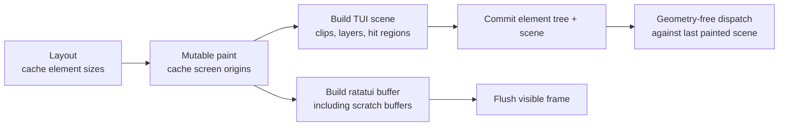

# TUI retained geometry and hit scene — Tech Spec

Branch: `harry/fix-hoverable-hit-box`.

Base: [`origin/master` at `d459702`](https://github.com/warpdotdev/warp/tree/d45970299fb02c8c9295ca766d4cd86530066458).

Research snapshot: [`eba8ef7`](https://github.com/warpdotdev/warp/tree/eba8ef71648f49028052e7a8dfc7803900ee4b82).

## Context

TUI event dispatch currently passes an `area` from the root through every parent to every child. Layout has already measured the tree, so dispatch does not repeat measurement; it repeats the arrangement walk using cached child sizes. `TuiFlex`, for example, caches `child_sizes` during layout and reconstructs child rectangles during render, cursor lookup, and dispatch ([`flex.rs:253-424 @ eba8ef7`](https://github.com/warpdotdev/warp/blob/eba8ef71648f49028052e7a8dfc7803900ee4b82/crates/warpui_core/src/elements/tui/flex.rs#L253-L424)). `TuiViewportedList` similarly reconstructs each visible item slot for all three operations ([`viewported_list.rs:338-401 @ eba8ef7`](https://github.com/warpdotdev/warp/blob/eba8ef71648f49028052e7a8dfc7803900ee4b82/crates/warpui_core/src/elements/tui/viewported_list.rs#L338-L401)).

The reported bug exposes the weakness of making the dispatched area the element's geometry. A start-aligned flex child is measured to its content width but is rendered and dispatched with the full cross-axis slot ([`flex.rs:213-243 @ eba8ef7`](https://github.com/warpdotdev/warp/blob/eba8ef71648f49028052e7a8dfc7803900ee4b82/crates/warpui_core/src/elements/tui/flex.rs#L213-L243)). Consequently, the collapsible thinking header's `TuiHoverable` treats blank columns after the text and chevron as part of its target. The branch currently compensates by caching the hoverable child's last measured size and intersecting it with the parent-provided area ([`hoverable.rs:44-178 @ eba8ef7`](https://github.com/warpdotdev/warp/blob/eba8ef71648f49028052e7a8dfc7803900ee4b82/crates/warpui_core/src/elements/tui/hoverable.rs#L44-L178)). That fixes this element but leaves retained geometry as a `TuiHoverable` special case and still requires parents to reconstruct and forward correct placement.

The GUI framework already has the desired contract:

- `Element::layout` establishes size, mutable `paint` establishes origin, and `size`/`origin` expose retained geometry.
- `Element::dispatch_event` receives no geometry; events are structurally broadcast and each interactive element decides whether the event applies.
- `Scene::visible_rect` applies active clipping, while `Scene::is_covered` checks hit records on higher normal or overlay layers.
- Paint primitives and explicit surfaces record hit regions; structural wrappers do not become opaque merely because they participate in layout.

See [`elements/gui/mod.rs:106-179 @ eba8ef7`](https://github.com/warpdotdev/warp/blob/eba8ef71648f49028052e7a8dfc7803900ee4b82/crates/warpui_core/src/elements/gui/mod.rs#L106-L179), [`elements/gui/hoverable.rs:405-431 @ eba8ef7`](https://github.com/warpdotdev/warp/blob/eba8ef71648f49028052e7a8dfc7803900ee4b82/crates/warpui_core/src/elements/gui/hoverable.rs#L405-L431), and [`scene.rs:416-505 @ eba8ef7`](https://github.com/warpdotdev/warp/blob/eba8ef71648f49028052e7a8dfc7803900ee4b82/crates/warpui_core/src/scene.rs#L416-L505).

The TUI implementation will adopt that model. Elements use signed absolute terminal-space coordinates for placement, retained geometry, and child composition. Ratatui's unsigned buffer-local coordinates are a private paint-backend detail: `TuiPaintSurface` maps absolute positions into whichever buffer it owns. `TuiClipped` renders a complete child into a temporary ratatui buffer rooted at `(0, 0)` and copies only the visible rows into the destination buffer ([`clipped.rs:61-139 @ eba8ef7`](https://github.com/warpdotdev/warp/blob/eba8ef71648f49028052e7a8dfc7803900ee4b82/crates/warpui_core/src/elements/tui/clipped.rs#L61-L139)); its scratch surface privately maps the child's unchanged absolute origin to that local buffer origin.

## End-to-end flow



Pointer input always targets the last completely painted element tree and scene—the geometry represented by the visible frame. A terminal resize schedules a new draw; dispatch does not combine the new terminal size with measurements from the previous frame and does not synchronously lay out or paint.

## Proposed changes

### Retained TUI geometry

Add signed, cell-based screen and scene geometry alongside ratatui's private unsigned buffer geometry:

- `TuiScreenPosition`: signed absolute terminal-space `x`/`y`, used for element placement.
- `TuiScreenPoint`: a `TuiScreenPosition` plus `TuiZIndex`, used for retained scene geometry.
- `TuiScreenRect`: signed origin plus `TuiSize`, with intersection and point-containment helpers.
- `TuiZIndex`: normal and overlay layer indices, matching GUI `ZIndex`.
- `TuiClipBounds`: active layer, explicit bound, active-layer intersection, or unbounded, matching GUI `ClipBounds`.

Pointer events remain unsigned terminal positions because crossterm only reports visible cells. Converting a pointer position to signed scene coordinates is lossless. Signed origins are required for logical content above or left of a viewport; clipping converts those logical bounds into visible terminal bounds.

Update `TuiElement` in [`elements/tui/mod.rs:169-256 @ eba8ef7`](https://github.com/warpdotdev/warp/blob/eba8ef71648f49028052e7a8dfc7803900ee4b82/crates/warpui_core/src/elements/tui/mod.rs#L169-L256) to mirror GUI:

```rust
pub trait TuiElement {
    fn layout(
        &mut self,
        constraint: TuiConstraint,
        ctx: &mut TuiLayoutContext,
        app: &AppContext,
    ) -> TuiSize;

    fn render(
        &mut self,
        origin: TuiScreenPosition,
        surface: &mut TuiPaintSurface<'_>,
        ctx: &mut TuiPaintContext,
    );

    fn size(&self) -> Option<TuiSize>;

    fn origin(&self) -> Option<TuiScreenPoint>;

    fn bounds(&self) -> Option<TuiScreenRect> {
        TuiScreenRect::from_origin_and_size(self.origin()?, self.size()?)
    }


    fn present(&mut self, ctx: &mut TuiPresentationContext<'_>) {}

    fn dispatch_event(
        &mut self,
        event: &TuiEvent,
        ctx: &mut TuiEventContext,
        app: &AppContext,
    ) -> bool;
}
```

The `origin` render parameter is always signed absolute terminal space. An element that retains geometry obtains its `TuiScreenPoint` by attaching the active scene z-index through `TuiPaintContext`; parents derive absolute child origins by adding their retained layout offsets. Elements never receive a raw ratatui buffer or buffer-local origin.

Every concrete element must retain or delegate its measured size. Elements that own a visual or interaction boundary retain their screen origin during paint. Transparent wrappers may delegate `size` and `origin` when their geometry is exactly their child's, matching GUI wrapper behavior.

Geometry is absent before the first successful layout and paint. Pointer hit-testing fails closed when `size`, `origin`, or the retained scene is unavailable; it never falls back to the root or parent area.

The hardware terminal cursor is paint output, matching GUI editor cursors that are drawn into `Scene`. Cursor-owning leaves submit a `TuiScreenPoint` through `TuiPaintContext::set_terminal_cursor` during render; structural elements expose no cursor API and perform no cursor delegation. The paint context prefers submissions from higher layers and later submissions at the same layer. After paint, the presenter accepts the submitted cursor only when its point is inside that scene layer's clip and is not covered by a higher opaque layer, then converts the visible nonnegative coordinate to the frame's `(u16, u16)` cursor.

The existing `present` pass remains between layout and paint. It is geometry-independent and continues to build child-view embeddings through `TuiPresentationContext`, which are reported to `AppContext` for focus ancestry and responder-chain propagation. It is not folded into mutable paint.

### Paint context and paint surfaces

Extend `TuiPaintContext` in [`elements/tui/mod.rs:105-167 @ eba8ef7`](https://github.com/warpdotdev/warp/blob/eba8ef71648f49028052e7a8dfc7803900ee4b82/crates/warpui_core/src/elements/tui/mod.rs#L105-L167) with:

- a mutable `TuiScene`;
- helpers that attach the active z-index to an absolute screen position;
- scoped push/pop helpers for scene layers;
- paint-time hardware cursor submission;
- the existing child-view map and repaint deadline.

Add `TuiPaintSurface`, which temporarily borrows one ratatui buffer and privately retains the mapping from an absolute screen origin to that buffer's unsigned local origin. Its public paint operations accept only absolute positions and sizes:

- render a ratatui widget within absolute bounds;
- apply a style to absolute bounds;
- read or write a cell at an absolute position;
- copy cells from a completed scratch buffer into absolute destination positions.

The surface performs checked conversion at the write boundary. Positions not representable in the active buffer return no cell or skip the paint operation; they never saturate or clamp into a different valid cell. Whole-rectangle widget operations require their mapped bounds to fit the active buffer, while per-cell and style operations intersect with the buffer's addressable area.

At the root, absolute terminal `(0, 0)` maps to buffer `(0, 0)`. Normal containers pass absolute child origins. Elements performing only structural composition never convert coordinates.

`TuiClipped` keeps its current scratch-buffer rendering strategy:

1. Cache the viewport's absolute screen origin and start a scene layer clipped to its visible bounds.
2. Allocate the full logical child scratch buffer at local `(0, 0)`.
3. Derive the child's absolute logical origin by offsetting the viewport origin upward by `viewport_origin_y`.
4. Create a scratch `TuiPaintSurface` mapping that same absolute child origin to scratch `(0, 0)`, then pass the unchanged absolute origin to the child. Child origins and hit records therefore need no coordinate conversion and are clipped by the scene layer.
5. Copy the visible scratch rows into the destination surface.
6. Drop the scratch surface and pop the scene layer.

Layer helpers must restore state through scoped guards or closure-based APIs, including early returns. A scratch surface's buffer borrow and mapping cannot outlive the scratch buffer.

This separates two concerns:

- element placement, retained geometry, and hit testing always use signed absolute terminal-space coordinates;
- ratatui buffer coordinates remain unsigned, local to one render target, and private to `TuiPaintSurface`.

Scene clipping does not proxy or intercept ratatui buffer writes. Outside `TuiClipped`, the layout invariant guarantees that each retained element size fits its parent constraint and destination surface. Every element paints the exact absolute rectangle formed from `origin + size()`. `TuiClipped` allocates a scratch buffer large enough for both the child's retained logical size and the visible viewport before painting it. Elements that perform manual cell writes use the surface's checked absolute cell API.

### TUI hit scene

Add a TUI-specific retained scene under `crates/warpui_core/src/elements/tui/`. It mirrors the GUI scene's input semantics without taking over terminal rendering:

- ordered normal and overlay layers;
- an active-layer stack;
- a clip bound and click-through flag per layer;
- clipped rectangular hit records;
- `visible_rect(origin, size)`;
- `is_covered(point)`;
- `start_layer`, `start_overlay_layer`, `set_active_layer_click_through`, and `stop_layer`.

Hit records are coarse layout/paint rectangles, not individual nonblank terminal cells. This keeps interaction stable across whitespace, animation, wide graphemes, and styling changes.

Recording follows GUI paint semantics:

- a `TuiContainer` records its complete bounds when it has a background or border; a padding-only container does not create occlusion;
- other explicit surfaces such as panels, scrollbars, and overlay backdrops record their painted bounds;
- structural wrappers such as flex, constrained boxes, child views, event handlers, and animation wrappers do not automatically record opaque regions;
- text glyph writes do not independently make an entire layer opaque; an enclosing surface records coverage when the text belongs to an opaque panel;
- intentional pass-through uses the layer click-through flag rather than omission by accident.

The initial implementation may store hit rectangles in a vector because TUI scenes contain cell-scale element counts. The scene API must not expose that representation, allowing an R-tree matching GUI to replace it if profiling shows a need.

### Paint-time origin and child placement

Paint becomes the single top-down placement pass, matching GUI. Parents use cached child sizes to calculate absolute child origins once and call mutable child `render`. Cursor-owning leaves submit the terminal cursor during that pass, and event dispatch consumes retained child origins rather than reconstructing slots.

For `TuiFlex`:

- cache the flex's size during layout and absolute screen origin during paint;
- place each child by adding its retained relative layout offset to the flex's absolute origin;
- start-aligned children keep their measured cross-axis size;
- stretched children fill because layout supplies a tight cross-axis constraint;
- centered and end-aligned children receive the corresponding origin offset;
- full-row visuals or targets must opt into tight/expanded layout instead of inheriting unused slot width.

The content-sized rule fixes the reported bug structurally: the header text and chevron retain their measured width, `TuiHoverable::size` delegates to that child, and blank trailing columns are outside `Hoverable::bounds`.

Other geometry-owning parents apply the same pattern:

- `TuiContainer` caches its own bounds, paints its background and border through the absolute surface API, and paints its child at the absolute origin plus the retained padding/border offset.
- `TuiViewportedList` paints each visible element at its viewport origin; clipping supplies visible bounds.
- `TuiConstrainedBox` and other transparent wrappers delegate geometry when their bounds equal the child's.
- `TuiAnimated` paints its current child mutably and delegates retained geometry.

The branch's `TuiHoverable::laid_out`, `hit_area(area)`, and full-area fallback are removed. The shared slot helpers added to keep dispatch geometry synchronized may remain as paint-only placement helpers, but dispatch must not call them.

Changing start-aligned children from full-slot paint rectangles to retained content bounds can shrink existing backgrounds, borders, dividers, or manually painted rows that implicitly relied on the oversized `area`. Before migration, inventory every `TuiContainer` under a start-aligned flex and every custom `TuiElement::render` that paints from the supplied area rather than its measured result. Each caller must either adopt tight/stretch layout to claim the full row intentionally or remain content-sized. Add visual regression tests for every migrated full-row surface.

### Presenter, scene lifetime, and child views

Extend `TuiPresenter` in [`presenter/tui.rs:73-226 @ eba8ef7`](https://github.com/warpdotdev/warp/blob/eba8ef71648f49028052e7a8dfc7803900ee4b82/crates/warpui_core/src/presenter/tui.rs#L73-L226) to retain the scene produced with `last_element`. Publish the newly painted element tree and scene together only after root layout and paint complete. Replace `last_element_mut` with a dispatch-state API, or borrow the presenter's disjoint element, scene, and child-view-map fields directly, so runtime dispatch cannot obtain an element tree without its paired scene.

Dispatch uses that pair without querying the current terminal size. If no completed scene exists, pointer dispatch returns unhandled.

`TuiChildView` gains retained `size` and `origin`, matching GUI `ChildView` ([`presenter.rs:806-868 @ eba8ef7`](https://github.com/warpdotdev/warp/blob/eba8ef71648f49028052e7a8dfc7803900ee4b82/crates/warpui_core/src/presenter.rs#L806-L868)). Layout caches the embedded view's size. Paint caches the host node's screen origin and paints the registered child through the active `TuiPaintContext`, so the child receives the same transform, clip, and scene. Dispatch still temporarily establishes the child view as the action origin before traversing its retained element subtree.

An updated child view is rendered, laid out, and painted before the new tree/scene pair becomes dispatchable. Dispatch never combines a freshly replaced child element with geometry from its predecessor.

### Geometry-free event context and dispatch

Move dispatch-time access to `rendered_views` and the retained scene into `TuiEventContext`, paralleling GUI `EventContext`. Add:

- `visible_rect(origin, size)`;
- `is_covered(point)`;
- conversion from a terminal event position to a signed element-local point by subtracting the element's retained screen origin;
- a combined visible/uncovered hit-test helper for ordinary press, hover, and wheel eligibility;
- child-view lookup/dispatch;
- the existing notification, typed-action, and origin-view state.

Nested scratch-buffer mappings do not need to be replayed during dispatch: their accumulated translation is already reflected in each element's retained screen origin. Ordinary pointer handling first uses the visible/uncovered hit-test helper, then converts the event position to local coordinates. Pointer-capture paths may use the unbounded signed local conversion after a gesture began inside the element.

Remove `area` and the layout context from `TuiElement::dispatch_event`. The runtime path in [`runtime/mod.rs:109-174 @ eba8ef7`](https://github.com/warpdotdev/warp/blob/eba8ef71648f49028052e7a8dfc7803900ee4b82/crates/warpui_core/src/runtime/mod.rs#L109-L174) constructs the event context from the presenter's last element tree, retained scene, and child-view map.

Dispatch follows GUI structural broadcast:

- parents offer the event to every child and combine handled results;
- each interactive element decides whether a pointer event applies using its bounds, visible scene rectangle, and higher-layer coverage;
- wrappers dispatch to their child before running their own handler;
- the scene supplies geometry and occlusion but does not retain callbacks, element identities, or a second copy of the element tree;
- key events continue through the keymap/responder-chain pass before element-tree dispatch and do not require scene geometry.

`TuiHoverable` mirrors GUI `Hoverable`:

- `size` delegates to its child;
- mutable paint caches its screen origin and the maximum child z-index;
- hover and press/release containment use `visible_rect`;
- higher scene layers suppress hover/click through `is_covered`;
- mouse moves remain non-consuming so every hoverable can update transitions;
- click callbacks remain child-first and preserve press/release pairing.

`TuiScrollable` uses its retained visible bounds and scene coverage for wheel eligibility. `TuiClipped` no longer filters or translates events; its retained scene layer and transformed child origins already encode that result.

`TuiEditorElement` migrates its area-dependent pointer logic explicitly:

- mouse-down and wheel use retained visible/uncovered bounds;
- click positions convert to signed local coordinates before gutter, row, and column calculations;
- an active selection drag continues converting positions outside the bounds, preserving drag-to-scroll behavior;
- mouse-up ends a captured drag even when released outside;
- nested clipping affects initial eligibility but does not cancel an already captured drag.

### Migration sequence

The trait change must land atomically with all production implementations:

1. Inventory full-slot visual dependencies and classify each as intentionally tight/stretch or content-sized.
2. Add signed screen and scene geometry, `TuiScene`, and clip support to `TuiPaintContext`.
3. Add `TuiPaintSurface` and change `TuiElement` render, geometry, presentation, and dispatch APIs; move terminal cursor output to `TuiPaintContext`.
4. Migrate leaf elements to retain size and paint-time origin.
5. Migrate transparent wrappers to delegate geometry and broadcast dispatch.
6. Migrate geometry-owning parents: flex, container, constrained box, viewported list, scrollable, and clipped.
7. Migrate `TuiChildView`, presenter scene retention, and runtime event-context construction.
8. Replace the hoverable workaround and adapt the branch's regression tests to retained geometry.
9. Migrate `warp_tui` implementations, including editor and terminal block elements.

Do not retain an area-passing compatibility dispatch method. A partial migration would permit old and new geometry sources to disagree and would leave the framework contract ambiguous.

## Testing and validation

### Geometry and scene unit tests

- Signed screen rectangles intersect correctly with visible terminal bounds.
- Absolute screen positions map to root and scratch buffer coordinates through `TuiPaintSurface`.
- Invalid or out-of-range absolute writes fail closed rather than clamping into another cell.
- Scene layers intersect active clips correctly.
- Normal and overlay z-order coverage matches GUI semantics.
- Click-through layers do not cover lower targets.
- Hit records are clipped before insertion.
- Missing geometry and a missing scene fail closed for pointer input.

### Element tests

- `TuiFlex` retains content-sized bounds for start alignment and full cross-axis bounds for stretch.
- Center/end alignment changes retained origins without changing measured size.
- `TuiContainer` includes its border/padding in its own bounds and places the child at the retained inner origin.
- `TuiClipped` passes one absolute child origin through retained geometry while its scratch surface maps that origin to local `(0, 0)`, and exposes only the viewport intersection.
- Nested clipped/viewported elements preserve transforms and clips.
- `TuiChildView` retains host and child geometry while preserving action attribution.
- Paint-submitted cursor placement uses retained origins and excludes clipped or covered cursors.
- Existing full-row backgrounds, borders, and dividers preserve their intended visual width through explicit tight/stretch layout.

### Interaction tests

- The collapsible header reacts within the text and chevron but not in trailing row space.
- Hover transitions clear correctly because mouse movement reaches every hoverable.
- Press inside/release outside cancels; press and release inside invokes once.
- An opaque higher normal layer and an overlay layer suppress lower hover/click handlers.
- A click-through overlay allows lower handlers.
- A hoverable directly inside a clipped child is hittable at its visible screen position after scrolling.
- Scroll wheel handling requires visible, uncovered scrollable bounds.
- Editor clicks resolve through screen-to-local coordinates under nested clipping.
- Editor drag selection continues outside visible bounds only after a press began inside.
- Pointer input before the first completed paint is unhandled.
- A resize before repaint continues to target the last painted scene; the next frame replaces it atomically.

### Commands

- `cargo nextest run -p warpui_core --features tui`
- `cargo nextest run -p warp_tui`
- `cargo check -p warpui_core --features tui`
- `cargo check -p warp_tui`
- `./script/format`
- Run the clippy command selected by `./script/presubmit` for the affected workspace targets.

## Risks and mitigations

- **Surface/screen mapping drift:** construct each `TuiPaintSurface` with an explicit absolute-to-buffer anchor, keep conversion private, and use checked non-saturating conversion. Cover nested clipping, negative logical origins, and nonzero root origins in tests.
- **Screen/local input drift:** centralize inverse coordinate conversion on `TuiEventContext`; test editor clicks and captured drags under nested clipping.
- **Unbalanced scene layers:** use scoped helpers and assert root paint restores the layer stack.
- **Stale element/scene pairs:** publish them together after paint; dispatch never reads current terminal dimensions or newly rendered-but-unpainted child trees.
- **Unexpected event fan-out:** mirror GUI child-before-parent behavior and add overlap tests for handlers that return `true`.
- **Over-recorded occlusion:** only paint primitives and explicit surfaces add hit records; structural layout elements remain transparent.
- **Silent visual shrinkage:** inventory elements that paint an assigned slot wider than their measured size and migrate intentional full-row surfaces to tight/stretch layout.
- **Migration breadth:** remove the compatibility path and require the full TUI workspace to compile before behavioral validation.
- **Scene lookup cost:** begin with simple clipped rectangles behind a representation-independent API; profile before adopting a spatial index.

## Parallelization

The core implementation should have one owner because the `TuiElement` trait, paint context, presenter, and all element implementations must change atomically to keep the workspace compiling. Parallel modification would create high-conflict branches around the trait and shared test support.

After the core migration compiles, independent read-only validation can run in parallel:

- geometry/scene and clipping audit;
- event propagation and hover/click audit;
- child-view/runtime lifetime audit;
- full test, formatting, and clippy validation.

Any fixes from those audits should be integrated by the core owner into this branch so the result remains one PR.
