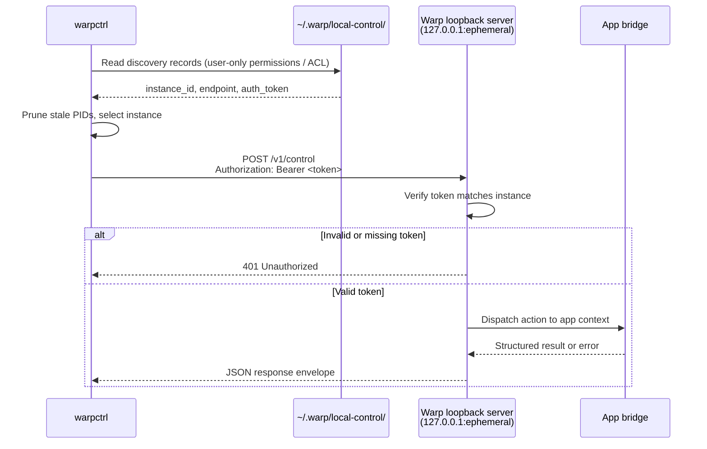

# warpctrl operator README
`warpctrl` is the provisional CLI entrypoint for controlling an already-running local Warp app instance. It is intended for scripts, demos, agent workflows, and developer automation that need to perform allowlisted Warp UI actions through the installed channel-specific Warp binary without launching the GUI.
The first implementation slice is intentionally narrow:
- discover compatible running Warp instances;
- select one instance implicitly when unambiguous or explicitly with `--instance`;
- send authenticated local-control requests through the per-instance discovery record;
- create a new terminal tab with `warpctrl tab create`.
The local-control protocol and catalog are broader than this slice, but commands outside the implemented capability set should fail with structured unsupported-action errors until their handlers land.
## Packaging model
`warpctrl` should be packaged as an Oz-style wrapper script rather than a standalone Rust binary. The wrapper should resolve the installed channel-specific Warp executable and invoke it with the hidden `--warpctrl` control-mode flag:
- `crates/local_control` owns discovery records, local authentication material, client transport, protocol envelopes, action names, and error types.
- `crates/warp_cli` owns command parsing conventions for local-control subcommands.
- the channel-specific app binary owns the hidden `--warpctrl` dispatch path and exits before normal GUI startup.
- the app-side bridge owns the per-process loopback listener and dispatches supported actions onto the live Warp UI context.
The control-mode path should initialize only the work needed for CLI parsing, instance discovery, local authentication loading, request serialization, HTTP transport, and output formatting. It should not initialize GUI state, terminal models, rendering, workspaces, or main-app startup paths.
During the provisional naming period, release artifacts and helper names may be channelized, but operator docs and examples should use `warpctrl` unless an integration branch explicitly documents a channel-specific alias.
This branch wires the core hidden dispatch contract through the existing Warp binary. Follow-up packaging work should install platform-specific wrapper scripts that call the channel binary with `--warpctrl` instead of producing or selecting a separate `warpctrl` artifact.
## Install and invocation guidance
### macOS
Until the wrapper installer lands, build the local Warp binary and invoke it with the hidden control-mode flag for development checks:
```bash
cargo run -p warp --bin warp -- --warpctrl instance list
```
For distributable checks, the installed `warpctrl` wrapper should live on `PATH` and exec the app bundle's channel-specific executable with `--warpctrl`.
### Linux
Until the wrapper installer lands, build the local Warp binary and invoke it with the hidden control-mode flag for development checks:
```bash
cargo run -p warp --bin warp -- --warpctrl instance list
```
For distributable checks, downstream packages should install a `warpctrl` wrapper onto `PATH` that execs the installed channel-specific Warp executable with `--warpctrl`.
Run `warpctrl --version` after installation to confirm the shell is resolving the expected build.
### Windows
Until the wrapper installer lands, build the local Warp binary and invoke it with the hidden control-mode flag for development checks:
```powershell
cargo run -p warp --bin warp -- --warpctrl instance list
```
Installer helper creation and release-artifact wiring still need a later packaging change before docs can promise an installer-provided `warpctrl` command.
## End-to-end local test flow
Use matching app and CLI bits from the same branch or release artifact so the protocol version and action catalog agree.
1. Start Warp and leave at least one window open.
2. Confirm that the local-control server registered the running process:
   ```bash
   warpctrl instance list
   ```
3. If exactly one compatible instance is listed, create a new terminal tab:
   ```bash
   warpctrl tab create
   ```
4. If multiple compatible instances are listed, copy the desired `instance_id` and target it explicitly:
   ```bash
   warpctrl tab create --instance <instance_id>
   ```
5. Verify the running app receives focus for the selected instance and a new terminal tab appears according to Warp's normal new-tab placement behavior.
6. In a future slice that implements `tab list`, inspect state before and after the mutation:
   ```bash
   warpctrl tab list --instance <instance_id>
   ```
Expected failures:
- no running compatible app: exits non-zero with a no-instance error;
- multiple ambiguous instances: exits non-zero and asks for `--instance`;
- unsupported app build or stale discovery record: exits non-zero with a protocol, stale-target, or transport error;
- `tab.create` not yet implemented by the running app bridge: exits non-zero with an unsupported-action error.
## Security model
The local-control protocol is designed for same-user scripting, not cross-user or network access. The trust boundary is the local user account.
- **Loopback-only listener.** Each Warp process binds its control server to `127.0.0.1` on an ephemeral port. The listener is not reachable from the network.
- **Per-instance bearer token.** A random token is generated at startup and written into the discovery record. Every control request must present this token in the `Authorization` header; missing or invalid tokens are rejected with HTTP 401.
- **File-permission-gated discovery.** Discovery records are stored in a per-user local-control directory. On POSIX platforms, files must be created with `0600` permissions (owner read/write only). On Windows, records must be stored under the current user's app data directory with an ACL that grants access only to the current user, Administrators, and SYSTEM. Any same-user process that can read the credential can authenticate, so the baseline security boundary is same-user process isolation.
- **Stale-record pruning.** On each `instance list` or implicit discovery call, records whose PID is no longer alive are deleted automatically, preventing stale tokens from lingering on disk.
- **No CORS.** The control endpoints do not set permissive CORS headers, so browser-origin JavaScript cannot read responses even if it guesses the port. The bearer token requirement provides a second layer since browsers cannot read the discovery file.

**Known limitations and future hardening:**
- The token is stored in plaintext in the discovery JSON file. Any compromised process running as the same user can extract it.
- Tokens do not rotate or expire during a Warp session. A leaked token is valid until the process exits.
- Windows local-control authentication is not complete until discovery-record ACL creation and validation are implemented.
- Once higher-risk handlers land (e.g. `input.insert`, command execution), the same-user boundary becomes a code-execution trust boundary. Consider separating the token from the discovery metadata, adding per-request nonces, or switching to a Unix domain socket with `SO_PEERCRED` for kernel-verified caller identity.
## Documentation review notes
- Treat `warpctrl` as provisional executable naming until packaging signs off on final artifact aliases.
- Keep examples scoped to discovery and `tab create` until additional app-side handlers are implemented.
- Do not document catalog commands as usable just because they exist in protocol enums or parser scaffolding; operator docs should distinguish implemented commands from planned allowlist entries.
- Windows packaging may initially follow the existing helper-wrapper pattern. Update this README when that decision is final.
