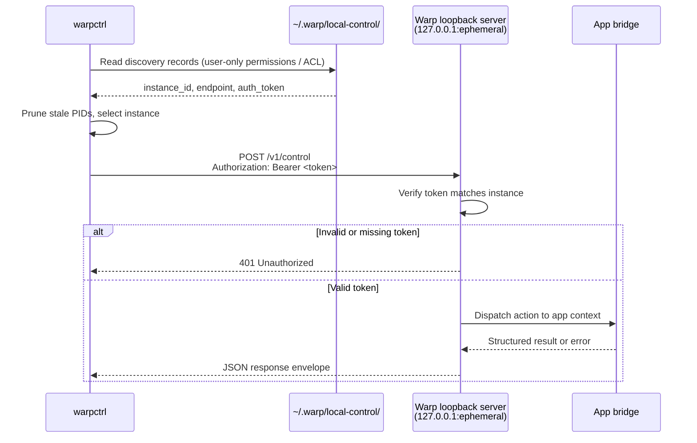

# warpctrl operator README
`warpctrl` is the provisional standalone CLI for controlling an already-running local Warp app instance. It is intended for scripts, demos, agent workflows, and developer automation that need to perform allowlisted Warp UI actions without launching the GUI executable in CLI mode.
The first implementation slice is intentionally narrow:
- discover compatible running Warp instances;
- select one instance implicitly when unambiguous or explicitly with `--instance`;
- send authenticated local-control requests through the per-instance discovery record;
- return implemented app/action/layout/appearance/settings metadata reads;
- create a new terminal tab with `warpctrl tab create`.
The local-control protocol and catalog are broader than this slice, but commands outside the implemented capability set should fail with structured unsupported-action errors until their handlers land. Operator docs and Agent skills must not present stubbed commands as guaranteed live app handlers.
## Packaging model
`warpctrl` should be packaged as a separate CLI artifact from the Warp GUI app while reusing shared repository code:
- `crates/local_control` owns discovery records, local authentication material, client transport, protocol envelopes, action names, and error types.
- `crates/warp_cli` owns command parsing conventions for local-control subcommands.
- the app-side bridge owns the per-process loopback listener and dispatches supported actions onto the live Warp UI context.
The binary should initialize only CLI parsing, instance discovery, local authentication loading, request serialization, HTTP transport, and output formatting. It should not initialize GUI state, terminal models, rendering, workspaces, or main-app startup paths.
During the provisional naming period, release artifacts and helper names may be channelized, but operator docs and examples should use `warpctrl` unless an integration branch explicitly documents a channel-specific alias.
This branch wires the standalone binary target and the macOS/Linux bundle-script artifact selectors:
- `cargo build -p warp --bin warpctrl`
- `script/macos/bundle --artifact warpctrl ...`
- `script/linux/bundle --artifact warpctrl ...`
Windows has the native Rust binary target, but installer/release helper exposure remains follow-up packaging work.
## Install and invocation guidance
### macOS
Build locally with `cargo build -p warp --bin warpctrl`, then run `target/debug/warpctrl` or copy/symlink that binary onto `PATH`.
For distributable standalone artifact checks, use `script/macos/bundle --artifact warpctrl` with the desired channel/signing flags. The bundle script writes a standalone `warpctrl` binary into its macOS artifact output directory instead of embedding it in the GUI app bundle.
### Linux
Build locally with `cargo build -p warp --bin warpctrl`, then run `target/debug/warpctrl` or copy/symlink that binary onto `PATH`.
For distributable standalone artifact checks, use `script/linux/bundle --artifact warpctrl` with the desired channel/package selection. The Linux bundle script routes packaging through the standalone control-binary artifact path; downstream package installation should place the emitted `warpctrl` binary according to that package format.
Run `warpctrl --version` after installation to confirm the shell is resolving the expected build.
### Windows
Build locally with `cargo build -p warp --bin warpctrl`, then run `target\debug\warpctrl.exe` or copy that binary onto `PATH`.
The Windows-native binary target exists in this slice. Installer helper creation and release-artifact wiring still need a later packaging change before docs can promise an installer-provided `warpctrl` command.
## Read-only metadata command contract
The read-only contract separates low-sensitivity metadata reads from underlying-data reads. This branch implements metadata reads only. Metadata read permission must not be treated as permission to read terminal contents, command history, input buffers, file contents, Drive object contents, or AI conversation content.
Implemented metadata read command forms are:
- `warpctrl instance list`
- `warpctrl app ping`
- `warpctrl app version`
- `warpctrl app active`
- `warpctrl app inspect`
- `warpctrl action list`
- `warpctrl action get <action>`
- `warpctrl window list`
- `warpctrl tab list`
- `warpctrl pane list`
- `warpctrl session list`
- `warpctrl theme list`
- `warpctrl appearance get`
- `warpctrl setting list`
- `warpctrl setting get <key>`
`theme.list`, `appearance.get`, `setting.list`, and `setting.get` are classified as `ReadMetadata` actions and are logged-out-safe because they expose only local appearance/configuration metadata from a small allowlist. `setting.get` rejects unknown, private, and sensitive settings with `not_allowlisted`.
Underlying-data reads are not part of this shard. Do not document or rely on `block`, `input`, `history`, `file`, Drive content, terminal output, command execution, workflow execution, accepted-command submission, or agent prompt submission as available from this read-only settings/docs branch.
## Safe targeting guidance
For repeatable scripts and Agent workflows:
- Start with `warpctrl --output-format json instance list` and record the target `instance_id`.
- If exactly one compatible instance is listed, implicit targeting may be acceptable for interactive use. In scripts, pass `--instance <instance_id>` once discovered.
- If multiple instances are listed, always pass `--instance`; do not rely on active/frontmost selection unless the task is explicitly interactive and ambiguity is acceptable.
- Prefer opaque `instance_id` selectors over PID selectors for durable automation. `--pid` is a convenience filter for short-lived local debugging.
- Handle structured failures explicitly: `no_instance`, `ambiguous_instance`, `local_control_disabled`, `unauthorized_local_client`, `insufficient_permissions`, `execution_context_not_allowed`, `unsupported_action`, and `stale_target`.
- Treat `unsupported_action` as a version or implementation mismatch, not as permission to fall back to mutating UI automation or internal dispatch.
## End-to-end local test flow
Use matching app and CLI bits from the same branch or release artifact so the protocol version and action catalog agree.
1. Start Warp and leave at least one window open.
2. Confirm that the local-control server registered the running process:
   ```bash
   warpctrl --output-format json instance list
   ```
3. Copy the desired `instance_id`, then check the selected app's protocol version and implemented action catalog:
   ```bash
   warpctrl --output-format json app version --instance <instance_id>
   warpctrl --output-format json action list --instance <instance_id>
   ```
4. Inspect local structure and settings metadata:
   ```bash
   warpctrl --output-format json tab list --instance <instance_id>
   warpctrl --output-format json theme list --instance <instance_id>
   warpctrl --output-format json appearance get --instance <instance_id>
   warpctrl --output-format json setting list --instance <instance_id>
   warpctrl --output-format json setting get --instance <instance_id> appearance.themes.theme
   ```
5. If you are smoke-testing the first implemented mutation, create a new terminal tab explicitly in that instance:
   ```bash
   warpctrl tab create --instance <instance_id>
   ```
6. Verify the running app receives focus for the selected instance and a new terminal tab appears according to Warp's normal new-tab placement behavior.
Expected failures:
- no running compatible app: exits non-zero with a no-instance error;
- multiple ambiguous instances: exits non-zero and asks for `--instance`;
- unsupported app build or stale discovery record: exits non-zero with a protocol, stale-target, or transport error;
- `tab.create` not yet implemented by the running app bridge: exits non-zero with an unsupported-action error.
## Security model
The local-control protocol is designed for same-user scripting, not cross-user or network access. The trust boundary is the local user account.
- **Loopback-only listener.** Each Warp process binds its control server to `127.0.0.1` on an ephemeral port. The listener is not reachable from the network.
- **Per-instance bearer token.** A random token is generated at startup and written into the discovery record. Every control request must present this token in the `Authorization` header; missing or invalid tokens are rejected with HTTP 401.
- **File-permission-gated discovery.** Discovery records are stored in a per-user local-control directory. On POSIX platforms, files must be created with `0600` permissions (owner read/write only). On Windows, records must be stored under the current user's app data directory with an ACL that grants access only to the current user, Administrators, and SYSTEM. Any same-user process that can read the credential can authenticate, so the baseline security boundary is same-user process isolation.
- **Stale-record pruning.** On each `instance list` or implicit discovery call, records whose PID is no longer alive are deleted automatically, preventing stale tokens from lingering on disk.
- **No CORS.** The control endpoints do not set permissive CORS headers, so browser-origin JavaScript cannot read responses even if it guesses the port. The bearer token requirement provides a second layer since browsers cannot read the discovery file.

**Known limitations and future hardening:**
- The token is stored in plaintext in the discovery JSON file. Any compromised process running as the same user can extract it.
- Tokens do not rotate or expire during a Warp session. A leaked token is valid until the process exits.
- Windows local-control authentication is not complete until discovery-record ACL creation and validation are implemented.
- Once higher-risk handlers land (e.g. `input.insert`, command execution), the same-user boundary becomes a code-execution trust boundary. Consider separating the token from the discovery metadata, adding per-request nonces, or switching to a Unix domain socket with `SO_PEERCRED` for kernel-verified caller identity.
## Documentation review notes
- Treat `warpctrl` as provisional executable naming until packaging signs off on final artifact aliases.
- Keep examples scoped to implemented metadata reads and `tab create` until additional app-side handlers land.
- Do not document catalog commands as usable just because they exist in protocol enums or parser scaffolding; operator docs should distinguish implemented commands from planned allowlist entries.
- Windows packaging may initially follow the existing helper-wrapper pattern rather than shipping a native standalone executable. Update this README when that decision is final.
