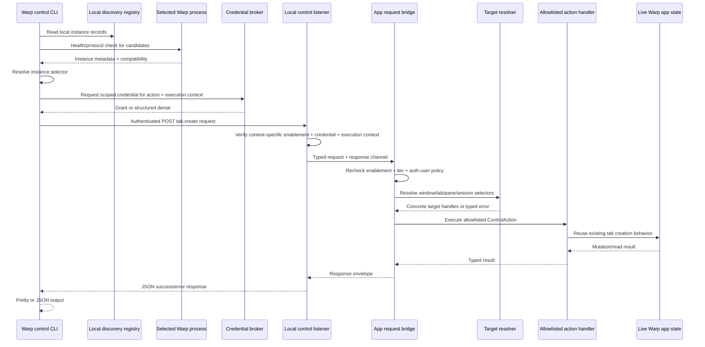
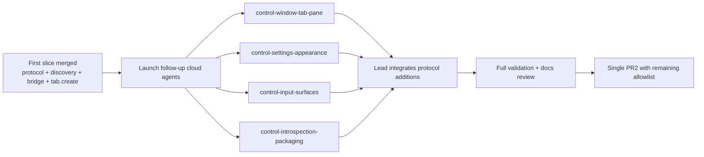

# Context
`PRODUCT.md` defines a standalone local Warp control CLI binary, provisionally named `warpctrl`, with an allowlisted action catalog, deterministic addressing across multiple running Warp app processes, and an incremental implementation plan.
`SECURITY.md` is the normative security architecture for this feature. Implementation work must follow it for separate inside-Warp and outside-Warp enablement, the top-level Settings > Scripting surface, protected enablement storage, granular permissions, discovery metadata, credential storage, scoped safety grants, verified execution context, authenticated-user requirements, localhost/browser protections, action-tier enforcement, deterministic target resolution, and local app-side validation. If this technical plan and `SECURITY.md` disagree, update the plan before implementing rather than treating the security architecture as optional follow-up work.
The existing app already has three relevant building blocks:
- `crates/http_server/src/lib.rs (7-61)` runs a native-only loopback Axum server on fixed port `9277`.
- `app/src/lib.rs (1993-2001)` registers that HTTP server in the native app and currently merges only installation-detection and profiling routers.
- `crates/app-installation-detection/src/lib.rs (15-60)` and `app/src/profiling.rs (208-242)` show the current local HTTP routes. They are narrow endpoints, not a general control plane.
Warp also already has the app-side behaviors the control API should reuse rather than reimplement:
- `app/src/terminal/view/action.rs (193-196)` defines split-pane terminal actions.
- `app/src/pane_group/mod.rs (4266-4360, 5377-5414)` shows pane creation/splitting semantics and how split events mutate pane layout.
- `app/src/workspace/action.rs (153-156)` defines the existing tab creation actions, including default and terminal-tab variants.
- `app/src/workspace/view.rs (21203-21244)` shows how user-visible default and terminal-tab actions are dispatched.
- `app/src/settings/theme.rs (9-82)` defines persisted theme settings.
- `app/src/themes/theme_chooser.rs (416-458)` shows persisted theme selection behavior.
- `app/src/workspace/action.rs (95-776)` is the largest existing inventory of user-visible workspace actions and informs the allowlist catalog.
- `app/src/workspace/util.rs (12-18)` defines `PaneViewLocator`, and `app/src/pane_group/pane/mod.rs (84-177)` defines serializable pane identifiers, both useful reference points for selector resolution.
- `app/src/uri/mod.rs (822-1093, 1166-1364)` demonstrates external intents being resolved into active windows/workspaces and dispatched into running app state.
The current Oz CLI build/distribution model is also directly relevant because the control CLI should follow the same standalone-artifact approach rather than relying on the Warp GUI executable to service ordinary shell invocations:
- `crates/warp_cli/src/lib.rs (88-188, 316-418)` defines the existing CLI/parser conventions and channel-specific command naming support.
- `app/src/lib.rs (631-746)` routes CLI invocations into CLI execution rather than GUI launch.
- `script/macos/bundle (353-735)` and `script/linux/bundle (157-294)` build standalone CLI artifacts with the `standalone` feature.
- `.github/workflows/create_release.yml (423-554, 660-858, 992-1276)` publishes macOS/Linux CLI artifacts.
- `script/windows/windows-installer.iss (235-263)` shows the current Windows helper-wrapper pattern for CLI access.
The most important constraint surfaced by this code is that the current fixed-port local HTTP server cannot be the entire solution for a multi-process control API. If multiple local Warp processes attempt to expose mutating routes through the same fixed port, only one can own it. The control design therefore needs explicit per-process discovery and addressing.
## Proposed changes
### 0. Security architecture dependency
Before implementing any local-control listener, CLI command, credential path, or action handler, the implementation must be checked against `SECURITY.md`.
Required security gates:
- Local control scripting has separate inside-Warp and outside-Warp enablement states. Inside-Warp control for verified Warp-managed terminal sessions defaults on; outside-Warp control for external terminals, scripts, IDEs, launch agents, and other same-user processes defaults off.
- Both controls live under a new top-level Settings pane page named **Scripting**.
- The authoritative enablement states are local-only, not Settings Sync'd, and stored in protected local storage rather than ordinary user-editable settings.
- `warpctrl`, direct protocol requests, shell scripts, config files, registry/plist edits, defaults writes, and server-backed preferences must not be able to enable either setting.
- Discovery records do not publish actionable endpoints or credential references for disabled outside-Warp control.
- Credential issuance is unavailable when the request's invocation context is disabled.
- Raw credential material is kept out of plaintext discovery records and stored in platform secure storage where available.
- The broker distinguishes verified Warp-terminal invocations from external invocations using an app-issued execution-context proof, not a caller-declared label.
- External invocations default to a smaller logged-out-safe action set that does not touch user-authenticated data.
- Verified Warp-terminal invocations may receive authenticated-user grants only when the selected app has a true logged-in Warp user and local-control settings allow authenticated-user actions from Warp terminals.
- The app rejects disabled, unauthenticated, expired, revoked, insufficient-scope, unsupported, malformed, ambiguous, missing-target, and stale-target requests with structured errors.
- Every action has a documented risk tier and the app bridge enforces the required tier locally before selector resolution or handler dispatch.
- Every action has a documented `requires_authenticated_user` value and allowed execution contexts. New actions default to requiring an authenticated user unless explicitly reviewed as logged-out-safe.
- Granular local-control settings under Settings > Scripting gate the maximum grants for metadata reads, terminal-data reads, non-destructive mutations, destructive/execution actions, authenticated-user actions from Warp terminals, and authenticated-user actions from external clients.
- Safety tiers are treated as user-intent and accident-prevention guardrails, not as strong same-user malicious-app isolation.
- Remote control remains out of scope for the local same-machine credential model.
The first implementation slice should include the protected enablement gate, credential issuance checks, and app-side tier enforcement even if the only mutating action initially implemented is `tab.create`. Shipping `tab.create` without the enablement and validation architecture would create the wrong foundation for the full catalog.
### 1. Protocol crate and stable envelope
Create a small shared protocol crate or equivalent shared module used by both the app server and standalone CLI client. It should define:
- Protocol version metadata.
- Discovery/health response types.
- Execution-context proof/request types for verified Warp-terminal invocations versus external invocations.
- Action metadata describing risk tier, required grant, `requires_authenticated_user`, allowed execution contexts, and target families.
- Selector types:
  - `InstanceSelector`
  - `WindowSelector`
  - `TabSelector`
  - `PaneSelector`
  - `SessionSelector`
- Opaque protocol-facing ID newtypes for instance/window/tab/pane/session identifiers.
- Allowlisted `ControlAction` variants and typed parameter payloads.
- Success/error envelopes with stable machine-readable error codes.
The protocol should treat target IDs as opaque. The app may encode existing runtime identifiers internally, but the public wire contract should not require callers to understand `EntityId`, `PaneId`, or other implementation types.
Recommended top-level request shape for `tab.create`:
```json
{
  "protocol_version": 1,
  "request_id": "client-generated-id",
  "action": "tab.create",
  "target": {
    "window": "active"
  },
  "params": {}
}
```
Recommended response shape:
```json
{
  "ok": true,
  "protocol_version": 1,
  "request_id": "client-generated-id",
  "instance_id": "opaque-instance-id",
  "resolved_target": {
    "window_id": "opaque-window-id",
    "tab_id": "opaque-tab-id"
  },
  "result": {}
}
```
Error payloads should include stable codes defined in `SECURITY.md`, including `local_control_disabled`, `unauthorized_local_client`, `insufficient_permissions`, `authenticated_user_required`, `authenticated_user_unavailable`, `execution_context_not_allowed`, `ambiguous_instance`, `stale_target`, `invalid_selector`, `unsupported_action`, `not_allowlisted`, `invalid_params`, `target_state_conflict`, `missing_target`, and `no_instance`.
### 2. Per-process discovery instead of fixed-port-only routing
Keep the existing fixed-port HTTP behavior intact for installation detection/profiling compatibility. Add a separate local-control listener that follows the same native Axum/Tokio pattern but supports multiple local Warp app processes.
Recommended design:
- Each participating Warp process creates a random opaque `instance_id` at startup.
- Each process binds a loopback control listener on an ephemeral port or an app-managed available port.
- Each process writes a discovery record into a secure per-user Warp state directory. The record should contain:
  - `instance_id`
  - PID
  - channel/build metadata
  - control-listener endpoint
  - protocol version
  - start timestamp
  - credential metadata or secure-storage references only when the relevant inside-Warp or outside-Warp context is enabled
- The CLI loads discovery records, removes or ignores stale records after health checks, and chooses an instance using the product selector rules.
- `warpctrl instance list` is a CLI-first projection of this discovery registry plus health responses.
When outside-Warp control is disabled, discovery must follow `SECURITY.md`: either publish no actionable local-control record for external clients or publish only a minimal disabled-status record with no endpoint authority or credential reference.
This design preserves the current `9277` behavior while avoiding cross-process port contention for the new control API.
### 3. Local authentication, enablement, and safety boundary
Mutating localhost routes should not copy the permissive CORS posture of `/install_detection`.
Recommended local trust model:
- No browser-readable CORS allowance on control endpoints.
- The relevant inside-Warp or outside-Warp Scripting setting must allow the request context before credentials are minted or sensitive control requests are accepted.
- The authoritative enablement bit must live in protected local storage and must not be writable by `warpctrl` or ordinary same-user preference/config edits.
- Per-instance raw credential material must be kept out of plaintext discovery records and stored in platform secure storage where practical.
- The CLI may load or request scoped credentials through an app-owned broker/helper, but it must not mint authority itself.
- The broker verifies whether the invocation originated from a Warp-managed terminal session before issuing in-Warp-only grants.
- The broker issues authenticated-user grants only when the selected app has a true logged-in Warp user and the relevant local-control permission is enabled.
- The app rejects disabled-state, missing, malformed, invalid, expired, or revoked credentials before selector resolution or mutation.
- The app maps every action to a risk tier and rejects insufficient grants before selector resolution or mutation.
- The app maps every action to a `requires_authenticated_user` value and allowed execution contexts, rejecting mismatches before selector resolution or mutation.
- Health metadata exposed without credentials, if needed for stale-record pruning, must not reveal mutating capabilities, credentials, or sensitive target state.
This keeps the protocol local and scriptable without creating an ambient browser-to-localhost control surface.
Do not ship the first slice as a plaintext discovery bearer token, even for same-user human CLI use. The first slice is the foundation for higher-risk terminal data, input injection, command execution, and destructive operations, so it must establish the protected enablement, credential storage, scoped grant, and app-side enforcement model from `SECURITY.md`.
### 4. App-side request bridge onto the UI/application context
The HTTP handler runs on a Tokio runtime thread owned by the local-control server. It cannot directly access or mutate Warp's UI models, views, or app context because all WarpUI state is single-threaded and owned by the main app event loop. The bridge solves this by sending a closure from the Tokio handler thread to the main thread, executing it in the model's context, and returning the result to the waiting HTTP handler.
#### Thread model
- **Tokio runtime thread (HTTP handler):** Owns the Axum router, receives HTTP requests, authenticates, deserializes the `RequestEnvelope`. Cannot touch `AppContext`, views, or models.
- **Main app thread:** Owns all WarpUI entities (`App`, `AppContext`, views, models). All UI state reads and mutations must happen here.
- **Bridge:** Transfers a typed closure from the Tokio thread to the main thread, executes it with `&mut ModelContext`, and sends the return value back.
#### Implementation: `ModelSpawner`
The bridge uses WarpUI's `ModelSpawner<T>` mechanism, which is the standard way for background threads to schedule work on a model's main-thread context:
1. During app initialization, a `LocalControlBridge` singleton model is created. The model's `ModelContext::spawner()` method returns a `ModelSpawner<LocalControlBridge>` — a cloneable, `Send` handle that can enqueue closures from any thread.
2. The `ModelSpawner` is stored in the Axum router's shared state (`ControlServerState`), making it available to every HTTP handler.
3. When an HTTP request arrives, the handler calls `spawner.spawn(|bridge, ctx| { ... }).await`:
   - `spawn` sends a boxed `FnOnce(&mut LocalControlBridge, &mut ModelContext<LocalControlBridge>) -> R` closure through an `async_channel` to the main thread's task-callback loop.
   - The main thread dequeues the closure, constructs a fresh `ModelContext` for the bridge model, and calls the closure.
   - Inside the closure, the bridge has full access to `ModelContext`, which derefs to `AppContext`. This means it can call `ctx.windows()`, `ctx.views_of_type::<Workspace>(window_id)`, `workspace.update(ctx, ...)`, and any other main-thread API.
   - The closure returns a typed result (e.g., `ResponseEnvelope`), which is sent back to the Tokio thread via a `oneshot` channel.
4. The HTTP handler awaits the oneshot result and serializes it as the HTTP response.
#### Concrete flow for `tab.create`
```
HTTP handler (Tokio thread)
  │
  ├─ verify inside-Warp or outside-Warp context is enabled
  ├─ verify credential, execution context, safety grant, and authenticated-user grant
  ├─ deserialize RequestEnvelope
  ├─ call bridge_spawner.spawn(move |bridge, ctx| {
  │      bridge.handle_request(request, ctx)  // runs on main thread
  │  }).await
  │
  └─ serialize ResponseEnvelope as JSON

LocalControlBridge::handle_request (main thread)
  │
  ├─ verify protected context-specific enablement state is still enabled
  ├─ map action to required risk tier
  ├─ map action to authenticated-user and execution-context requirements
  ├─ verify presented credential grants that tier, target family, execution context, and authenticated-user access
  ├─ match request.action.kind
  │   └─ ActionKind::TabCreate
  │       ├─ validate_tab_create_target(&request.target)
  │       ├─ ctx.windows().active_window()
  │       │   └─ if none: return invalid_selector / missing_target
  │       ├─ ctx.views_of_type::<Workspace>(window_id)
  │       └─ workspace.update(ctx, |workspace, ctx| {
  │             workspace.handle_action(
  │                 &WorkspaceAction::AddTerminalTab { hide_homepage: false },
  │                 ctx,
  │             )
  │           })
  │
  └─ return ResponseEnvelope::ok(request_id, json!({ ... }))
```
#### Why this pattern
- **Thread safety.** WarpUI's entity/view system is not `Send` or `Sync`. The only safe way to interact with it from a background thread is through `ModelSpawner`, which serializes access through the main event loop.
- **Synchronous result.** Unlike fire-and-forget patterns (e.g., URI intent dispatch in `app/src/uri/mod.rs`), the `spawn` call returns a concrete `Result<R, ModelDropped>`, so the HTTP handler can produce a structured success or error response.
- **Reuses existing infrastructure.** `ModelSpawner` is already used throughout the codebase for background-to-main-thread communication (e.g., async file I/O results, network responses). No new concurrency primitive is needed.
- **Action dispatch reuses existing app behavior.** The bridge calls `workspace.handle_action(&WorkspaceAction::AddTerminalTab { ... }, ctx)` — the exact same method the UI keybinding system uses. This ensures the control CLI produces identical behavior to the corresponding user action, including side effects like tab count updates, focus changes, and event emissions.
- **Deterministic targeting.** The bridge must not silently fall back from the active window to an arbitrary ordered window for mutating actions. If the caller relies on the default active selector and no active window exists, return a structured missing-target or invalid-selector error. If future command forms allow explicit window IDs, resolve the explicit ID exactly or return `stale_target`.
#### Adding new action handlers
To add a new action to the bridge:
1. Add a variant to `ActionKind` in `crates/local_control/src/protocol.rs`.
2. Document its `SECURITY.md` risk tier, required grant, `requires_authenticated_user` value, and allowed execution contexts.
3. Add a match arm in `LocalControlBridge::handle_request` in `app/src/local_control/mod.rs`.
4. Before selector resolution or dispatch, verify local control is enabled and the presented credential grants the action tier, target family, execution context, and authenticated-user access if required.
5. Inside the match arm, use `ctx` (which is a `&mut ModelContext<LocalControlBridge>` that derefs to `&mut AppContext`) to resolve selectors and dispatch the action onto existing app types.
6. Return a `ResponseEnvelope::ok(...)` or `ResponseEnvelope::error(...)` with the result.
The bridge closure has access to the full `AppContext` API surface, including `ctx.windows()`, `ctx.window_ids()`, `ctx.views_of_type::<T>(window_id)`, `handle.update(ctx, ...)`, and `handle.read(ctx, ...)`. This makes it straightforward to wire new actions to existing UI behavior without introducing new concurrency concerns.
### 5. Target resolution model
Implement target resolution as a reusable component rather than scattering lookup logic across handlers.
Recommended resolution order:
1. Select instance in the CLI/discovery layer.
2. Resolve window inside the target process.
3. Resolve tab within the window.
4. Resolve pane within the tab/pane-group context.
5. Resolve session only for session-scoped commands.
Selector behavior:
- `active` resolves from current app focus/selection state.
- Explicit opaque IDs must resolve exactly or return `stale_target`.
- Index selectors are allowed only for user-visible indexed concepts such as tabs and should resolve to a concrete opaque ID before execution.
- A session-scoped request against a non-terminal pane returns `target_state_conflict`.
Target resolution must happen after protected enablement, authentication, and safety-grant checks. This prevents denied requests from learning more target state than necessary and keeps enforcement centralized.
Implementation references:
- Window-level active selection already exists inside the app through `WindowManager`.
- Pane scoping can build on the conceptual model of `PaneViewLocator` in `app/src/workspace/util.rs (12-18)`.
- Existing URI intent routing in `app/src/uri/mod.rs (895-1093)` shows how to locate workspaces/windows and avoid silently acting in the wrong place.
### 6. Allowlisted handler families
Use one handler module per action family. The protocol layer owns parsing/validation; handler modules own target resolution and delegation to existing app logic.
Recommended modules/families:
- Discovery/state:
  - instances, version, active chain, windows/tabs/panes/sessions listings.
- Window/tab:
  - new, focus, close, activate, move, rename, color, close variants.
- Pane:
  - split, focus, navigate, close, maximize, resize.
- Input/session:
  - insert, replace, clear, run command, cycle session, mode switch where supported.
- Appearance/settings:
  - theme list/set, system-theme controls, font/zoom actions, allowlisted settings reads/writes/toggles.
- Panels/surfaces:
  - settings/page/search, palettes, left/right panels, Drive, resource center, code review, vertical tabs, AI assistant.
Do not use a generic “dispatch action by string” endpoint. Every handler should be reachable only through an explicit `ControlAction` variant.
### 7. First slice: prove discovery and `tab.create`
The first `warpctrl` implementation slice should land the minimum cross-cutting architecture plus a single representative tab mutation:
- Shared protocol types and error envelopes.
- New top-level Settings > Scripting page with separate protected inside-Warp and outside-Warp enablement states.
- Protected local-only enablement storage where inside-Warp control defaults on and outside-Warp control defaults off.
- Granular local-control permission storage under Settings > Scripting for at least metadata, non-destructive local mutations, and authenticated-user-action categories.
- Discovery registry and CLI instance selection.
- A standalone `warpctrl` binary or artifact path that runs control commands without starting the GUI app runtime.
- Per-process authenticated local-control server that refuses sensitive work when the request's inside-Warp or outside-Warp context is disabled.
- Scoped credential issuance/storage with no raw credentials in plaintext discovery records, including execution-context fields and authenticated-user grant fields.
- App-side request bridge and selector resolver.
- Action-tier mapping and app-side safety-grant enforcement.
- Action metadata for `tab.create` that deliberately classifies it as a logged-out-safe non-destructive local mutation only when the user's granular local-control settings allow that category.
- Read-only `ping/version` plus `warpctrl instance list` or equivalent minimal discovery command.
- End-to-end `warpctrl tab create` for the selected instance, reusing the same app behavior as the user-visible new-terminal-tab action.
Why `tab.create` first:
- It proves a UI/layout action can be targeted and executed against live app state.
- It exercises process discovery, local authentication, request bridging, selector defaults, app-context dispatch, and structured success/error output without introducing higher-risk terminal input execution.
- It exercises the protected enablement and scoped-grant model before higher-risk action families depend on it.
- It gives operators a concise end-to-end smoke test: discover a running instance, create a tab, and confirm the live app changed.
The PR should also introduce the shell-facing CLI command grammar that the remainder of the protocol will reuse and establish a lightweight CLI startup path distinct from GUI startup.
### 8. Follow-up slices: fill out the remaining protocol in parallel
After the first slice validates discovery, auth, selector resolution, CLI syntax, and server-to-app execution, follow-up slices can add the remaining allowlisted catalog in parallelized action-family groups. The baseline code should make new action additions mostly additive:
- Extend `ControlAction`.
- Add typed params/results.
- Add a handler.
- Add validation/tests.
- Add CLI surface/tests.
### 9. CLI parsing and output libraries
The `warpctrl` CLI must use the same argument parsing and output libraries as the existing Oz CLI so that conventions, derive patterns, and shell-completion generation remain consistent across both binaries.
- **clap** (with the `derive` feature) for argument parsing, subcommand trees, and help generation. Both binaries share the `warp_cli` crate, so parser types defined there are reused directly.
- **serde** / **serde_json** for JSON request/response serialization and for `--output-format json` output.
- **clap_complete** for shell completion generation, reusing the same infrastructure the Oz CLI uses.
- The `OutputFormat` enum (`Pretty`, `Json`, `Ndjson`, `Text`) is shared from `warp_cli::agent::OutputFormat` so human-readable vs. machine-readable output follows the same conventions.
- New subcommand types for `warpctrl` live in `warp_cli::local_control` and follow the same `#[derive(Parser)]` / `#[derive(Subcommand)]` / `#[derive(Args)]` patterns used by the Oz CLI's top-level `Args` and `CliCommand` types.
Do not introduce alternative parsing libraries (e.g., `structopt`, `argh`) or alternative serialization approaches. Keeping one set of libraries across both CLIs reduces dependency weight, ensures consistent `--help` formatting, and lets contributors move between the two surfaces without learning a different stack.
### 10. CLI packaging and release shape
The shipped product shape should be a separate bundled `warpctrl` CLI binary that reuses shared CLI/protocol crates but does not depend on launching the GUI binary in command mode. Follow the Oz CLI release model as closely as practical:
- macOS:
  - Add a standalone control CLI artifact path next to the existing Oz standalone CLI artifact flow.
  - If the app bundle also exposes a wrapper/install flow, keep channelized naming consistent with the final product name decision.
- Linux:
  - Extend bundle/release scripts to emit control CLI standalone artifacts and packages in the same broad pattern as the current Oz CLI tarball/deb/rpm/Arch package flow.
- Windows:
  - Mirror the existing installer-generated helper-wrapper pattern first if that remains the canonical Oz behavior on Windows.
  - If the product decision is to ship a true standalone Windows control CLI binary, add a dedicated release path in follow-up work rather than silently diverging from existing Oz precedent.
Startup and dependency expectations:
- The CLI process should initialize only command parsing, discovery, authentication material loading, protocol serialization, HTTP transport, and output formatting needed for the requested command.
- The CLI should not initialize GUI state, rendering, terminal session models, app workspaces, or other main-app-only subsystems.
- Startup cost should be treated as part of the product contract because control commands are expected to compose naturally in scripts and repeated interactive shell usage.
Naming decision:
- Product examples use provisional `warpctrl ...` command lines for the standalone local-control binary.
- Final artifact filenames, channelized aliases, and installer exposure should be chosen before broad rollout to avoid churn in bundle scripts, docs, shell completions, and release workflow files.
## End-to-end flow

## Testing and validation
Map tests directly to `PRODUCT.md` behavior.
- Security architecture:
  - Protected enablement tests proving inside-Warp control defaults on, outside-Warp control defaults off, and disabled contexts reject credential issuance, sensitive discovery, and mutating requests with `local_control_disabled`.
  - Tests proving discovery in disabled state exposes no actionable endpoint authority or credential reference.
  - Credential-storage tests proving raw credentials are not written into plaintext discovery records.
  - Execution-context tests proving external clients cannot receive grants reserved for verified Warp-terminal invocations.
  - Tier-enforcement tests proving insufficient grants fail with `insufficient_permissions` before selector resolution or handler dispatch.
  - Authenticated-user tests proving user-authenticated actions fail without a logged-in app user or authenticated-user grant.
  - Settings > Scripting tests proving both top-level toggles and granular disabled categories invalidate credentials and prevent new grants.
  - Structured-error tests for disabled, unauthenticated, expired, revoked, insufficient-scope, execution-context-denied, authenticated-user-required, authenticated-user-unavailable, unsupported, malformed, ambiguous, missing-target, stale-target, and invalid-selector requests.
- Behavior 1-6, 29-31:
  - Protocol version/unit tests.
  - Discovery-registry tests with zero, one, multiple, stale, and incompatible instance records.
  - Local-auth tests for missing, invalid, expired, revoked, and valid credentials.
- Behavior 7-13:
  - Selector-resolution unit tests for active, explicit ID, index, stale target, ambiguous target, and non-terminal session target.
  - Tests that no lower-level selector silently retargets after an explicit stale selector fails.
- Behavior 15-28:
  - Parser/serde tests for every first-slice `ControlAction` variant.
  - Router tests proving unknown/unallowlisted actions are rejected.
  - CLI parse/output tests for pretty and JSON rendering.
- Behavior 18 and 33:
  - App-side tests for `tab.create` using existing workspace/tab helpers or a narrow extracted helper.
  - Manual local verification that `warpctrl tab create` creates a terminal tab in a running app.
- Behavior 30:
  - Multi-process integration-style coverage using two synthetic discovery records and mock health responders, plus manual testing with multiple channel builds where practical.
- Packaging:
  - `--artifact cli`-style bundle smoke tests or script-level checks for each supported platform path touched by the first slice.
  - Startup-path tests or focused checks confirming `warpctrl` dispatches commands without entering GUI-app launch code.
  - Shell completions/help output checks once final command naming is selected.
## Parallelization
The first slice should stay mostly sequential because protocol envelope, discovery, authentication, selector resolution, and `tab.create` are tightly coupled and need one coherent architecture.
The follow-up catalog expansion is a strong fit for remote Oz cloud-agent fan-out after the first slice lands. Proposed parallel workstreams:
- `control-window-tab-pane` — remote agent owns window/tab/pane action expansion, including CLI syntax, protocol variants, app handlers, and tests. Branch suggestion: `zach/warp-control-cli-window-tab-pane`.
- `control-settings-appearance` — remote agent owns settings/theme/font/zoom allowlist expansion and validation. Branch suggestion: `zach/warp-control-cli-settings-appearance`.
- `control-input-surfaces` — remote agent owns session/input plus panel/palette/settings-surface commands, with extra care around command execution risk. Branch suggestion: `zach/warp-control-cli-input-surfaces`.
- `control-introspection-packaging` — remote agent owns richer list/read commands, documentation/examples, and any follow-on bundle/release plumbing not completed in PR1. Branch suggestion: `zach/warp-control-cli-introspection-packaging`.
Merge strategy:
- Each remote agent works from the first slice’s merged baseline or a designated follow-up integration base.
- Each returns a branch or compact patch plus validation notes.
- A lead integrator folds accepted slices into one combined second PR so the public protocol remains coherent.

## Risks and mitigations
- Fixed-port server assumptions:
  - Mitigation: leave current `9277` endpoints undisturbed and use a per-process control listener plus discovery registry.
- Browser-to-localhost abuse:
  - Mitigation: no permissive CORS, protected in-app enablement, explicit local auth, scoped grants, and mutating routes gated before selector resolution.
- External apps silently enabling outside-Warp local control:
  - Mitigation: the outside-Warp enablement state defaults off, lives in protected local storage behind Settings > Scripting, is local-only, is not Settings Sync'd, and is not writable through `warpctrl`, config files, registry/plist preference edits, defaults writes, or server-backed settings.
- External apps obtaining in-Warp authenticated-user grants:
  - Mitigation: require an app-issued execution-context proof for Warp-terminal-only grants, do not trust caller-declared labels or plain environment variables as sole authority, and keep external authenticated-user grants behind a separate default-off permission.
- Logged-out requests touching user-authenticated data:
  - Mitigation: every action declares `requires_authenticated_user`, new actions default to true, and the bridge returns authenticated-user errors before selector resolution or dispatch.
- Implementation drift from `SECURITY.md`:
  - Mitigation: treat `SECURITY.md` as normative for security behavior; update this technical plan before implementation when there is disagreement, and include tests for the security architecture in the first slice.
- Action catalog drift from real UI behavior:
  - Mitigation: each control action reuses or factors existing UI action paths rather than duplicating behavior.
- Leaking internal unstable identifiers:
  - Mitigation: public protocol exposes opaque IDs and selectors; internal runtime IDs stay implementation details.
- Over-broad settings mutation:
  - Mitigation: allowlisted setting keys only, with private/debug/derived settings rejected.
- Command execution risk:
  - Mitigation: keep `input.run`/session execution in the catalog but require explicit follow-up product/review decision before broad rollout.
- Packaging churn due to provisional executable naming:
  - Mitigation: document `warpctrl` as provisional and settle final aliases before broad release workflow rollout.
- Heavyweight CLI startup caused by sharing the GUI binary's launch path:
  - Mitigation: ship a separate control CLI artifact with a narrow initialization path and keep GUI-only subsystems out of ordinary CLI command execution.
## Follow-ups
- Decide the final artifact filename/channel alias scheme around the provisional `warpctrl ...` public command surface.
- Decide whether Windows should follow the current Oz wrapper pattern indefinitely or gain standalone control CLI artifacts.
- Decide whether a future subscription/watch protocol is useful for scripts that want live state changes, rather than single request/response calls only.
