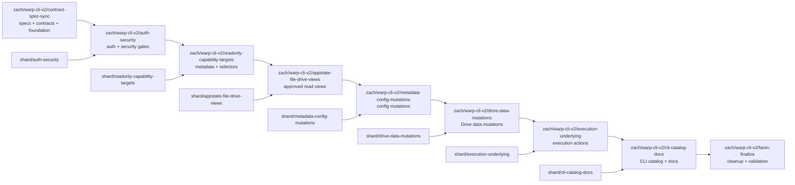

# Context
`PRODUCT.md` defines a local Warp control CLI command, provisionally named `warpctrl`, with an allowlisted action catalog, deterministic addressing across multiple running Warp app processes, and an incremental implementation plan. The public command should be exposed through an Oz-style wrapper script that invokes the existing channel-specific Warp binary in control mode, not through a separate standalone control binary.
`SECURITY.md` is the normative security architecture for this feature. Implementation work must follow it for the top-level Settings > Scripting surface, protected mode storage, discovery metadata, credential storage, scoped safety grants, verified execution context, authenticated-user requirements, localhost/browser protections, permission-category enforcement, deterministic target resolution, and local app-side validation. The long-term architecture includes separate verified inside-Warp and outside-Warp invocation contexts, but the current foundation implementation supports outside-Warp requests only in the broadest mode and must reject `InvocationContext::InsideWarp` until the verified Warp-terminal proof broker lands. If this technical plan and `SECURITY.md` disagree, update the plan before implementing rather than treating the security architecture as optional follow-up work.
The existing app already has three relevant building blocks:
- `crates/http_server/src/lib.rs (7-61)` runs a native-only loopback Axum server on fixed port `9277`.
- `app/src/lib.rs (1993-2001)` registers that HTTP server in the native app and currently merges only installation-detection and profiling routers.
- `crates/app-installation-detection/src/lib.rs (15-60)` and `app/src/profiling.rs (208-242)` show the current local HTTP routes. They are narrow endpoints, not a general control plane.
Warp also already has the app-side behaviors the control API should reuse rather than reimplement:
- `app/src/terminal/view/action.rs (193-196)` defines split-pane terminal actions.
- `app/src/pane_group/mod.rs (4266-4360, 5377-5414)` shows pane creation/splitting semantics and how split events mutate pane layout.
- `app/src/workspace/action.rs (153-156)` defines the existing tab creation actions, including default and terminal-tab variants.
- `app/src/workspace/view.rs (21203-21244)` shows how user-visible default and terminal-tab actions are dispatched.
- `app/src/settings/theme.rs (9-82)` defines persisted theme settings.
- `app/src/themes/theme_chooser.rs (416-458)` shows persisted theme selection behavior.
- `app/src/workspace/action.rs (95-776)` is the largest existing inventory of user-visible workspace actions and informs the allowlist catalog.
- `app/src/workspace/util.rs (12-18)` defines `PaneViewLocator`, and `app/src/pane_group/pane/mod.rs (84-177)` defines serializable pane identifiers, both useful reference points for selector resolution.
- `app/src/uri/mod.rs (822-1093, 1166-1364)` demonstrates external intents being resolved into active windows/workspaces and dispatched into running app state.
The current Oz CLI build/distribution model is also directly relevant because the control CLI should follow the same wrapper-script approach rather than introducing a separate bundled binary:
- `crates/warp_cli/src/lib.rs (88-188, 316-418)` defines the existing CLI/parser conventions and channel-specific command naming support.
- `app/src/lib.rs (631-746)` routes CLI invocations into CLI execution rather than GUI launch, and already avoids GUI startup for commands such as `dump-debug-info`.
- `script/macos/bundle (542-567)` writes the bundled Oz wrapper script into `Resources/bin` and uses `exec -a "$0"` to call the channel binary in `Contents/MacOS`.
- `script/linux/bundle (157-198)` shows the existing channelized binary naming and the current standalone artifact code that should be removed from the `warpctrl` path rather than extended.
- `script/windows/windows-installer.iss (235-263)` shows the current Windows helper-wrapper pattern for CLI access.
The most important constraint surfaced by this code is that the current fixed-port local HTTP server cannot be the entire solution for a multi-process control API. If multiple local Warp processes attempt to expose mutating routes through the same fixed port, only one can own it. The control design therefore needs explicit per-process discovery and addressing.
## Proposed changes
### 0. Security architecture dependency
Before implementing any local-control listener, CLI command, credential path, or action handler, the implementation must be checked against `SECURITY.md`.
Required security gates:
- Local control scripting has a single mode setting: disabled by default, enabled within Warp, and enabled everywhere including outside Warp. Inside-Warp control for verified Warp-managed terminal sessions can work only after the app-issued proof broker exists; outside-Warp control for external terminals, scripts, IDEs, launch agents, and other same-user processes requires the broadest mode.
- In the current foundation slice, the mode setting is implemented, outside-Warp credential requests are allowed only in the broadest mode, and inside-Warp credential requests must be rejected until proof verification exists.
- The control lives under a new top-level Settings pane page named **Scripting**.
- The authoritative mode is local-only, not Settings Sync'd, and stored in protected local storage rather than ordinary user-editable settings.
- The current foundation branch must mark the implemented local-control mode as `private: true` and `sync_to_cloud: SyncToCloud::Never`. It must not appear in the user-visible `settings.toml` file, generated settings schema, Settings Sync, Warp Drive, server-backed preferences, or any future `warpctrl settings` surface.
- `warpctrl`, direct protocol requests, shell scripts, config files, registry/plist edits, defaults writes, and server-backed preferences must not be able to enable or widen the mode.
- Discovery records do not publish actionable endpoints or credential references for disabled outside-Warp control.
- Credential issuance is unavailable when the request's invocation context is disabled.
- The current foundation keeps credentials out of plaintext discovery records and mints short-lived local-control credentials in memory without a stored or bootstrap secret; any future long-lived proof or bootstrap secrets use platform secure storage where available.
- The broker distinguishes verified Warp-terminal invocations from external invocations using an app-issued execution-context proof, not a caller-declared label. Until that broker exists, `InsideWarp` is a reserved protocol concept that must not receive credentials.
- External invocations are limited to a smaller logged-out-safe action set that does not touch user-authenticated data and cannot receive authenticated-user authority.
- Verified Warp-terminal invocations may receive authenticated-user grants only when the selected app has a true logged-in Warp user and local-control mode plus action policy allow authenticated-user actions from Warp terminals.
- The app rejects disabled, unauthenticated, expired, revoked, insufficient-scope, unsupported, malformed, ambiguous, missing-target, and stale-target requests with structured errors.
- Every action has a documented state/data category and the app bridge enforces the required permission category locally before selector resolution or handler dispatch.
- Every action has a documented `requires_authenticated_user` value and allowed execution contexts. New actions default to requiring an authenticated user unless explicitly reviewed as logged-out-safe.
- The Settings > Scripting mode gates invocation contexts; action metadata, credential grants, Agent/Profile policy, and authenticated-scripting identity gate metadata reads, underlying data reads, app-state mutations, metadata/configuration mutations, underlying data mutations, and authenticated-user actions.
- Permission categories are treated as user-intent and accident-prevention guardrails, not as strong same-user malicious-app isolation.
- Remote control remains out of scope for the local same-machine credential model.
The first implementation slice should include the protected enablement gate, credential issuance checks, and app-side permission-category enforcement even if the only mutating action initially implemented is `tab.create`. Shipping `tab.create` without the enablement and validation architecture would create the wrong foundation for the full catalog.
### 1. Protocol crate and stable envelope
Create a small shared protocol crate or equivalent shared module used by both the app server and the `warpctrl` command-mode client. It should define:
- A request protocol version used as a defensive schema guard for stale copied JSON, stale wrappers, and future external clients, not as a normal compatibility-negotiation mechanism between separately versioned CLI and GUI binaries.
- Discovery/health response types.
- Execution-context proof/request types for verified Warp-terminal invocations versus external invocations.
- Action metadata describing state/data category, required permission grant, `requires_authenticated_user`, allowed execution contexts, and target families.
- Selector types:
  - `InstanceSelector`
  - `WindowSelector`
  - `TabSelector`
  - `PaneSelector`
  - `SessionSelector`
  - `BlockSelector`
  - `FileSelector`
  - `DriveObjectSelector`
- Opaque protocol-facing ID newtypes for instance/window/tab/pane/session identifiers.
- Allowlisted `ControlAction` variants and typed parameter payloads.
- Success/error envelopes with stable machine-readable error codes.
The protocol should treat target IDs as opaque. The app may encode existing runtime identifiers internally, but the public wire contract should not require callers to understand `EntityId`, `PaneId`, or other implementation types.
Recommended selector variants:
- `InstanceSelector`: `Active`, `Id(InstanceId)`, `Pid(u32)`.
- `WindowSelector`: `Active`, `Id(WindowId)`, `Index(u32)`, `Title(String)`.
- `TabSelector`: `Active`, `Id(TabId)`, `Index(u32)`, `Title(String)`.
- `PaneSelector`: `Active`, `Id(PaneId)`, `Index(u32)`.
- `SessionSelector`: `Active`, `Id(SessionId)`, `Index(u32)`.
- `BlockSelector`: `Id(BlockId)`.
- `FileSelector`: `Path { path, line, column }`.
- `DriveObjectSelector`: `Id(DriveObjectId)` or `Lookup { object_type, name_or_path }`.
Index selectors are resolved only within their parent selector context, so tab index resolution requires a resolved window and pane/session index resolution requires a resolved tab or pane. Title and name/path lookup selectors are ergonomic helpers for interactive use and must fail on ambiguity rather than choosing the first match.
Recommended top-level request shape for `tab.create` matches the shared `RequestEnvelope` and `Action` serde contract. The action kind and action-specific parameters are nested together under `action` so the allowlisted action name and parameter payload travel as one typed protocol field:
```json
{
  "protocol_version": 1,
  "request_id": "client-generated-id",
  "target": {
    "window": "active"
  },
  "action": {
    "kind": "tab.create",
    "params": {}
  }
}
```
Recommended success response shape matches `ResponseEnvelope` and the tagged `ControlResponse::Ok` variant:
```json
{
  "protocol_version": 1,
  "request_id": "client-generated-id",
  "response": {
    "status": "ok",
    "data": {}
  }
}
```
Recommended request-scoped error response shape matches `ResponseEnvelope` and the tagged `ControlResponse::Error` variant:
```json
{
  "protocol_version": 1,
  "request_id": "client-generated-id",
  "response": {
    "status": "error",
    "error": {
      "code": "missing_target",
      "message": "No active window is available",
      "details": null
    }
  }
}
```
Recommended decode-level error response shape for malformed requests that cannot be decoded into a full request envelope:
```json
{
  "protocol_version": 1,
  "error": {
    "code": "invalid_request",
    "message": "Request body could not be decoded",
    "details": null
  }
}
```
Error payloads should include stable codes defined in `SECURITY.md`, including `local_control_disabled`, `unauthorized_local_client`, `insufficient_permissions`, `authenticated_user_required`, `authenticated_user_unavailable`, `execution_context_not_allowed`, `ambiguous_instance`, `ambiguous_target`, `stale_target`, `invalid_request`, `invalid_selector`, `unsupported_action`, `not_allowlisted`, `invalid_params`, `target_state_conflict`, `missing_target`, and `no_instance`. Decode-level malformed JSON uses `invalid_request`; decoded actions with invalid action-specific parameters use `invalid_params`.
### 2. Per-process discovery instead of fixed-port-only routing
Keep the existing fixed-port HTTP behavior intact for installation detection/profiling compatibility. Add a separate local-control listener that follows the same native Axum/Tokio pattern but supports multiple local Warp app processes.
Recommended design:
- Each participating Warp process creates a random opaque `instance_id` at startup.
- Each process binds a loopback control listener on an ephemeral port or an app-managed available port.
- Each process writes a discovery record into a secure per-user Warp state directory. The record should contain:
  - `instance_id`
  - PID
  - channel/build metadata
  - control-listener endpoint
  - protocol version
  - start timestamp
  - an instance-bound owner-authenticated broker-socket reference only when the selected mode allows outside-Warp control
- The CLI loads discovery records, rejects records unless the control endpoint is exactly `127.0.0.1` and the broker socket is the selected instance's expected filename inside the owner-only discovery directory, removes or ignores stale records after health and instance-identity checks, and chooses an instance using the product selector rules.
- `warpctrl instance list` is a CLI-first projection of this discovery registry plus health responses.
When outside-Warp control is disabled, discovery must follow `SECURITY.md`: either publish no actionable local-control record for external clients or publish only a minimal disabled-status record with no endpoint authority or credential reference.
This design preserves the current `9277` behavior while avoiding cross-process port contention for the new control API.
### 3. Local authentication, enablement, and safety boundary
Mutating localhost routes should not copy the permissive CORS posture of `/install_detection`.
Recommended local trust model:
- No browser-readable CORS allowance on control endpoints.
- The relevant Scripting mode must allow the request context before credentials are minted or sensitive control requests are accepted. In the current foundation branch that means outside-Warp only when the broadest mode is selected; future inside-Warp support must also verify the terminal proof.
- The authoritative mode must live in protected local storage and must not be writable by `warpctrl` or ordinary same-user preference/config edits.
- Per-instance raw credential material must be kept out of plaintext discovery records. The current foundation broker mints short-lived scoped credentials in memory only after authenticating the connecting Unix-socket peer.
- The CLI may load or request scoped credentials through an app-owned broker/helper, but it must not mint authority itself.
- The broker verifies whether the invocation originated from a Warp-managed terminal session before issuing in-Warp-only grants.
- The broker issues authenticated-user grants only when the selected app has a true logged-in Warp user and the selected mode plus action policy allow the grant.
- The app rejects disabled-state, missing, malformed, invalid, expired, or revoked credentials before selector resolution or mutation.
- The app maps every action to a state/data category and rejects insufficient grants before selector resolution or mutation.
- The app maps every action to a `requires_authenticated_user` value and allowed execution contexts, rejecting mismatches before selector resolution or mutation.
- Health metadata exposed without credentials, if needed for stale-record pruning, must not reveal mutating capabilities, credentials, or sensitive target state.
This keeps the protocol local and scriptable without creating an ambient browser-to-localhost control surface.
Do not ship the first slice as a plaintext discovery bearer token, even for same-user human CLI use. The first slice is the foundation for underlying data reads, app-state mutations, metadata/configuration mutations, and underlying data mutations, so it must establish the protected enablement, credential storage, scoped grant, and app-side enforcement model from `SECURITY.md`.
### 4. Future verified Warp-terminal invocation context
The current foundation branch does not implement verified inside-Warp invocation. `InvocationContext::InsideWarp` and `ExecutionContextProof::VerifiedWarpTerminal` may remain in the shared protocol as reserved future concepts, but the credential broker must reject them until the proof broker described here exists.
Minimum implementable design:
- When Warp creates or Warpifies a terminal session, the app creates a high-entropy per-session capability and records verifier state in an app-owned terminal-session registry.
- The registry entry is bound to the selected app instance, terminal/session identifier, issuing process generation, expiry, and revocation state.
- The shell receives only proof material needed by `warpctrl`, such as an opaque handle plus a short-lived token or challenge-response input. Plain environment variables may carry handles or hints, but a caller-set variable must not be sufficient authority.
- `warpctrl` invoked from that terminal sends `InvocationContext::InsideWarp` and `ExecutionContextProof::VerifiedWarpTerminal` to the owner-authenticated credential broker when it has proof material. Without proof material it must use `OutsideWarp`.
- The broker verifies the proof against the app-owned registry, including app instance, session liveness, expiry, revocation, and nonce or challenge binding before minting any inside-Warp scoped credential.
- The broker then checks Settings > Scripting mode and permission-category policy for the requested action. A valid proof raises the maximum eligible grant set; it does not bypass user settings, action metadata, authenticated-user requirements, target scopes, or bridge enforcement.
- The minted credential records `invocation_context: InsideWarp`, the granted permission category, expiry, instance, and any authenticated-user subject. The app bridge revalidates the grant and current app policy on every control request.
Hardened follow-ups can strengthen this minimum design by storing secret material in platform secure storage, exposing only opaque handles through the shell, adding a Windows named-pipe equivalent to the current Unix-domain-socket peer-credential check, binding proofs to broker challenges, and invalidating proofs on shell/session teardown, app logout, user switch, or Settings > Scripting changes. These hardening layers improve direct-token theft resistance, but they do not create a perfect security boundary against malicious same-user software with process, filesystem, Accessibility, or screen-observation access.
### 5. Authenticated scripting identity
The full control catalog includes Warp Drive data mutation and execution-underlying actions. Those actions require an authenticated scripting layer in addition to local-control credentials. Local-control credentials prove authority to call the local app; authenticated scripting credentials prove the logged-in Warp user allowed to request user-backed or high-risk actions.
#### Verified Warp-terminal authenticated scripting
For `warpctrl` launched inside a Warp-managed terminal, use the verified terminal proof broker from the previous section. When the proof is valid and the selected app is logged into Warp, the broker may mint an authenticated-user grant bound to the app's current user subject. The grant is available only if the selected Settings > Scripting mode and action policy allow authenticated-user actions for verified Warp terminals.
The CLI must not receive raw Firebase, OAuth, server, or session tokens. The app bridge executes authenticated actions through the selected app's existing auth state and rejects the grant if the app logs out, switches users, or the grant subject no longer matches the app user.
External invocations remain limited to logged-out-safe actions. External API-key authenticated scripting and `auth.api_key.*` commands are not part of the selected public contract; adding them requires a separate product/security review and catalog change.
#### Auth command surface
Add CLI and broker support for:
- `warpctrl auth status [selectors]` to report selected app login state and verified Warp-terminal authenticated grant availability without exposing secrets.
- `warpctrl auth login [selectors]` to focus the selected app's normal sign-in UI for interactive app login.
### 6. App-side request bridge onto the UI/application context
The HTTP handler runs on a Tokio runtime thread owned by the local-control server. It cannot directly access or mutate Warp's UI models, views, or app context because all WarpUI state is single-threaded and owned by the main app event loop. The bridge solves this by sending a closure from the Tokio handler thread to the main thread, executing it in the model's context, and returning the result to the waiting HTTP handler.
#### Thread model
- **Tokio runtime thread (HTTP handler):** Owns the Axum router, receives HTTP requests, validates context-specific enablement plus the transport credential's existence, expiry, and instance binding before deserializing the `RequestEnvelope`, then hands the decoded request and grant to the bridge. Cannot touch `AppContext`, views, or models.
- **Main app thread:** Owns all WarpUI entities (`App`, `AppContext`, views, models). All UI state reads and mutations must happen here.
- **Bridge:** Transfers a typed closure from the Tokio thread to the main thread, executes it with `&mut ModelContext`, and sends the return value back.
#### Implementation: `ModelSpawner`
The bridge uses WarpUI's `ModelSpawner<T>` mechanism, which is the standard way for background threads to schedule work on a model's main-thread context:
1. During app initialization, a `LocalControlBridge` singleton model is created. The model's `ModelContext::spawner()` method returns a `ModelSpawner<LocalControlBridge>` — a cloneable, `Send` handle that can enqueue closures from any thread.
2. The `ModelSpawner` is stored in the Axum router's shared state (`ControlServerState`), making it available to every HTTP handler.
3. When an HTTP request arrives, the handler calls `spawner.spawn(|bridge, ctx| { ... }).await`:
   - `spawn` sends a boxed `FnOnce(&mut LocalControlBridge, &mut ModelContext<LocalControlBridge>) -> R` closure through an `async_channel` to the main thread's task-callback loop.
   - The main thread dequeues the closure, constructs a fresh `ModelContext` for the bridge model, and calls the closure.
   - Inside the closure, the bridge has full access to `ModelContext`, which derefs to `AppContext`. This means it can call `ctx.windows()`, `ctx.views_of_type::<Workspace>(window_id)`, `workspace.update(ctx, ...)`, and any other main-thread API.
   - The closure returns a typed result (e.g., `ResponseEnvelope`), which is sent back to the Tokio thread via a `oneshot` channel.
4. The HTTP handler awaits the oneshot result and serializes it as the HTTP response.
#### Concrete flow for `tab.create`
```
HTTP handler (Tokio thread)
  │
  ├─ verify inside-Warp or outside-Warp context is enabled
  ├─ verify credential existence, expiry, and instance binding
  ├─ deserialize RequestEnvelope after transport credential lookup
  ├─ call bridge_spawner.spawn(move |bridge, ctx| {
  │      bridge.handle_request(request, ctx)  // runs on main thread
  │  }).await
  │
  └─ serialize ResponseEnvelope as JSON

LocalControlBridge::handle_request (main thread)
  │
  ├─ verify protected local-control mode still allows the context
  ├─ map action to required permission category
  ├─ map action to authenticated-user and execution-context requirements
  ├─ verify presented credential grants that category, target family, execution context, and authenticated-user access
  ├─ match request.action.kind
  │   └─ ActionKind::TabCreate
  │       ├─ validate_tab_create_target(&request.target)
  │       ├─ ctx.windows().active_window()
  │       │   └─ if none: resolve the sole window, or return missing_target / ambiguous_target
  │       ├─ ctx.views_of_type::<Workspace>(window_id)
  │       └─ workspace.update(ctx, |workspace, ctx| {
  │             workspace.handle_action(
  │                 &WorkspaceAction::AddTerminalTab { hide_homepage: false },
  │                 ctx,
  │             )
  │           })
  │
  └─ return ResponseEnvelope::ok(request_id, json!({ ... }))
```
#### Why this pattern
- **Thread safety.** WarpUI's entity/view system is not `Send` or `Sync`. The only safe way to interact with it from a background thread is through `ModelSpawner`, which serializes access through the main event loop.
- **Synchronous result.** Unlike fire-and-forget patterns (e.g., URI intent dispatch in `app/src/uri/mod.rs`), the `spawn` call returns a concrete `Result<R, ModelDropped>`, so the HTTP handler can produce a structured success or error response.
- **Reuses existing infrastructure.** `ModelSpawner` is already used throughout the codebase for background-to-main-thread communication (e.g., async file I/O results, network responses). No new concurrency primitive is needed.
- **Action dispatch reuses existing app behavior.** The bridge calls `workspace.handle_action(&WorkspaceAction::AddTerminalTab { ... }, ctx)` — the exact same method the UI keybinding system uses. This ensures the control CLI produces identical behavior to the corresponding user action, including side effects like tab count updates, focus changes, and event emissions.
- **Deterministic targeting.** The bridge may use an active/default window selector for mutating actions only when the target is deterministic: first use the active Warp window, then fall back to the sole window if exactly one window exists. If no window exists, return `missing_target`; if more than one window exists and none is active, return `ambiguous_target`. If future command forms allow explicit window IDs, resolve the explicit ID exactly or return `stale_target`.
#### Adding new action handlers
To add a new action to the bridge:
1. Add an entry to the macro-backed `ActionKind` catalog in `crates/local_control/src/catalog.rs`.
2. Document its `SECURITY.md` state/data category, required permission grant, `requires_authenticated_user` value, and allowed execution contexts.
3. Add a match arm in `LocalControlBridge::handle_request` in `app/src/local_control/mod.rs`.
4. Before selector resolution or dispatch, verify local control is enabled and the presented credential grants the action category, target family, execution context, and authenticated-user access if required.
5. Inside the match arm, use `ctx` (which is a `&mut ModelContext<LocalControlBridge>` that derefs to `&mut AppContext`) to resolve selectors and dispatch the action onto existing app types.
6. Return a `ResponseEnvelope::ok(...)` or `ResponseEnvelope::error(...)` with the result.
The bridge closure has access to the full `AppContext` API surface, including `ctx.windows()`, `ctx.window_ids()`, `ctx.views_of_type::<T>(window_id)`, `handle.update(ctx, ...)`, and `handle.read(ctx, ...)`. This makes it straightforward to wire new actions to existing UI behavior without introducing new concurrency concerns.
### 7. Target resolution model
Implement target resolution as a reusable component rather than scattering lookup logic across handlers.
Recommended resolution order:
1. Select instance in the CLI/discovery layer.
2. Resolve window inside the target process.
3. Resolve tab within the window.
4. Resolve pane within the tab/pane-group context.
5. Resolve session only for session-scoped commands.
6. Resolve block/file/Drive selectors only for commands whose action metadata declares that target family.
Selector behavior:
- `active` resolves from current app focus/selection state. For window-scoped mutations in the first slice, a missing active window may resolve to the sole existing window because that target is still unambiguous; zero matching windows return `missing_target`, and multiple windows without an active window return `ambiguous_target`.
- Explicit opaque IDs must resolve exactly or return `stale_target`.
- Index selectors are allowed only for user-visible indexed concepts and should resolve to a concrete opaque ID before execution.
- Title, name, and path selectors are convenience selectors. They must be exact by default, document any future fuzzy behavior explicitly, and return `ambiguous_target` when more than one target matches.
- A session-scoped request against a non-terminal pane returns `target_state_conflict`.
Target resolution must happen after protected enablement, authentication, and safety-grant checks. This prevents denied requests from learning more target state than necessary and keeps enforcement centralized.
Implementation references:
- Window-level active selection already exists inside the app through `WindowManager`.
- Pane scoping can build on the conceptual model of `PaneViewLocator` in `app/src/workspace/util.rs (12-18)`.
- Existing URI intent routing in `app/src/uri/mod.rs (895-1093)` shows how to locate workspaces/windows and avoid silently acting in the wrong place.
#### CLI selector grammar
The current foundation branch only needs the instance selector flags that are implemented by the first-slice CLI:
- Instance selectors: `--instance <instance_id>` and `--pid <pid>`, with clap conflicts.
The shared target selector CLI group for windows, tabs, panes, sessions, blocks, files, and Drive objects is deferred to the `zach/warp-cli-v2/readonly-capability-targets` branch, where those target families are first exposed through read-only metadata commands. That later branch should add:
- Window selectors: `--window <active|id:<id>|index:<n>|title:<title>>`, `--window-id <id>`, `--window-index <n>`, and `--window-title <title>`, with one form allowed.
- Tab selectors: `--tab <active|id:<id>|index:<n>|title:<title>>`, `--tab-id <id>`, `--tab-index <n>`, and `--tab-title <title>`, with one form allowed.
- Pane selectors: `--pane <active|id:<id>|index:<n>>`, `--pane-id <id>`, and `--pane-index <n>`, with one form allowed.
- Session selectors: `--session <active|id:<id>|index:<n>>`, `--session-id <id>`, and `--session-index <n>`, with one form allowed.
- Block/file/Drive selectors only on commands that need them: `--block-id <id>`, path arguments or `--path <path>` plus `--line`/`--column`, and Drive object ID arguments or `--drive-id <id>`.
As each selector family is added, the CLI converts those flags into the protocol `TargetSelector` before sending the request. It must not rely on positional entity IDs for commands like `window close 1`; target entities are selected through shared selector flags so command arguments remain reserved for action parameters.
### 8. Allowlisted handler families
Use one handler module per action family. The protocol layer owns parsing/validation; handler modules own target resolution and delegation to existing app logic.
Recommended modules/families:
- Discovery/state:
  - instances, version, active chain, windows/tabs/panes/sessions listings.
- Window/tab:
  - new, focus, close, activate, move, rename, color, close variants.
- Pane:
  - split, focus, navigate, close, maximize, resize.
- Input/session:
  - insert, replace, clear, run command, cycle session, mode switch where supported.
- Appearance/settings:
  - theme list/set, system-theme controls, font/zoom actions, allowlisted settings reads/writes/toggles.
- Panels/surfaces:
  - settings/page/search, palettes, left/right panels, Drive, resource center, code review, vertical tabs, AI assistant.
- Files:
  - app-state-only path opening and metadata reads for files already open in Warp. File content reads and filesystem-content mutations are intentionally excluded from the public `warpctrl` catalog.
- Warp Drive:
  - object listing/inspection/opening, object creation/update/delete/insert, opening the share dialog, the v0 personal-to-team share mutation, and typed workflow execution where supported.
Do not use a generic “dispatch action by string” endpoint. Every handler should be reachable only through an explicit `ControlAction` variant.
#### Future WarpCtrlBehavior review gate
The public `ControlAction` catalog remains the source of truth for the wire protocol, CLI parser, permission metadata, generated documentation, and app bridge handlers. Internal app actions such as `WorkspaceAction`, `TerminalAction`, `PaneGroupAction`, settings actions, and future user-visible action enums must not become the public protocol directly because they can contain transient view locators, indices, debug-only variants, implementation-specific payloads, and unstable internal semantics.
The exhaustive `WarpCtrlBehavior` review mapping is not a current foundation-branch requirement. It should land in a later action-review or `zach/warp-cli-v2/cli-catalog-docs` branch after the public catalog and generated docs surface are mature enough to enforce it consistently. Once added, the mapping is a code-level forcing function, not an automatic exposure mechanism. It answers whether each internal app action is:
- `Exposed` through a specific public `ControlAction` kind.
- `CoveredBy` an existing public `ControlAction` kind because several internal actions map to one stable CLI behavior.
- `Excluded` with an explicit reason such as debug-only, unsafe/privileged, internal implementation detail, not user-visible, no deterministic targeting model, no stable public semantics, or prohibited in the initial public version.
- `Deferred` with an explicit reason and tracking issue when the action might belong in `warpctrl` later but needs additional product, security, selector, or protocol design.
Future `WarpCtrlBehavior` implementations must use exhaustive matches without wildcard arms. Adding a new variant to a reviewed action enum should fail compilation until the developer or agent deliberately classifies its relationship to `warpctrl`. This mirrors the existing exhaustive-action-review style used by app-state saving decisions and makes “should this exist in Warp Control?” part of the ordinary code path for adding new user-visible actions.
Recommended shape:
- Define a shared `WarpCtrlBehavior` trait in the local-control integration layer or another app-visible module that does not force the core `warpui::Action` blanket implementation to change.
- Define review enums such as `WarpCtrlActionReview`, `WarpCtrlExclusionReason`, and `WarpCtrlDeferredReason`.
- Implement `WarpCtrlBehavior` for the major user-visible action enums, starting with `WorkspaceAction` and `TerminalAction`.
- Keep the mapping one-way from internal behavior to public catalog metadata. `WarpCtrlBehavior::Exposed(ControlActionKind::TabCreate)` means the action is represented by the public `tab.create` command; it does not mean raw `WorkspaceAction::AddTerminalTab` is serializable or dispatchable over the protocol.
- Add tests that collect reviewed action kinds and verify every `ControlActionKind` has protocol metadata, permission metadata, CLI parser coverage, generated-doc coverage, and an app-side handler before it can be advertised as supported.
The `warpui::Action` trait should not be extended for this purpose because it currently has a blanket implementation for any `Any + Debug + Send + Sync` type. The enforcement point is the concrete user-visible action enums and binding/action registration surfaces, where exhaustive review can be required without weakening the allowlisted protocol boundary.
### 9. First slice: prove discovery and `tab.create`
The first `warpctrl` implementation slice should land the minimum cross-cutting architecture plus a single representative tab mutation:
- Shared protocol types and error envelopes.
- `FeatureFlag::WarpControlCli` and Cargo feature `warp_control_cli`, with app-side runtime gating for settings, discovery, bridge registration, and local-control endpoints.
- New top-level Settings > Scripting page rendered only while `FeatureFlag::WarpControlCli` is enabled. The current foundation exposes one local-control mode with disabled as the default, enabled within Warp as a reserved mode that rejects requests until proof support exists, and enabled everywhere as the only mode that allows outside-Warp credential requests.
- Protected local-only mode storage where outside-Warp control defaults off unless the broadest mode is selected.
- The local-control mode lives in the typed `LocalControlSettings` group as a private setting with `SyncToCloud::Never`, an explicit private storage key, and no `toml_path`. This keeps it out of the user-visible settings file and generated settings schema. It is persisted through Warp's secure-storage provider, migrates earlier private-preferences values only after a protected write succeeds, and allows explicitly documented weaker owner-only fallback storage on platforms whose secure provider is unavailable.
- Discovery registry and CLI instance selection.
- A `warpctrl` wrapper entrypoint that invokes the existing channel-specific Warp binary with a hidden `--warpctrl` control-mode flag and runs control commands without starting the GUI app runtime.
- Per-process authenticated local-control server that refuses sensitive work when outside-Warp control is disabled and rejects inside-Warp credential requests until verified terminal proof support is implemented.
- Scoped credential issuance/storage with no raw credentials in plaintext discovery records, including execution-context fields and authenticated-user grant fields.
- App-side request bridge and selector resolver.
- Action-category mapping and app-side safety-grant enforcement.
- Action metadata for `tab.create` that deliberately classifies it as a logged-out-safe app-state mutation only when the selected local-control mode allows the invocation context.
- Read-only `ping/version` plus `warpctrl instance list` or equivalent minimal discovery command.
- End-to-end `warpctrl tab create` for the selected instance, reusing the same app behavior as the user-visible new-terminal-tab action.
Why `tab.create` first:
- It proves a UI/layout action can be targeted and executed against live app state.
- It exercises process discovery, local authentication, request bridging, selector defaults, app-context dispatch, and structured success/error output without introducing higher-risk terminal input execution.
- It exercises the protected enablement and scoped-grant model before higher-risk action families depend on it.
- It gives operators a concise end-to-end smoke test: discover a running instance, create a tab, and confirm the live app changed.
The PR should also introduce the shell-facing CLI command grammar that the remainder of the protocol will reuse and establish a lightweight control-mode startup path inside the existing Warp binary that dispatches before GUI startup.
### 10. Follow-up slices: fill out the remaining protocol in parallel
After the first slice validates discovery, auth, selector resolution, CLI syntax, and server-to-app execution, follow-up slices can add the remaining allowlisted catalog in parallelized action-family groups. The baseline code should make new action additions mostly additive:
- Extend the macro-backed action catalog.
- Once the later review gate lands, update the relevant `WarpCtrlBehavior` mappings for the internal app actions that implement, overlap with, exclude, or defer the behavior.
- Add typed params/results.
- Add a handler.
- Add validation/tests.
- Add CLI surface/tests.
### 11. CLI parsing and output libraries
The `warpctrl` CLI must use the same argument parsing and output libraries as the existing Oz CLI so that conventions, derive patterns, and shell-completion generation remain consistent across both command surfaces.
- **clap** (with the `derive` feature) for argument parsing, subcommand trees, and help generation. Oz and `warpctrl` share the `warp_cli` crate, so parser types defined there are reused directly.
- **serde** / **serde_json** for JSON request/response serialization and for `--output-format json` output.
- **clap_complete** for shell completion generation, reusing the same infrastructure the Oz CLI uses.
- The `OutputFormat` enum (`Pretty`, `Json`, `Ndjson`, `Text`) is shared from `warp_cli::agent::OutputFormat` so human-readable vs. machine-readable output follows the same conventions.
- New subcommand types for `warpctrl` live in `warp_cli::local_control` and follow the same `#[derive(Parser)]` / `#[derive(Subcommand)]` / `#[derive(Args)]` patterns used by the Oz CLI's top-level `Args` and `CliCommand` types.
Do not introduce alternative parsing libraries (e.g., `structopt`, `argh`) or alternative serialization approaches. Keeping one set of libraries across both command surfaces reduces dependency weight, ensures consistent `--help` formatting, and lets contributors move between the two surfaces without learning a different stack.
### 12. CLI packaging and release shape
The shipped product shape should be a bundled `warpctrl` wrapper script or helper that calls the existing channel-specific Warp binary with a hidden `--warpctrl` flag. It should match the Oz app-bundle model: users invoke `warpctrl ...`, while the wrapper delegates to the real Warp executable that already carries channel identity, embedded resources, signing, and release metadata.
- macOS:
  - Add a `Resources/bin/warpctrl` wrapper next to the existing Oz wrapper script in the app bundle.
  - The wrapper should use the same pattern as Oz: compute its script directory, `exec -a "$0"` the channel binary in `Contents/MacOS`, and append the hidden `--warpctrl` flag before forwarding user arguments.
  - Keep channelized naming consistent with the final product name decision; if non-stable channels need aliases, the aliases should still point at the same channel app binary.
- Linux:
  - Prefer installing a small `warpctrl` wrapper or symlink/helper in the same package as the Warp app, routed to the packaged channel binary with `--warpctrl`.
  - Do not build a separate standalone Rust binary for `--artifact warpctrl`; the standalone validation artifact emits a wrapper plus the channel binary it forwards to and compiles that binary with `warp_control_cli`.
  - Installing the wrapper into the normal Linux app package remains a follow-up separate from the standalone validation artifact.
- Windows:
  - Mirror the existing installer-generated helper-wrapper pattern first.
  - If Windows cannot cheaply use a shell-script-style wrapper, generate the smallest possible helper that forwards to the installed channel binary with `--warpctrl` and preserves stdout/stderr behavior for scripts.
Startup and dependency expectations:
- `app/src/lib.rs` should recognize `--warpctrl` before app launch and route into `warp_cli::local_control` just as current CLI commands route before GUI launch.
- The control-mode path should initialize only command parsing, discovery, authentication material loading, protocol serialization, HTTP transport, output formatting, and any minimal shared state needed for channel/version/feature evaluation.
- The control-mode path should not initialize GUI state, rendering, terminal session models, app workspaces, or other main-app-only subsystems.
- Startup cost should be treated as part of the product contract because control commands are expected to compose naturally in scripts and repeated interactive shell usage. Add a focused startup-path regression test or smoke check so the wrapper path stays close to Oz command latency.
Naming decision:
- Product examples use provisional `warpctrl ...` command lines for the local-control wrapper.
- Final wrapper names, channelized aliases, and installer exposure should be chosen before broad rollout to avoid churn in bundle scripts, docs, shell completions, and release workflow files.
## Implementation Plan
### Branch stack
Use raw git for the stack; do not use Graphite for these branches.
The active durable review stack is the recovered `zach/warp-cli-v2/*` stack. This stack is the review architecture for the current implementation because it preserves the fan-in work while slicing it into branch-sized review boundaries. The older branch names in the pre-recovery plan are historical source material only and should not be used as the active PR stack.
Spec ownership is part of the branch architecture. The only v2 branch that may intentionally change `specs/warp-control-cli/PRODUCT.md`, `TECH.md`, `SECURITY.md`, or `README.md` is `zach/warp-cli-v2/contract-spec-sync`. After a spec change lands there, propagate it upward through every higher v2 branch with raw git rebases so those files remain byte-identical across the stack. Higher implementation branches must not make independent spec edits except when resolving a propagation conflict in a way that preserves the bottom-branch content.
The intended v2 stack is:
1. `zach/warp-cli-v2/contract-spec-sync` — create from `origin/master`. It owns the product, technical, security, and README specs plus the shared contract/foundation: protocol crate shape, discovery/auth scaffolding, initial instance selector and error types, action metadata/catalog structure, Scripting settings surface, protected local-control settings, local-control server/bridge skeleton, `warpctrl` wrapper/control-mode entrypoint, packaging hooks, module split, and the minimum first-slice smoke path needed to prove the end-to-end architecture.
2. `zach/warp-cli-v2/auth-security` — create from `zach/warp-cli-v2/contract-spec-sync`. It owns authentication and security enforcement that applies across command families: scoped grants, execution-context policy, authenticated-user plumbing, denial paths, Settings > Scripting security controls, and tests proving high-risk actions cannot run without the required identity and permission category.
3. `zach/warp-cli-v2/readonly-capability-targets` — create from `zach/warp-cli-v2/auth-security`. It owns structural metadata reads, capability/action metadata, target selector parsing and resolution, opaque IDs, active window/tab/pane/session targeting, metadata-read permission checks, and read-only CLI output for these surfaces. It must not expose terminal output, input buffers, history, Drive object contents, or other underlying user data.
4. `zach/warp-cli-v2/appstate-file-drive-views` — create from `zach/warp-cli-v2/readonly-capability-targets`. It owns read-only app-state, file view, Drive view, block/input/history-style underlying-data read surfaces that are approved for the public catalog, along with the required underlying-data-read permission checks. It must keep local filesystem content reads/writes outside the v0 public catalog unless the specs are updated first.
5. `zach/warp-cli-v2/metadata-config-mutations` — create from `zach/warp-cli-v2/appstate-file-drive-views`. It owns metadata/configuration mutations: allowlisted settings changes, labels/titles/appearance/configuration updates, settings or surface-opening commands that are metadata/configuration rather than underlying-data mutations, and tests proving unallowlisted or private settings are rejected.
6. `zach/warp-cli-v2/drive-data-mutations` — create from `zach/warp-cli-v2/metadata-config-mutations`. It owns authenticated underlying-data mutations for Warp Drive objects, including typed object create/update/delete/insert and the approved v0 personal-to-team sharing path. It must use disposable resources in tests and must not implement local file content reads, writes, appends, deletes, or other filesystem-content mutations.
7. `zach/warp-cli-v2/execution-underlying` — create from `zach/warp-cli-v2/drive-data-mutations`. It owns authenticated execution-underlying actions such as `input.run` and typed workflow execution where supported. It must require underlying-data-mutation permission plus authenticated scripting identity, deterministic target resolution, audit records, and tests proving accepted-command submission and agent-prompt submission remain unavailable.
8. `zach/warp-cli-v2/cli-catalog-docs` — create from `zach/warp-cli-v2/execution-underlying`. It owns the final CLI/catalog/docs integration pass: generated or curated command catalog output, help/completion polish, user-facing docs, Agent skill updates, command-family documentation, future `WarpCtrlBehavior` action-review scaffolding if it has not landed earlier, and consistency checks that every advertised action has protocol metadata, permission metadata, parser coverage, handler coverage, and tests.
9. `zach/warp-cli-v2/fanin-finalize` — create from `zach/warp-cli-v2/cli-catalog-docs`. It owns fan-in cleanup only: conflict-resolution preservation, naming/format consistency, final test fixes, validation matrix updates, and integration fixes required for the recovered stack to compile and pass tests. It should not introduce broad new command families.
Recommended raw-git setup for a clean local reconstruction:
```bash
git fetch origin
git checkout -b zach/warp-cli-v2/contract-spec-sync origin/master
git checkout -b zach/warp-cli-v2/auth-security
git checkout -b zach/warp-cli-v2/readonly-capability-targets
git checkout -b zach/warp-cli-v2/appstate-file-drive-views
git checkout -b zach/warp-cli-v2/metadata-config-mutations
git checkout -b zach/warp-cli-v2/drive-data-mutations
git checkout -b zach/warp-cli-v2/execution-underlying
git checkout -b zach/warp-cli-v2/cli-catalog-docs
git checkout -b zach/warp-cli-v2/fanin-finalize
```
If a lower branch changes after higher branches exist, rebase each higher branch onto its immediate lower branch in stack order. Resolve conflicts by preserving the lower branch's shared contracts, permission model, and spec files while also keeping the higher branch's owned behavior.
The previous `zach/warp-cli-integration-fanin` branch and its backup are preservation/history refs for the integrated implementation work. They are not review branches. Earlier non-v2 proposed branch names and the older broad stacks are migration-source/history material only unless the stack is deliberately renamed in a future explicit reslicing.
### Feature flag and rollout gate
The entire feature should be gated behind a Warp feature flag, proposed as `FeatureFlag::WarpControlCli` with Cargo feature `warp_control_cli`.
Implementation should follow the existing runtime feature-flag conventions:
- Add `warp_control_cli = []` under `[features]` in `app/Cargo.toml`, not under the default feature set until launch.
- Add `WarpControlCli` to the `FeatureFlag` enum in `crates/warp_features/src/lib.rs`.
- Add the `#[cfg(feature = "warp_control_cli")] FeatureFlag::WarpControlCli` entry in `app/src/features.rs` so the compile-time feature initializes the runtime flag.
- Enable the flag for dogfood or preview by adding it to `DOGFOOD_FLAGS` or `PREVIEW_FLAGS` only when the rollout plan calls for that exposure.
- Prefer runtime checks with `FeatureFlag::WarpControlCli.is_enabled()` over broad `#[cfg]` gates except where code cannot compile without the Cargo feature.
When `FeatureFlag::WarpControlCli` is disabled in the Warp app:
- the Scripting settings page should not expose Warp control settings;
- `LocalControlSettings` should not register user-visible controls for Warp control;
- the app should not create `LocalControlBridge` or `LocalControlServer`;
- no local-control discovery record should be written;
- no `/v1/control` local server endpoint or credential-broker socket should be exposed;
- command-palette/keybinding entries related specifically to installing, configuring, or using `warpctrl` should be hidden;
- tests should cover both enabled and disabled flag states with the repo's normal feature-flag override helpers.
The `warpctrl` wrapper may still be installed in a build where the app feature is disabled, but the hidden control-mode entrypoint should find no compatible enabled app instance and should return a structured no-instance or feature-disabled error rather than relying on hidden server state.
### Merge and review strategy
Keep PR boundaries aligned with the v2 stack:
- PR1: `zach/warp-cli-v2/contract-spec-sync` into `master` for specs, shared contracts, protocol, CLI skeleton, settings, bridge, module scaffolding, and first-slice smoke behavior.
- PR2: `zach/warp-cli-v2/auth-security` into `zach/warp-cli-v2/contract-spec-sync` or its merged successor for auth/security enforcement, execution-context policy, scoped grants, and Settings > Scripting security controls.
- PR3: `zach/warp-cli-v2/readonly-capability-targets` into `zach/warp-cli-v2/auth-security` or its merged successor for metadata reads, capabilities, target selectors, and read-only structural command output.
- PR4: `zach/warp-cli-v2/appstate-file-drive-views` into `zach/warp-cli-v2/readonly-capability-targets` or its merged successor for approved underlying-data read surfaces, app-state/file/Drive views, and underlying-data-read permission tests.
- PR5: `zach/warp-cli-v2/metadata-config-mutations` into `zach/warp-cli-v2/appstate-file-drive-views` or its merged successor for metadata/configuration mutations, allowlisted settings changes, and configuration-denial tests.
- PR6: `zach/warp-cli-v2/drive-data-mutations` into `zach/warp-cli-v2/metadata-config-mutations` or its merged successor for authenticated Warp Drive underlying-data mutations.
- PR7: `zach/warp-cli-v2/execution-underlying` into `zach/warp-cli-v2/drive-data-mutations` or its merged successor for authenticated execution-underlying actions.
- PR8: `zach/warp-cli-v2/cli-catalog-docs` into `zach/warp-cli-v2/execution-underlying` or its merged successor for catalog, docs, help/completion, Agent skill, and advertised-action consistency work.
- PR9: `zach/warp-cli-v2/fanin-finalize` into `zach/warp-cli-v2/cli-catalog-docs` or its merged successor for final cleanup, preserved fan-in conflict resolutions, and validation fixes.
If a lower PR merges before higher branches are ready, rebase the next branch onto the merged successor of its base and continue upward through the stack. Use raw git for all rebases, conflict resolution, cherry-picks, and pushes. Do not open PRs from `zach/warp-cli-integration-fanin` or the old non-v2 branch names unless a future explicit reslicing replaces the v2 architecture.
## End-to-end flow

## Testing and validation
Map tests directly to `PRODUCT.md` behavior.
- Catalog/parser implementation-status invariant:
  - `ActionImplementationStatus::Implemented` means the action is complete enough for wrapper-script CLI users in the selected build: it has a parseable `warpctrl ...` command route, generated help/completion/docs coverage, a protocol parameter mapping, and an app-side bridge handler.
  - Catalog entries that have only an internal app handler, only protocol metadata, or only a planned product command must remain `Stub` until the wrapper-backed CLI route and generated surfaces ship.
  - Tests must enumerate the implemented catalog and prove each implemented action has at least one parseable `warpctrl ...` CLI example that maps to the same `ActionKind`.
  - Tests must also prove each shipped parser route maps to an allowlisted catalog action and that help/completion generation includes the implemented route. `action list --implemented-only`, `capability list --implemented-only`, discovery metadata, shell completions, generated docs, and app-side bridge support must not drift silently from one another.
- Security architecture:
  - Protected mode tests proving outside-Warp control defaults off, disabled and inside-only modes reject outside-Warp credential issuance, sensitive discovery, and mutating requests with `local_control_disabled`, the broadest mode allows outside-Warp credential issuance, and current inside-Warp credential requests are rejected with `execution_context_not_allowed`.
  - Tests proving discovery in disabled state exposes no actionable endpoint authority or credential reference.
  - Credential-storage tests proving raw credentials are not written into plaintext discovery records.
  - Execution-context tests proving external clients cannot receive grants reserved for verified Warp-terminal invocations.
  - Permission-category enforcement tests proving insufficient grants fail with `insufficient_permissions` before selector resolution or handler dispatch, including separate denial cases for app-state mutation, metadata/configuration mutation, and underlying-data mutation.
  - Authenticated-user tests proving user-authenticated actions fail without a logged-in app user or authenticated-user grant.
  - External-context tests proving authenticated-user actions remain unavailable outside verified Warp-terminal invocations and fail before selector resolution or handler dispatch.
  - Settings > Scripting tests proving mode changes invalidate credentials and prevent new grants for invocation contexts no longer allowed.
  - Structured-error tests for protocol and runtime local-control failures such as disabled, unauthenticated, expired, revoked, insufficient-scope, execution-context-denied, authenticated-user-required, authenticated-user-unavailable, unsupported, malformed local-control request payloads, ambiguous targets, missing targets, stale targets, and invalid selectors. Clap parser usage errors are allowed to follow the parser's normal CLI error behavior unless a later branch explicitly wraps them.
- Behavior 1-6, 29-31:
  - Protocol version/unit tests.
  - Discovery-registry tests with zero, one, multiple, stale, and incompatible instance records.
  - Local-auth tests for missing, invalid, expired, revoked, and valid credentials.
  - Grant-lifecycle tests for instance binding, expired-grant pruning, and the active-grant cap. Define and enforce a replay policy before broader or higher-risk command families ship.
- Behavior 7-13:
  - Selector-resolution unit tests for active, explicit ID, index, stale target, ambiguous target, and non-terminal session target.
  - Tests that no lower-level selector silently retargets after an explicit stale selector fails.
  - In the current foundation branch, CLI selector parsing tests only need to cover the implemented instance selectors `--instance` and `--pid` plus their conflict behavior.
  - The `zach/warp-cli-v2/readonly-capability-targets` branch should add CLI selector parsing tests for every generic and explicit alias form it introduces: `--window`, `--window-id`, `--window-index`, `--window-title`, `--tab`, `--tab-id`, `--tab-index`, `--tab-title`, `--pane`, `--pane-id`, `--pane-index`, `--session`, `--session-id`, and `--session-index`.
  - As each selector family lands, CLI conflict tests should prove only one selector form per entity family is accepted and that positional target IDs are rejected where the command expects selector flags.
- Behavior 15-28:
  - Parser/serde tests for every first-slice `ControlAction` variant.
  - Router tests proving unknown/unallowlisted actions are rejected.
  - CLI parse/output tests for pretty and JSON rendering.
- Behavior 18 and 33:
  - App-side tests for `tab.create` using existing workspace/tab helpers or a narrow extracted helper.
  - Manual local verification that `warpctrl tab create` creates a terminal tab in a running app.
- Behavior 30:
  - Multi-process integration-style coverage using two synthetic discovery records and mock health responders, plus manual testing with multiple channel builds where practical.
- Packaging:
  - Bundle smoke tests or script-level checks for each supported platform path touched by the first slice, proving the `warpctrl` wrapper is installed and forwards to the channel binary with `--warpctrl`.
  - Startup-path tests or focused checks confirming `warpctrl` dispatches commands through early control-mode routing without entering GUI-app launch code.
  - Shell completions/help output checks once final command naming is selected.
### Computer-use CLI verification
Before any stacked PR is considered ready for review, run an end-to-end computer-use verification pass against a cloud built validation artifact from that branch. The validation artifact is a Warp app build plus its packaged `warpctrl` wrapper from the exact commit under review, with `warp_control_cli` compiled in and `FeatureFlag::WarpControlCli` enabled at runtime.
The verifier must launch the built Warp app, enable the Scripting settings needed for the command category under test, and capture screenshots or screen recordings that prove both the terminal invocation and the user-visible result of each basic command family. Every `warpctrl` invocation executed during verification must have a durable screenshot captured immediately after the command runs, showing the exact command line and full terminal output in either pretty or JSON mode. Screenshots should be saved as durable artifacts and named by branch, invocation context, command family, command name, and whether the image shows terminal output or app UI state.
Verification screenshots should make the cause and effect visible in a single image whenever possible. The preferred composition is a staggered two-window layout where the terminal running the `warpctrl` command remains visible and unobscured, while the target Warp window or terminal is also visible enough to prove the UI state before or after the command. For outside-Warp invocations, use one external terminal window for the CLI command and one built Warp app window, staggered so the screenshot shows both the command/output and the Warp UI result. For inside-Warp invocations, use two Warp terminal windows or panes when possible: one Warp terminal running `warpctrl` and a second Warp terminal or Warp window showing the target/result state, staggered so both are visible in the same screenshot. Avoid screenshots that show only the CLI terminal or only the Warp UI when a combined view can be captured.
Before/after screenshots for visible mutations should preserve the same staggered layout so reviewers can compare the command context and UI state directly. If a single combined screenshot is not possible because of window-manager, display-size, or focus limitations, the verifier must capture paired screenshots with the same ordinal: one terminal-output screenshot that fully shows the command and output, and one UI screenshot that shows the resulting Warp state. The manifest entry should explain why the combined composition was not possible. Screenshots should not crop out the command, exit status, selected Warp target, or relevant visible UI effect.
Before every computer-use scenario, the verifier must explicitly ask and answer, "What is the best way to show the impact of this CLI command?" The verifier should then put Warp into a state where the expected effect is clearly visible before running the command. For example, syntax-highlighting changes should start with recognizable text in the input editor that will visibly change; font-size and zoom changes should start with enough terminal text or UI chrome to compare scale; tab or pane rename/color commands should keep the affected tab or pane label visible; app-state mutation commands should make the target workspace, tab, pane, input box, or surface visible; and denial paths should show the relevant Settings > Scripting state or target state that makes the denial meaningful. Each manifest entry for a visible or user-facing command should describe the chosen proof setup, the expected visual effect, and any setup screenshot used to establish the before state.
After each command that has a visible or user-facing result, the verifier must use computer vision on the captured screenshot or screen recording to inspect whether the visible Warp state matches the expected effect. The verifier should record the visual inspection result in the manifest, including unexpected UI changes, missing visual evidence, ambiguous screenshots, focus/onboarding artifacts, or differences between JSON success and the visible app state. JSON success alone is not sufficient for visible-effect validation; if the screenshot does not clearly prove the expected effect, the case should be marked failed or blocked with an explanation, even when the CLI response is successful.
The verifier must exercise every invocation context implemented by the branch under review. For the current foundation branch, inside-Warp verification means proving `InsideWarp` requests are rejected because proof verification does not exist yet, while the default disabled mode blocks all contexts until the user changes it. Once verified Warp-terminal support is implemented, the verifier must also run `warpctrl` from a terminal session inside the feature-flag-enabled Warp app and prove the app-issued execution-context proof is accepted and Settings > Scripting mode gates the invocation context. The outside-Warp path must run the packaged `warpctrl` wrapper from an external terminal or automation shell outside the built Warp app and prove outside-Warp control is default-off, then works only after selecting the broadest mode in Settings > Scripting.
The verification matrix should cover every implemented command in `PRODUCT.md` at least once in JSON output mode. The verifier must capture a terminal-output screenshot for every command invocation, including successful calls, expected denials, unsupported stubs, and fail-closed policy gates. Where there is a visible UI effect, the verifier must also capture app UI screenshots after the command runs, and before the command when that is needed to prove a before/after state transition. At minimum:
- read-only metadata commands show successful CLI output in a terminal screenshot and, for active/focus/list commands, a visible target that matches the output;
- underlying data read commands show successful CLI output only when the underlying-data-read permission is enabled, plus terminal screenshots for disabled-permission denials;
- app-state mutation commands show terminal-output screenshots plus before/after app UI screenshots proving the visible Warp UI changed;
- metadata/configuration mutation commands show terminal-output screenshots plus before/after app UI screenshots proving the persisted setting or label changed;
- underlying data mutation commands run only in a disposable test workspace/session with test Warp Drive objects, show terminal screenshots for denial without the underlying-data-mutation permission, then show terminal screenshots and any relevant app/file/Drive state evidence for success with the permission enabled;
- authenticated-user commands show terminal screenshots for both the logged-out or missing-grant denial path and the enabled authenticated path when a test account/environment is available.
The verifier should produce a verification manifest checked into or attached to the PR artifacts. The manifest should list each command, branch under test, invocation context, required permission category, expected result, actual result, terminal screenshot artifact path, UI screenshot artifact path when applicable, and any skipped case with a reason. Missing terminal screenshots for any executed `warpctrl` invocation block review readiness. Missing UI screenshots for visible commands also block review readiness.
## Parallelization
The durable review stack should remain linear, but implementation can still happen in parallel with Oz cloud agents. For the recovered v2 stack, parallel work should feed short-lived shard branches that are merged or cherry-picked into exactly one v2 review branch by the lead integrator. Shard branches should not become long-lived PRs by default.
The completed recovery used fan-in shard work as source material, then sliced it into the v2 stack. Future parallel work should use the same contract-first fan-out pattern:
- Start from the lowest v2 branch that already contains the contracts needed by the shard.
- Give each shard a single owned command family or permission boundary.
- Keep `specs/warp-control-cli/*` unchanged on shards unless the shard explicitly starts from and targets `zach/warp-cli-v2/contract-spec-sync` for a spec update.
- Have the lead integrator merge or cherry-pick shard work into the appropriate v2 branch, then rebase all higher v2 branches upward.
Suggested shard-to-stack ownership:
- `zach/warp-cli-shard/auth-security` feeds `zach/warp-cli-v2/auth-security`.
- `zach/warp-cli-shard/readonly-capability-targets` feeds `zach/warp-cli-v2/readonly-capability-targets`.
- `zach/warp-cli-shard/appstate-file-drive-views` feeds `zach/warp-cli-v2/appstate-file-drive-views`.
- `zach/warp-cli-shard/metadata-config-mutations` feeds `zach/warp-cli-v2/metadata-config-mutations`.
- `zach/warp-cli-shard/drive-data-mutations` feeds `zach/warp-cli-v2/drive-data-mutations`.
- `zach/warp-cli-shard/execution-underlying` feeds `zach/warp-cli-v2/execution-underlying`.
- `zach/warp-cli-shard/cli-catalog-docs` feeds `zach/warp-cli-v2/cli-catalog-docs`.
Each cloud shard prompt should include:
- The exact base branch and shard branch name.
- The v2 review branch it is intended to feed.
- Owned command families and permission categories.
- Owned files/modules.
- Files/modules the shard must not edit without calling out the need for integration.
- Selector resolution requirements.
- Validation commands and expected tests.
- A handoff requirement: report branch name, changed files, implemented commands, permission decisions, validation results, and any conflicts or follow-ups.
The lead integrator owns the final `zach/warp-cli-v2/fanin-finalize` branch, where cross-shard cleanup, conflict-resolution preservation, validation fixes, and stack-wide consistency checks land.

## Risks and mitigations
- Fixed-port server assumptions:
  - Mitigation: leave current `9277` endpoints undisturbed and use a per-process control listener plus discovery registry.
- Browser-to-localhost abuse:
  - Mitigation: no permissive CORS, protected in-app enablement, explicit local auth, scoped grants, and mutating routes gated before selector resolution.
- External apps silently enabling outside-Warp local control:
  - Mitigation: outside-Warp control requires the broadest mode, which lives in protected local storage behind Settings > Scripting, is local-only, is not Settings Sync'd, and is not writable through `warpctrl`, config files, registry/plist preference edits, defaults writes, or server-backed settings.
- External apps obtaining in-Warp authenticated-user grants:
  - Mitigation: require an app-issued execution-context proof for Warp-terminal-only grants, do not trust caller-declared labels or plain environment variables as sole authority, and reject authenticated-user grants for external invocations regardless of the selected local-control mode.
- Logged-out requests touching user-authenticated data:
  - Mitigation: every action declares `requires_authenticated_user`, new actions default to true, and the bridge returns authenticated-user errors before selector resolution or dispatch.
- Implementation drift from `SECURITY.md`:
  - Mitigation: treat `SECURITY.md` as normative for security behavior; update this technical plan before implementation when there is disagreement, and include tests for the security architecture in the first slice.
- Action catalog drift from real UI behavior:
  - Mitigation: each control action reuses or factors existing UI action paths rather than duplicating behavior, and user-visible app action enums implement exhaustive `WarpCtrlBehavior` mappings so new internal actions cannot be added without an explicit expose/cover/exclude/defer decision.
- Leaking internal unstable identifiers:
  - Mitigation: public protocol exposes opaque IDs and selectors; internal runtime IDs stay implementation details.
- Over-broad settings mutation:
  - Mitigation: allowlisted setting keys only, with private/debug/derived settings rejected.
- Command execution risk:
  - Mitigation: keep `input.run`/typed workflow execution in the catalog but implement it only in `zach/warp-cli-v2/execution-underlying` after authenticated scripting identity, underlying-data-mutation permission, deterministic target resolution, and audit coverage are in place.
- Packaging churn due to provisional wrapper naming:
  - Mitigation: document `warpctrl` as provisional and settle final aliases before broad release workflow rollout.
- Heavyweight CLI startup caused by sharing the app binary:
  - Mitigation: route `--warpctrl` before GUI launch, keep the control-mode initialization path as narrow as current Oz command dispatch, and add startup-path checks that fail if the wrapper initializes GUI-only subsystems.
## Follow-ups
- Decide the final wrapper filename/channel alias scheme around the provisional `warpctrl ...` public command surface.
- Decide whether Windows should follow the current Oz helper-wrapper pattern indefinitely or gain a different forwarding helper.
- Decide whether a future subscription/watch protocol is useful for scripts that want live state changes, rather than single request/response calls only.
